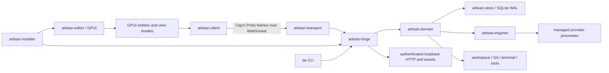

# Artisan native rewrite plan: GPUI editor and Rust Forge

- Status: proposed migration program
- Research frozen: 2026-08-24
- Primary target: Windows x64, followed by macOS and Linux
- UI target: GPUI `0.2.2`, pinned exactly until an explicit upgrade review
- Backend target: standalone Rust Forge preserving the current SQLite database and versioned wire protocol
- Migration mode: compatibility-led strangler migration, never a big-bang replacement
- Translation workers: Ox Alpha and DeepSeek V4 Flash 0731, operating through bounded work packets and independent verification

## Outcome

Replace Electron, Svelte, Effect, the TypeScript Forge, and the TypeScript engine runtime with two native Rust products:

1. `artisan-editor`, a GPUI desktop application that owns presentation, interaction, local view state, native window integration, and the existing Forge client experience.
2. `artisan-forge`, a standalone Rust service that owns persistence, orchestration, workspaces, Git, terminals, tools, engine processes, managed installations, previews, marketplace capabilities, and the existing authenticated loopback API.

The rewrite must preserve the product that already exists: its behavior, state machines, database semantics, protocol semantics, error handling, recovery behavior, security boundaries, visual identity, interaction details, provider behavior, and edge cases. It must not preserve TypeScript or Effect implementation structure for its own sake.

The target is an idiomatic Rust and GPUI system, not a transliteration.

## Non-negotiable migration rule

### Preserve semantics, not syntax

The existing implementation is the executable specification. The port must retain every externally observable invariant, but it should express that invariant using the natural Rust or GPUI mechanism.

Examples:

| Existing concept | Preserve | Do not reproduce literally | Idiomatic target |
| --- | --- | --- | --- |
| `Effect.gen` workflow | Ordering, cancellation, typed failure, cleanup | A custom Effect monad in Rust | `async fn`, `Result`, RAII guards, cancellation tokens, task scopes |
| `Context.Service` | Explicit dependency ownership and test seams | A global service locator or one trait per service | Constructor-injected structs; traits only at true polymorphic boundaries |
| `Layer` graph | Correct lifetime and composition | A Rust dependency-injection framework mirroring Effect | Explicit application assembly in `main`, builders, owned resources |
| `Ref` / `SubscriptionRef` | Atomic state and observable updates | A generic reactive cell abstraction everywhere | Owned state, actors, `watch` channels, GPUI entities, targeted notifications |
| `Stream` | Ordering, backpressure, cancellation, terminal state | Turning every collection or callback into a Rust stream | `Stream` at transport/process boundaries; actors and iterators internally |
| tagged unions | Exhaustive state machines | String tags and untyped maps | Rust enums with domain-specific payloads |
| Effect schemas | Strict validation and versioning | A runtime schema DSL clone | `serde`, newtypes, `TryFrom`, `#[serde(deny_unknown_fields)]`, explicit validators |
| Svelte runes | Reactive dependency behavior | A Svelte runtime recreated in Rust | GPUI `Entity<T>`, observation, subscription, actions, minimal `notify()` calls |
| Svelte components | Visual and interaction behavior | One Rust file for every Svelte file regardless of cohesion | GPUI views and reusable elements organized around ownership and rendering cost |
| Tailwind classes | Exact design tokens and layout outcome | A runtime Tailwind parser | Typed theme tokens, style builders, reusable native design primitives |

Every translation work packet must begin with a behavior inventory and end with a parity proof. Mechanical line-by-line translation may be used as scaffolding, but scaffolding cannot be merged if it leaves non-idiomatic ownership, error, task, or state architecture behind.

## Explicit non-goals

- Do not build an Effect clone in Rust.
- Do not retain Electron, Chromium, WebView2, Svelte, or a browser DOM in the final desktop product.
- Do not embed the Rust Forge inside the UI process by default. The independent process boundary is valuable for crash isolation, remote Forge support, updates, and resource ownership.
- Do not replace system Git with a Rust Git implementation during the parity migration. System Git behavior, configuration, credentials, worktrees, hooks, and LFS compatibility are part of current semantics.
- Do not redesign the database while porting it.
- Do not port CodeMirror or build a native editable text/code editor in this program. Editable documents are explicitly deferred.
- Do not rename public protocol concepts merely to make the Rust API aesthetically cleaner.
- Do not copy Zed editor or application crates whose license is incompatible with Artisan. GPUI's license and every transitive dependency must be audited independently of Zed's application code.
- Do not declare parity from compilation alone.
- Do not allow untranslated TODOs, silent fallbacks, skipped tests, or placeholder error handling in production paths.
- Do not optimize behavior before the Rust implementation has demonstrated parity, except when the existing behavior itself violates a frozen performance or safety requirement.

## Deferred capability: editable text/code editor

The current CodeMirror-backed editor is outside this migration's scope. The GPUI application will preserve workspace browsing, file trees, read-only file inspection, syntax-colored code presentation, changes, diffs, copy operations, and opening a file in an external editor. It will not initially provide:

- editable document surfaces;
- editor tabs or retained editable document state;
- dirty tracking or save arbitration;
- undo/redo;
- cursor and multi-selection editing;
- rectangular selection;
- bracket closing or matching as an editing feature;
- indentation and completion;
- editor diagnostics gutters;
- code folding;
- editor-specific IME composition.

The existing TypeScript/CodeMirror implementation should remain in history as a behavioral reference, but no migration packet should translate it. The native `/e/...` route is intentionally retired for the first native release; old deep links should route to the corresponding workspace/thread and offer read-only file inspection where possible.

If editable code returns later, it becomes a separately planned program with its own product requirements, performance baseline, licensing review, document model, input/IME qualification, and cutover criteria. It must not delay removal of Electron or completion of the GPUI/Rust migration.

## Current system inventory

The production module roots contain approximately 187,306 code lines excluding comments, blanks, dependencies, build output, tests, and generated Drizzle snapshot JSON.

| Current module | Code LOC | Share | Native destination |
| --- | ---: | ---: | --- |
| `backend` | 81,655 | 43.59% | `artisan-store`, `artisan-domain`, and focused domain crates |
| `frontend` | 45,401 | 24.24% | `artisan-ui`, `artisan-ui-kit`, `artisan-render` |
| `engines` | 17,593 | 9.39% | `artisan-engines` and provider submodules |
| `protocol` | 9,204 | 4.91% | `artisan-protocol` |
| `transport` | 8,361 | 4.46% | `artisan-transport` |
| `cli` | 6,171 | 3.29% | existing Rust CLI plus migrated command logic |
| `installer` | 4,315 | 2.30% | existing Rust installer plus native application payload |
| `distribution` | 3,700 | 1.98% | `artisan-distribution` |
| `forge` | 3,243 | 1.73% | `artisan-forge` host binary and assembly |
| `catalog` | 2,403 | 1.28% | `artisan-catalog` |
| `checklist` | 1,772 | 0.95% | keep or fold into native developer tooling |
| `desktop` | 1,615 | 0.86% | `artisan-app` and `artisan-platform` |
| remaining modules | 2,728 | 1.46% | corresponding native crates or tooling |

Additional migration assets:

- approximately 135,591 code lines of tests;
- 47 Drizzle schema snapshots containing approximately 354,155 JSON lines, which are migration metadata rather than implementation;
- a standalone Forge process and existing process handoff;
- a versioned protocol and versioned transport;
- MessagePack WebSocket framing with distinct control and stream lanes (wire superseded by Cap'n Proto per the 2026-08-24 amendment; retained as the behavioral reference for lanes and bounds);
- an event journal with replay cursors and projections;
- SQLite WAL persistence and migration SQL;
- existing Rust CLI, installer, and broker foundations;
- managed provider binaries and isolated provider homes;
- a large body of captured provider fixtures and domain tests.

This means the rewrite is not starting from requirements. It is starting from a functioning product, durable schemas, detailed tests, and protocol boundaries.

## Existing architecture that must survive the rewrite

The following decisions are already correct and should remain:

1. Forge is a standalone process and can run independently from the desktop shell.
2. The client and Forge communicate through a versioned, authenticated, loopback transport.
3. Control traffic and high-volume binary streams are logically separate.
4. Transport queues are bounded and fail closed on overflow.
5. SQLite is the durable source of truth.
6. Journal append and read-model projection occur in the same transaction.
7. Commands are idempotent and carry correlation and causation identity.
8. Reconnection uses journal and stream cursors rather than guessing from view state.
9. Engine implementations normalize provider-specific streams into one canonical observation model.
10. Provider binaries and credentials live in Artisan-owned, isolated homes.
11. File, Git, preview, terminal, and tool operations are backend authority, never frontend authority.
12. The frontend can reconnect to a surviving Forge.
13. Forge startup takes an exclusive database lease.
14. Shutdown drains owned orchestration before releasing the database lease.

## Target architecture



The UI and Forge share protocol types but not mutable process memory. They are independently restartable and independently testable.

## Proposed Rust workspace

```text
crates/
  artisan-app/                 Native desktop entry point and lifecycle
  artisan-ui/                  GPUI screens, route composition, app entities
  artisan-ui-kit/              Artisan design primitives and interaction components
  artisan-render/              Custom GPUI elements, shaders, rich content, visual caches
  artisan-svg-assets/          Generated, licensed SVG catalog for every shipped icon/logo
  artisan-client/              Native Forge client and subscription projections
  artisan-protocol/            Shared envelopes, commands, events, queries, validation
  artisan-transport/           "Cap'n Proto frames, WebSocket, lanes, queue bounds, reconnect"
  artisan-catalog/             Engine/model/catalog manifests and presentation metadata
  artisan-domain/              Commands, orchestration, sessions, policies, services
  artisan-store/               SQLite actor, migrations, repositories, projections
  artisan-engines/             Engine traits, canonical observations, registry
  artisan-engine-codex/        Codex adapter
  artisan-engine-claude/       Claude adapter
  artisan-engine-acp/          Shared ACP adapter used by Cursor/Grok where applicable
  artisan-engine-opencode/     OpenCode V2 service adapter
  artisan-engine-hermes/       Hermes adapter
  artisan-toolchain/           Managed distributions, downloads, verification, homes
  artisan-workspace/           Files, bounded reads, discovery, snapshots, mutations
  artisan-git/                 System-Git command construction and normalized results
  artisan-terminal/            PTY ownership, sessions, stream tickets
  artisan-tools/               Tool registry, policies, execution, receipts
  artisan-marketplace/         Capabilities, routines, MCP, OAuth, secret seams
  artisan-preview/             Preview targets, inspection, rich-link assets
  artisan-platform/            Cross-platform host traits
  artisan-platform-windows/    Windows implementation where GPUI does not provide it
  artisan-observability/       Structured logs, product telemetry, crash metadata
  artisan-forge/               Standalone Forge host and executable
  artisan-testkit/             Fixtures, fake clocks, fake processes, protocol oracles
```

The existing `modules/cli`, `modules/installer`, and `modules/broker` Rust code should be migrated into this workspace rather than rewritten again. During transition, old and new directories may coexist, but Cargo owns all final native code.

## SVG and icon asset strategy

All SVGs shipped by the native application should come from one first-party Rust crate, `artisan-svg-assets`. The GPUI UI must not depend on Svelte icon components, `@tabler/icons-svelte`, SVGL runtime packages, JavaScript modules, or filesystem path conventions scattered through views.

The crate should absorb:

- every Tabler icon actually used by Artisan;
- every SVGL-derived brand mark actually used by Artisan;
- engine/provider marks currently represented as Svelte components;
- Artisan logos and product symbols;
- static UI illustrations that are naturally SVG;
- generated SVG returned by approved rich-content renderers through a separate bounded runtime cache.

Use a checked-in source layout:

```text
crates/artisan-svg-assets/
  Cargo.toml
  build.rs
  manifest.toml
  LICENSES/
  svg/
    artisan/
    brands/
    engines/
    tabler/
  src/lib.rs
```

`manifest.toml` records a stable asset ID, source project, upstream source URL/revision, original icon name, license/attribution file, view box, intended monochrome/multicolor behavior, and whether recoloring is allowed. Brand/trademark restrictions must be retained even when the underlying file is permissively licensed.

`build.rs` should:

- reject scripts, event handlers, remote references, embedded HTML, external fonts, and unsupported SVG features;
- parse every file with a strict SVG parser;
- validate a non-empty view box and bounded dimensions;
- canonicalize/minify deterministic source;
- generate an exhaustive `SvgId` enum and metadata table;
- embed bytes or canonical strings into the binary;
- fail on duplicate IDs, missing attribution, or manifest/source drift;
- generate a catalog digest used by screenshot caches and diagnostics.

The runtime API should be typed:

```rust
pub enum SvgId {
    ArrowRight,
    Codex,
    Claude,
    ArtisanJaw,
    // generated
}

pub fn source(id: SvgId) -> &'static str;
pub fn metadata(id: SvgId) -> &'static SvgMetadata;
```

GPUI elements should accept `SvgId`, size, and an optional semantic color. Views should not embed raw SVG strings. Multicolor brand marks ignore semantic recoloring unless their manifest explicitly allows it.

During dual-frontend migration, add an extractor that reads the current Tabler/SVGL/Svelte SVG sources and produces the checked-in catalog. The extractor is a migration tool; npm packages are not final runtime or build dependencies. A gallery test renders every asset at several scales and themes, checks clipping/view-box behavior, and includes license/attribution validation.

## Rust architecture rules

### Dependency composition

- Application assembly is explicit in `artisan-forge/src/main.rs` and `artisan-app/src/main.rs`.
- Constructors accept concrete dependencies by value or `Arc` when sharing is required.
- Traits exist only for platform variation, engine variation, durable store seams, external clocks/IDs, HTTP/process seams, and test doubles.
- Domain structs do not depend on GPUI, Tokio process handles, SQLite connections, or HTTP clients directly.
- `anyhow` is allowed at executable and diagnostic boundaries only.
- Domain failures use `thiserror` enums with stable error codes.
- External input must never panic.

### Ownership and concurrency

- GPUI owns the foreground thread and all visible entity mutation.
- Forge uses Tokio for network, process, timer, and orchestration concurrency.
- Long-lived mutable resources are actors with explicit command enums, not shared `Arc<Mutex<HashMap<...>>>` bags.
- SQLite initially uses a single writer actor so journal ordering and atomic projection remain obvious. Reads may use a bounded read pool after parity is proven.
- Provider processes are supervised actors owning stdin, stdout, stderr, cancellation, exit classification, and cleanup.
- `CancellationToken`, RAII guards, `JoinSet`, and task trackers replace Effect scopes and fibers.
- Every spawned task has an owner and a shutdown path.
- Background work may not retain GPUI entities or window contexts across await points unless GPUI explicitly supports that lifetime.

### State machines

- Use enums for installation, authentication, thread, run, continuation, approval, question, connection, and shutdown state.
- Illegal states should be unrepresentable where practical.
- Transitions return domain events or commands rather than mutating unrelated repositories directly.
- State transition tests should enumerate terminal and replacement races.

### Validation

- Wire structs use `serde` with `deny_unknown_fields` where the TypeScript schema currently rejects excess properties.
- Identifiers, revisions, paths, cursor sequences, URLs, and bounded strings use newtypes with validating constructors.
- Numeric bounds remain explicit; do not rely on Rust integer types alone when the wire accepts JavaScript-safe integers.
- Persisted JSON is decoded through versioned enums before entering domain code.
- Cap'n Proto frame fixtures are tested in both directions against the TypeScript implementation until TypeScript is retired.

## Protocol-first compatibility strategy

### Amendment (2026-08-24): Cap'n Proto replaces MessagePack

Decision (full swap, both sides move together in-tree): the wire serialization
switches from MessagePack to Cap'n Proto. Because Artisan has not shipped to
users, there is no released-client compatibility burden; the transport schema
version bumps `1` -> `2`, the TypeScript Forge and every client adopt framing
version `2` together, and no long-lived dual-stack window is maintained.

Binding rules for the swap:

1. Canonical wire shapes live in `.capnp` schema files under
   `crates/artisan-protocol/schema/`. Effect Schema definitions remain the
   validation layer (refinements, bounds, patterns) but stop being the wire
   definition.
2. MessagePack carried field names on the wire; Cap'n Proto carries field
   ordinals. Parity therefore means: documented ordinal layout plus an explicit
   name map per struct, checked by cross-language frame fixtures — not string
   names on the wire.
3. Frame-decoded input is size-bounded before allocation, exactly as
   MessagePack bytes were. Traversal limits are enforced at decode time.
4. Frames use unpacked serialization initially (`capnp-ts` does not implement
   packed encoding); packing is revisited only as a coordinated post-cutover
   optimization.
5. Validation refinements stay application-side in both languages; Cap'n Proto
   conveys structure and defaults only.
6. Cross-runtime golden frame fixtures replace MessagePack round-trip fixtures:
   bytes produced by one implementation must decode in the other.

The legacy MessagePack path may exist briefly inside each implementation's
codec module behind the negotiated transport version, and is deleted once both
sides speak version `2` exclusively.

The protocol is the migration hinge. Both replacement tracks must interoperate with the legacy opposite side:

| Client | Forge | Required during migration |
| --- | --- | --- |
| Svelte/Electron | TypeScript | Current baseline |
| GPUI/Rust | TypeScript | Required before UI feature migration |
| Svelte/Electron | Rust | Required before Forge cutover |
| GPUI/Rust | Rust | Final product |

### Protocol work

1. Inventory every exported schema in `modules/protocol/src` and every transport frame in `modules/transport/src`.
2. Produce canonical JSON and Cap'n Proto frame fixtures for every command, event, query, mutation result, stream frame, error, and version-negotiation frame.
3. Generate a manifest containing schema name, discriminator, version, fixture digest, and owning TypeScript file.
4. Implement Rust structs and enums with exact serialized field names and omission behavior.
5. Decode TypeScript-produced bytes in Rust.
6. Decode Rust-produced bytes in TypeScript.
7. Fuzz both decoders with malformed tags, extra properties, oversized buffers, invalid UTF-8, invalid sequence values, and truncated frames.
8. Preserve transport version `1` until a deliberate protocol change requires version `2`.
9. Do not use a protocol version change to hide migration incompatibility.

### Contract generation

The target should have one canonical Rust protocol after cutover, but the migration needs a neutral manifest. Add a temporary generator that exports the Effect schemas to JSON Schema or a constrained intermediate schema. The generator is a migration tool, not a runtime dependency.

Where automatic generation cannot represent Effect refinements, maintain an explicit refinement table and matching Rust tests. Generated Rust may be used as a starting point, but generated domain APIs must be wrapped in meaningful newtypes.

## Persistence strategy

### Preserve the database

The Rust Forge must open and continue the existing database in place. No export/import migration is acceptable for ordinary upgrade.

Preserve:

- current table and index names;
- column nullability and defaults;
- JSON payload shapes;
- WAL mode;
- `synchronous = NORMAL`;
- `temp_store = MEMORY`;
- cache size, journal size, and checkpoint policy;
- incremental vacuum behavior;
- command idempotency;
- stream sequence allocation;
- journal sequence allocation;
- atomic journal append plus projection;
- replay cursor validation;
- retention and erasure semantics;
- database lease behavior.

### Rust store implementation

Decision (2026-08-24, greenfield revision): Artisan has not shipped to users, so the store is implemented with `sqlx` (SQLite feature, Tokio runtime) instead of raw `rusqlite`. Compile-time verified queries are worth their setup cost in a greenfield codebase where Rust SQL and schema evolve together.

The constraints that made raw SQL attractive still hold and are unchanged:

- Drizzle-authored migration SQL remains the canonical schema definition. The Rust runner replays those files verbatim; it does not translate them into an ORM schema.
- A single writer actor still owns the database connection so journal ordering and atomic projection remain obvious. `sqlx` pooling is not used for writes; reads may adopt a bounded read pool after parity is proven.
- Transaction scope, statement order, and connection ownership stay explicit inside the actor. Async database calls do not spread through domain code; domain tasks talk to the actor's typed command enum only.
- Static repository SQL uses `sqlx` compile-time checked macros against a prepared offline schema (`cargo sqlx prepare` output is checked in). Dynamic or replayed migration SQL uses the runtime query API by necessity.
- The bundled SQLite version is pinned deliberately so pragma behavior (WAL, synchronous NORMAL, temp_store MEMORY, checkpoint policy) is identical across machines and matches the TypeScript implementation byte for byte at the behavioral level.

The actor should expose typed requests such as:

```rust
enum StoreCommand {
    AcceptCommand(AcceptCommand),
    AppendEvent(AppendEvent),
    ReadConversation(ReadConversation),
    ReadReplay(ReadReplay),
    ApplyWorkspaceMutation(ApplyWorkspaceMutation),
    // focused capabilities, not a generic execute-SQL escape hatch
}
```

Repository methods may compose several SQL operations inside one actor-owned transaction. The store must not expose a shared `Connection` to arbitrary domain tasks.

### Migration compatibility tests

- Create databases at every retained historical migration using the existing TypeScript migrator.
- Open and migrate them with Rust.
- Compare `sqlite_schema`, pragmas, and application-visible rows.
- Create data with TypeScript and read/mutate it with Rust.
- Create data with Rust and read/mutate it with TypeScript.
- Crash the Rust process at selected transaction boundaries and verify recovery.
- Run projection rebuild in both implementations and compare normalized tables row-for-row.
- Verify old binaries fail safely if a future migration becomes intentionally one-way.

Drizzle snapshot JSON remains in the repository until Rust migrations have passed all historical compatibility tests. It can be archived later, never casually deleted during the port.

## Forge domain design

### Event journal

Port the journal before high-level orchestration. It is the central correctness boundary.

The Rust journal must preserve:

- event IDs, correlation IDs, causation IDs, thread IDs, run IDs, and agent IDs;
- per-stream sequence allocation;
- global journal sequence allocation;
- command receipts and duplicate detection;
- atomic read-model projection;
- cursor derivation and validation;
- replay and resume distinctions;
- trusted-tail behavior;
- consumer checkpoints;
- notifier wakeups without polling races.

The Rust implementation should use explicit transaction functions and typed event enums. It should not carry a generic Effect-shaped repository interface into every caller.

### Orchestration

Model orchestration as actors and pure transition functions:

```text
command -> validate -> decide(state, command) -> events
events -> transactionally append and project
committed events -> schedule owned side effects
side-effect observations -> new commands/events
```

Pure decision functions should contain no I/O. Process and tool reactors should receive committed work through bounded channels. Every command remains idempotent.

### Backpressure

- All untrusted or high-volume ingress uses bounded channels.
- Channel capacity is named and tested.
- Overflow closes or rejects according to the current protocol contract; it never silently drops correctness-bearing events.
- UI coalescing may drop superseded presentation updates only after durable state has been retained.
- Provider stdout readers must continue draining while downstream work is paused so child processes cannot deadlock on full pipes.

## Engine migration strategy

### Shared engine trait

Create one focused engine abstraction around capabilities actually used by orchestration:

```rust
trait Engine: Send + Sync {
    fn descriptor(&self) -> &EngineDescriptor;
    async fn probe(&self, scope: EngineScope) -> Result<EngineProbe, EngineError>;
    async fn catalog(&self, scope: EngineScope) -> Result<ModelCatalog, EngineError>;
    async fn open(&self, input: OpenRun) -> Result<EngineRun, EngineError>;
    async fn usage(&self, scope: EngineScope) -> Result<UsageReport, EngineError>;
}
```

Optional capabilities should be separate traits or enum capabilities rather than a single trait full of default methods. An active `EngineRun` owns its observation stream and command sender.

### Shared process foundation

Port this before individual providers:

- Windows job ownership and child-tree termination;
- stdout/stderr draining;
- bounded JSONL line decoding;
- inactivity deadlines;
- exit classification;
- cancellation and graceful close;
- secret-safe diagnostics;
- process environment overlays;
- profile-specific spawn resolution;
- PTY and non-PTY modes;
- exact executable resolution and health checks.

Reuse or absorb the existing Rust broker instead of recreating Windows process ownership from TypeScript.

### Provider order

1. Codex: establishes the first end-to-end native thread and exercises the default product path.
2. Claude: exercises JSONL, tasks, child lineage, usage, and authentication probing.
3. Shared ACP plus Cursor and Grok: one generic adapter unlocks both smaller providers.
4. Managed toolchain: installation, integrity, rollback, homes, and authentication.
5. OpenCode V2: private service lifecycle, authenticated HTTP/SSE, scoped catalogs, and Console OAuth.
6. Hermes: managed Python environment, provider profiles, gateway protocol, and normalization.

Each provider port begins from recorded fixtures. Live provider certification happens only after deterministic fixtures pass.

### Do not port provider implementations line by line

Provider-specific normalizers are good candidates for mechanical translation because their semantics are mostly pure. Process/service ownership should be redesigned around Rust actors. Avoid preserving TypeScript callback nesting, Effect pipelines, or mutable closure patterns.

## Workspace, Git, terminal, and tool migration

### Workspace files

- Preserve path containment, canonicalization, symlink policy, size bounds, regular-file checks, revision checks, and mutation receipts.
- Use capability objects representing an attached workspace root.
- A path entering domain code should already be a validated workspace-relative path newtype.
- Large file reads remain streamed and bounded.
- File watching uses a debounced native watcher with overflow/rescan semantics matching the current product.

### Git

- Continue spawning the user's system Git.
- Port argument construction, environment policy, output bounds, parsing, and error classification.
- Preserve worktree, unborn branch, detached HEAD, path quoting, ignored files, diff limits, and checkpoint behavior.
- Add golden command-line fixtures and real temporary-repository tests.
- Do not switch to `libgit2` or `gix` during parity work.

### Terminal

- Replace `node-pty` with a native PTY layer while preserving ConPTY behavior on Windows.
- The terminal actor owns the PTY, process group/job, resize state, output ring, subscribers, and close reason.
- Output uses stream tickets over the existing binary stream lane.
- Test long lines, binary-looking output, resize storms, process trees, shell exit, detach/reattach, and shutdown.

### Tools and approvals

- Preserve tool IDs, invocation IDs, approval policy, request summaries, command receipts, timeout behavior, and audit records.
- Tool handlers receive explicit capabilities; they cannot reach global filesystem or process APIs.
- Approval state is a Rust enum with one terminal transition.

## GPUI application architecture

### Process and runtime boundary

`artisan-editor` starts GPUI on the foreground thread. Networking and decoding execute off the render path. A native client task owns the WebSocket and sends typed updates into GPUI through a bounded bridge.

No view performs I/O during render. No renderer callback waits on Forge.

### Entity hierarchy

```text
AppModel
  ConnectionModel
  ProjectCatalogModel
  AppearanceModel
  NotificationModel
  RouteModel
  OnboardingModel
  WorkspaceModel(s)
    ThreadListModel
    DraftThreadModel
    ThreadModel(s)
      ConversationModel
      ComposerModel
      ContextUsageModel
      WorkModel
      ApprovalModel
    WorkspaceFilesModel
      FileTreeModel
      FilePreviewModel
      DiffModel
    TerminalPanelModel
```

Rules:

- Models own durable or retained presentation state.
- Views borrow entities and render current state.
- A controller name is used only when it actually coordinates multiple entities or an external capability.
- Entity notifications are narrow. One streamed token must not invalidate the entire application shell.
- Derived display data is cached where its computation is significant.
- High-frequency transcript deltas are coalesced to the next frame without delaying durable receipt processing.

### Native routing

Replace URL routing with a typed enum while retaining deep-link compatibility:

```rust
enum Route {
    Home,
    NewThread { workspace_id: Option<WorkspaceId> },
    Thread { workspace_id: WorkspaceId, thread_id: ThreadId },
    Onboarding,
    Settings(SettingsRoute),
    Debug(DebugRoute),
}
```

Implement parsers for current URLs so links, restored windows, tests, and navigation semantics survive. The native app may expose an `artisan://` deep-link scheme later, but it should still understand current path forms.

## Artisan native design system

### Canonical tokens

Move color, spacing, radius, typography, duration, easing, shadow, blur, and layer tokens into a neutral checked-in theme manifest. During dual-frontend migration, generate both CSS variables and Rust constants from that manifest. Once Svelte is removed, Rust remains canonical.

Token families must include:

- surface ladder;
- foreground and muted foreground;
- semantic status colors;
- provider accents;
- nested radii;
- card and button inner-radius calculations;
- motion durations and easings;
- blur strengths;
- typography families and weights;
- z/layer ordering;
- prose and rail geometry.

### Required primitives before screen translation

Do not translate screens until these primitives exist and have a gallery:

1. `ArtisanButton`
2. `PlasticButton`
3. `Card`
4. `PlasticCard`
5. `GlassSurface` with a non-custom-shader baseline
6. `GodRayBackdrop` with a static/native-gradient baseline
7. `Tooltip`
8. `Popover`
9. `DropdownMenu`
10. `SafeHoverSurface`
11. `ScrollArea`
12. `VirtualList`
13. `SplitPane`
14. `Dialog`
15. `Sheet`
16. `Badge`
17. `Input`
18. `TextArea`
19. `Toggle` and `Switch`
20. `EngineMark`
21. `MarkdownView`
22. `CodeBlock`
23. `DiffView`
24. `ActivityIndicator`
25. `ContextGauge`
26. `CalendarActivityGrid`
27. `ImageViewer`
28. `FileTree`
29. `TabStrip`
30. `ReadOnlyFilePreview`

Each primitive requires pointer, keyboard, focus, disabled, pressed, hover, reduced-motion, light/dark, high-DPI, and accessibility coverage as applicable.

### Shader and glass deferral policy

Exact custom-shader parity is not a blocker for translating the application, cutting over to GPUI, removing Electron, or completing the Rust Forge. Shader work must not hold the functional port hostage.

The initial GPUI implementation should approximate current shader-backed surfaces using public GPUI primitives:

- native gradients;
- opacity and layered translucent fills;
- ordinary shadows and highlights;
- masks and clipping where supported;
- static or cheaply animated ray geometry;
- provider/accent color blending calculated on the CPU;
- the same card dimensions, radii, spacing, typography, and interaction states;
- reduced-motion behavior.

Preserve the semantic component names and styling inputs so an exact shader implementation can replace the fallback without rewriting callers. For example, `GlassSurface` may initially paint layered gradients while retaining ray offset, phase, accent, radius, and motion inputs for the future renderer.

The first native release must remain recognizably Artisan, but it may ship documented reduced-fidelity glass/ray effects. Geometry, hierarchy, typography, colors, states, focus, interaction, and non-shader motion remain parity requirements.

After the functional GPUI/Rust cutover, run a dedicated shader-completion program that reproduces:

- independent ray timing and offsets per card;
- current glass shading and light response;
- plastic highlights and shadows;
- clipping to calculated nested radii;
- animated transitions without repainting unrelated UI;
- Windows DirectX rendering at 100%, 125%, 150%, and 200% scale;
- Metal and WGSL/Vulkan equivalents for later platforms.

Start post-port shader work with public GPUI extension points. If GPUI does not expose the required hook, make the smallest possible renderer extension in a pinned fork and upstream it where practical. Define one backend-neutral Artisan render primitive with HLSL, MSL, and WGSL backends. Never scatter platform shader code through views.

### GPUI dependency policy

- Pin GPUI exactly in `Cargo.lock`.
- Prefer the published `0.2.2` package over an arbitrary Zed `main` commit.
- Add `cargo-deny` license and advisory checks before the first dependency lands.
- Audit the full transitive graph; do not rely only on GPUI's package license.
- Maintain a small `[patch.crates-io]` fork only when a required fix cannot wait for release.
- Every GPUI upgrade gets a dedicated compatibility PR with visual, input, memory, and frame benchmarks.
- Never copy Zed application/editor code without an explicit license review.

## Motion and interaction

Create a central native motion library rather than translating one-off Svelte transitions.

It should support:

- spring and cubic easing;
- interruption and retargeting;
- enter/exit presence;
- shared-element geometry transitions;
- opacity, blur, scale, color, shadow, and position interpolation;
- staggered children;
- frame-coalesced updates;
- reduced motion;
- deterministic virtual-clock tests.

Port interaction semantics explicitly:

- hover-safe polygons;
- keyboard focus rings;
- menu typeahead;
- tooltip delays;
- pointer capture;
- drag thresholds;
- scroll preservation;
- focus restoration after dialogs;
- disabled buttons that remain visually complete but reject interaction;
- status transitions that cannot be double-triggered.

## Rich content strategy

### Markdown

Parse Markdown off the UI thread into a stable native document tree. Render the tree with GPUI elements and virtualize block layout for long conversations. Cache parsing and syntax results by content hash.

Use a mature CommonMark parser as the base, then layer Artisan-specific fence metadata, safe links, attachments, and streaming behavior. Do not parse the entire transcript on every token.

### Syntax highlighting

Replace Shiki and Lezer with Tree-sitter or another native incremental highlighter. Freeze current theme token mappings and language fixtures. Highlighting must be cancellable and incremental.

### Mermaid and KaTeX compatibility

These are parity risks because the existing output comes from JavaScript libraries.

Use a two-stage plan:

1. Compatibility stage: run the existing deterministic Mermaid/KaTeX renderer inside a small isolated QuickJS worker, cache resulting SVG by content and theme digest, and display SVG natively in GPUI. This removes Chromium and Node while retaining visual compatibility.
2. Native stage: replace individual renderers only when a Rust implementation passes the same golden corpus. Native replacement is optional if the QuickJS worker is bounded, idle when unused, and meets performance targets.

No JavaScript executes on the GPUI render thread. The worker receives only bounded markup and returns bounded SVG or a typed failure.

### Streaming text

- Keep stable completed blocks immutable.
- Update only the active block during token streaming.
- Coalesce multiple protocol deltas into one frame notification.
- Preserve word-settlement animation without creating one entity per token.
- Stop animation immediately when the route is hidden or reduced motion is enabled.

## Read-only workspace file presentation

The native migration includes file discovery and inspection because conversations, changes, tools, and Git all need users to see workspace content. This is not an editable text editor.

The read-only file surface should provide:

- bounded file loading through Forge authority;
- large-file refusal and binary-file presentation;
- virtualized line rendering;
- line numbers;
- syntax coloring produced off the render thread;
- diagnostic or change annotations only when they explain Forge/thread output, not an editor linting workflow;
- search within the loaded preview;
- selection and copy;
- scroll and selection restoration while the preview remains in retained UI state;
- links from diffs, tool results, traces, and file trees to an exact line;
- an explicit `Open in external editor` action;
- image and supported asset previews;
- no mutation or save command.

Use a simple immutable line/index representation and bounded highlight cache. Do not introduce a rope, undo history, editor transaction model, completion system, folding engine, or multi-cursor model. Those belong only to a future editable-editor program.

## Accessibility and input

- Use GPUI's AccessKit integration for roles, names, values, focus, selection, and actions.
- Maintain an accessibility tree golden test for each major screen.
- Test Windows Narrator first, then VoiceOver and Orca.
- Test IME composition with CJK input, emoji, dead keys, surrogate pairs, RTL text, and combining marks.
- Preserve full keyboard operation for menus, thread lists, settings, dialogs, approvals, file trees, and read-only file previews.
- Scale and font changes must not clip or make controls unreachable.

## Migration execution model for Ox Alpha and DeepSeek V4 Flash

### Roles

For every work packet:

- one model is the implementer;
- the other is the adversarial reviewer and fixture author;
- roles alternate to reduce systematic bias;
- the integration branch accepts work only after both model roles and automated gates complete.

Neither model is allowed to approve its own semantic parity.

### Work packet size

Packets should usually be:

- one protocol family;
- one repository capability;
- one pure state machine;
- one engine normalizer;
- one UI primitive;
- one small screen slice;
- approximately 300–1,000 source LOC of semantic scope.

Do not issue prompts such as "port the backend" or "port all components." Large prompts produce plausible but unreviewable architecture drift.

### Required packet manifest

Each packet includes:

```text
Packet ID
Source files
Frozen behavior and invariants
Target crate/module
Required public API
Inputs and outputs
Persistence or wire impact
Concurrency and cancellation rules
Security boundaries
Fixtures and tests to port
Golden outputs
Forbidden shortcuts
Dependencies
Exit commands
Reviewer checklist
```

### Model prompt rule

Every implementation prompt must state:

> Preserve the listed behavior and invariants. Do not translate Effect or Svelte abstractions one-for-one. Use idiomatic Rust ownership, enums, errors, async tasks, actors, RAII, and GPUI entities/actions. Do not introduce a generic abstraction unless at least two current call sites require the same behavior. Do not weaken validation, bounds, cancellation, or cleanup. Produce complete tests and no TODOs.

### Worktrees and merge discipline

- One Git worktree and branch per packet.
- No two packets modify the same target module concurrently unless one is explicitly stacked on the other.
- Protocol/schema packets merge before dependents.
- Generated fixture changes and implementation changes land together.
- Each commit is focused and reversible.
- Rebase only before final validation; do not resolve semantic conflicts mechanically.
- The integration branch is always buildable.

### Review loop

1. Implementer writes a behavior inventory from source and tests.
2. Reviewer challenges omissions before code begins.
3. Implementer ports code and tests.
4. Compiler, formatter, Clippy, unit tests, compatibility tests, and relevant benchmarks run.
5. Reviewer compares source invariants, not syntax.
6. Reviewer adds at least one negative or race test not supplied by the implementer.
7. Integrator checks crate boundaries and rejects Effect-shaped or DOM-shaped Rust.
8. Packet lands only when its manifest is complete.

### Automated anti-slop gates

Reject:

- `unwrap()` or `expect()` on external/runtime input;
- `Box<dyn Error>` in domain APIs;
- stringly tagged states;
- unbounded channels on external or provider ingress;
- detached tasks without ownership;
- generic `ServiceContainer` or runtime locator;
- `Arc<Mutex<_>>` used to avoid deciding ownership;
- placeholder `todo!()` or `unimplemented!()`;
- silent `let _ =` on fallible operations;
- broad `allow` attributes;
- tests that only assert source text;
- visual components without focus/disabled/reduced-motion coverage;
- protocol structs without excess-field and invalid-tag tests;
- database methods exposing raw SQL outside the store crate.

## Four compatibility harnesses

### 1. Protocol oracle

Runs TypeScript and Rust codecs against the same fixture corpus and compares:

- successful values;
- rejected values;
- frame bytes where canonical encoding is required;
- semantic round trips where map ordering is irrelevant;
- omitted optional fields;
- byte arrays;
- safe integers and cursor bounds;
- unknown fields and tags;
- version errors.

### 2. Database oracle

Runs the same command sequence against copied databases using both implementations and compares normalized tables, journal events, projections, cursors, and errors.

### 3. Engine oracle

Replays identical recorded provider streams into both normalizers and compares canonical observations, commands, terminal states, error codes, usage, and continuation tokens.

### 4. UI oracle

Feeds identical fixture state and scripted input into Svelte and GPUI. It compares semantic accessibility trees, screenshot regions, focus order, enabled actions, scroll positions, and resulting protocol commands.

Pixel comparison must tolerate known renderer differences in glyph antialiasing while remaining strict about geometry, color, spacing, clipping, and state.

## Migration phases

## Phase 0: Freeze baselines and observability

### Work

- Record current cold/warm startup, idle memory, loaded-thread memory, CPU, GPU memory, frame times, input latency, stream throughput, Forge idle memory, and Forge event latency.
- Capture representative screenshots at all supported scale factors and themes.
- Capture scripted interaction traces for onboarding, project selection, thread creation, streaming, approvals, steering, cancel, read-only file inspection, Git, terminal, settings, and engine setup.
- Snapshot protocol fixtures and database fixtures.
- Classify all tests as semantic, protocol, persistence, engine, platform, source-structure, or visual.
- Identify frontend tests that inspect source text; convert their intended requirement into a future semantic gate.
- Add a migration dashboard showing packet state and parity status.

### Exit criteria

- Baselines are reproducible on a named Windows test machine.
- Every critical user journey has a trace and expected terminal state.
- Protocol and database fixtures are checked in and digest-addressed.
- No migration work starts without a way to prove its result.

## Phase 1: Native workspace and GPUI feasibility spikes

### Work

- Extend the Cargo workspace with the target crate skeletons.
- Pin GPUI and run license/advisory audit.
- Build a Windows GPUI shell with application icon, custom title bar behavior, menus, clipboard, file dialog, deep-link parser, crash logging, and single-instance behavior.
- Prove the non-shader `GlassSurface` and `GodRayBackdrop` fallbacks with public GPUI primitives.
- Build the generated SVG asset crate and render its complete catalog in GPUI.
- Build a 10,000-row virtualized transcript spike with streaming updates.
- Build text input and IME spike.
- Build a minimal authenticated WebSocket client against the TypeScript Forge.
- Establish frame-duration, input-latency, memory, and allocation instrumentation.

### Exit criteria

- GPUI runs reliably on supported Windows hardware and VM fallback configurations.
- The fallback glass/ray surfaces preserve layout, color, readability, interaction, and acceptable Artisan identity without a GPUI renderer fork.
- All shipped icons and logos load through the typed SVG catalog with validated attribution.
- Virtualized transcript stays within the frozen frame and memory budget.
- Text input, IME, focus, and accessibility are viable.
- The native shell can connect and authenticate to the current Forge.

If this phase fails, stop before mass translation. Do not let model throughput conceal a framework blocker.

## Phase 2: Rust protocol and transport

### Work

- Port all protocol envelopes and refinements.
- Port Cap'n Proto framing and the version-2 transport handshake.
- Port control and stream lanes.
- Port queue bounds and failure semantics.
- Port pairing, session authentication, origin policy, reconnection, cursors, and stream tickets.
- Implement `artisan-client` subscriptions and query/mutation calls.
- Build protocol fuzzing and cross-runtime fixtures.

### Exit criteria

- Rust client passes against TypeScript Forge.
- TypeScript client passes against Rust test server.
- Every current protocol test has a Rust equivalent or an explicit retirement reason.
- Malformed input cannot panic or allocate without bounds.

## Phase 3: GPUI design system and shell

### Work

- Generate Rust theme tokens from the neutral manifest.
- Implement the required primitive gallery.
- Port application shell, project switcher, sidebar, thread rail, account menu, settings navigation, Forge connection overlay, notifications, and title/attention state.
- Implement typed routes and retained route models.
- Implement fixture mode without Forge.
- Port appearance, text format, reduced motion, and display preferences.

### Exit criteria

- Shell screenshots and accessibility trees meet parity thresholds.
- Navigation, focus restoration, hover behavior, and transitions are correct.
- Shell remains responsive during an artificial 1,000-event/second client feed.

## Phase 4: Native new-thread and onboarding vertical slice

### Work

- Port project catalog view.
- Port new-thread draft model and revision fencing.
- Port model selector and session policy controls.
- Port composer basics, attachments, failure states, and first-message handoff.
- Port onboarding harness cards and managed setup state.
- Port engine usage/account presentation.
- Connect all actions to the TypeScript Forge through the Rust client.

### Exit criteria

- A user can install/authenticate a harness, create a draft, select a project/model/policy, send the first message, and navigate into a legacy Forge thread from GPUI.
- Every race in draft alignment and navigation recovery has a native test.

## Phase 5: Native conversation and thread workspace

### Work

- Port thread open/hydration.
- Port transcript projection and visual settlement.
- Port messages, traces, work sessions, status, approvals, forms, usage interruptions, changes cards, turn footer, and context usage.
- Port steering, retry, cancel, answer, approval, and follow-up actions.
- Add virtualized long-thread rendering and block caching.
- Add Markdown, code, math, diagram, links, images, and attachments.
- Port thread hover rail and attention behavior.

### Exit criteria

- GPUI can drive full live Codex/Claude threads against TypeScript Forge.
- Long transcripts meet frame/memory budgets.
- Commands and resulting state match Svelte traces.
- No whole-window invalidation occurs for one token delta.

## Phase 6: Native file inspection, Git, and terminal UI

### Work

- Port file tree and bounded file reads.
- Port read-only file previews, syntax coloring, line navigation, selection/copy, search, and external-editor handoff.
- Port diff/changelist presentation.
- Port repository/worktree/branch selector and project panel.
- Port terminal cards, attach/detach, output virtualization, resize, and input.
- Port preview and image viewer UI.

### Exit criteria

- The native app can inspect, search, copy, diff, and navigate workspace files without exposing mutation controls.
- Terminal attach survives route changes and reconnects.
- File preview selection, search, line navigation, large-file bounds, and external-editor handoff pass native integration tests.

## Phase 7: Rust Forge skeleton and read-only shadow

### Work

- Implement native Forge configuration, logging, HTTP host, WebSocket binding, control authority, instance registry, database lease, state card, and shutdown.
- Implement SQLite migration runner and read-only repositories.
- Run Rust Forge against a copy of a production database.
- Implement a shadow mode that consumes copied journal data or mirrored commands but never writes the primary database.
- Compare Rust read models to TypeScript responses.

### Exit criteria

- Rust Forge starts, announces, authenticates, serves health/status, drains, and exits correctly.
- It can answer read-only project/thread/catalog/conversation queries identically from a copied database.
- It never competes for the production database lease in shadow mode.

## Phase 8: Rust journal, projections, and command core

### Work

- Port journal store and notifier.
- Port transactional projections.
- Port command router and receipts.
- Port thread creation, metadata, read models, retention, erasure, defaults, favorites, guidance, and project identity.
- Port projection rebuild and recovery gate.
- Run dual database oracle sequences.

### Exit criteria

- Svelte and GPUI clients can both create/read ordinary threads through Rust Forge with engines disabled.
- Journal/projection tables match TypeScript for the same command sequence.
- Crash and replay tests pass.

## Phase 9: Rust workspace, Git, terminals, tools, and preview

### Work

- Port workspace capability registries and root attachment.
- Port file discovery, bounded reads, snapshots, mutations, changes, conflicts, and diffs.
- Port system-Git execution and normalized repositories.
- Port PTY terminal driver and session service.
- Port built-in tool registry, approval policy, invocations, and execution.
- Port preview targets, health, browser/inspection boundary, and rich-link assets.

### Exit criteria

- Existing clients pass workspace, Git, terminal, tool, and preview suites against Rust Forge.
- Windows process-tree and path-security deep tests pass.

## Phase 10: Rust orchestration and first native engine

### Work

- Port run/session policy translation.
- Port orchestrator actors, continuation, recovery, wake lock, resource quiescence, agent graph, and shutdown drain.
- Port shared process supervisor.
- Port Codex adapter and normalizer.
- Certify one complete Codex lifecycle: start, stream, tools, approval, answer, steer, cancel, retry, resume, usage interruption, completion, and crash recovery.

### Exit criteria

- Both clients drive live Codex through Rust Forge.
- Engine oracle matches recorded TypeScript outputs.
- No child process survives Forge shutdown.
- Provider output backpressure cannot deadlock the child.

## Phase 11: Remaining engines, toolchain, marketplace, and telemetry

### Work

- Port Claude.
- Port ACP, Cursor, and Grok.
- Port OpenCode V2.
- Port Hermes.
- Port managed toolchain installation/authentication/rollback.
- Port marketplace routines, capabilities, MCP transports, OAuth, and secret-store seams.
- Port product telemetry, preferences, crash markers, and operational events.

### Exit criteria

- Every supported engine passes deterministic fixture tests and live certification.
- Managed installations work from a clean machine.
- Marketplace trust and secret boundaries retain current behavior.
- Event catalog and privacy tests pass.

## Phase 12: Native packaging, updater, and cutover

### Work

- Package GPUI editor, Rust Forge, CLI, installer, broker/platform helpers, migrations, fonts, the generated SVG catalog, and runtime assets. Include custom shader assets only if they are already qualified; they are not a cutover dependency.
- Update `ae-installer` payload and manifest.
- Preserve first-launch onboarding, file associations, deep links, instance discovery, startup repair, and updater behavior.
- Add crash-safe upgrade and rollback between TypeScript and Rust Forge versions.
- Run clean-machine, upgrade, downgrade, repair, offline, proxy, antivirus, long-path, non-ASCII-path, and low-permission tests.
- Canary the native UI and Rust Forge independently.

### Exit criteria

- Native-only package contains no Electron, Node runtime, Chromium, Svelte bundle, or TypeScript Forge.
- Existing user databases and managed homes upgrade in place.
- Rollback restores the previous application without corrupting state.
- Performance budgets pass on release hardware.
- Legacy code is deleted only after the rollback window closes.

## Phase 13: Post-port shader fidelity

This phase begins only after GPUI and Rust Forge are the default, Electron and the TypeScript Forge are no longer required, and the functional/native performance gates are stable.

### Work

- Capture exact reference recordings of every legacy shader-backed surface before deleting the final visual oracle artifacts.
- Define a backend-neutral Artisan shader primitive and uniform contract.
- Implement the Windows HLSL/DirectX path first.
- Replace fallback glass and ray implementations without changing their calling components or state APIs.
- Implement and qualify Metal and WGSL/Vulkan paths for macOS/Linux releases.
- Add GPU memory, overdraw, frame-time, shader compilation, device-loss, and software-adapter tests.
- Compare exact and fallback modes so low-capability hardware can retain a safe presentation.

### Exit criteria

- Glass, plastic light response, and god rays meet approved visual recordings.
- Exact shaders do not regress the native memory, CPU, GPU-memory, or frame budgets.
- Device loss or unsupported hardware falls back without crashing or making text unreadable.
- Views contain no backend-specific shader logic.
- Shader artifacts are included in signed package manifests and covered by clean-machine tests.

## Feature cutover flags

During development, use explicit implementation selectors:

```text
ARTISAN_UI_IMPL=electron|gpui
ARTISAN_FORGE_IMPL=typescript|rust
ARTISAN_FORGE_SHADOW=0|1
```

The release launcher may expose equivalent internal configuration, but final production builds must not silently mix implementations.

Valid transition states:

1. Electron + TypeScript Forge
2. GPUI + TypeScript Forge
3. Electron + Rust Forge
4. GPUI + Rust Forge

Each state gets an integration suite. This matrix is the primary defense against coupling the two rewrites.

## Performance program

### Baselines

Measure current Electron and TypeScript Forge before implementation. Record process trees so provider, LSP, terminal, and helper memory is not attributed to the UI or Forge.

### Required scenarios

1. cold launch to first interactive frame;
2. warm launch;
3. idle home screen;
4. idle loaded thread;
5. 10,000-message transcript;
6. 50 token deltas per second;
7. 1,000 event replay burst;
8. 120 Hz continuous scroll;
9. composer typing with IME;
10. rapidly inspect 20 files and return to prior preview positions;
11. large file and large diff;
12. terminal flood;
13. six parallel agent threads;
14. Forge idle and Forge under orchestration load;
15. managed installation.

### Metrics

- private working set and committed memory by process;
- GPU dedicated/shared memory;
- idle and active CPU;
- energy/power where available;
- first-frame and interactive startup;
- input-to-paint latency;
- p50/p95/p99 frame duration;
- frames above 8.33, 16.67, and 50 ms;
- allocations per event and per rendered message;
- protocol encode/decode throughput;
- journal append and query latency;
- stream queue depth and drops;
- shutdown duration and surviving processes.

### Initial performance gates

Final numeric budgets should be frozen from measured baselines. Initial program goals:

- GPUI editor idle private working set no more than 50% of the Electron editor baseline;
- Rust Forge idle private working set no more than 40% of the TypeScript Forge baseline;
- no persistent UI CPU when no animation or work is active;
- p95 frame duration below 8.33 ms during ordinary interaction on a 120 Hz reference machine;
- p99 frame duration below 16.67 ms during streaming;
- no frame above 50 ms in the standard interaction trace;
- input-to-paint p95 below 16 ms;
- Rust Forge command/query p95 no worse than TypeScript during parity, then improved after cutover;
- provider turn latency excluding provider/network time must not regress more than 2%;
- no unbounded memory growth in an eight-hour soak.

Performance failures block cutover; they are not deferred as polish.

## Security invariants

- Forge remains bound to loopback unless an explicit reviewed remote mode is enabled.
- Origin, session, and pairing checks remain fail-closed.
- Session digests and secrets are never logged.
- Frame-decoded input and streamed bytes are bounded before allocation.
- Workspace paths are validated against canonical roots and symlink policy.
- Preview fetching retains DNS rebinding and private-address defenses.
- Managed downloads retain host allowlists, size bounds, checksums, extraction boundaries, and atomic activation.
- Child processes receive the minimum environment required for their profile.
- Provider credentials remain in isolated homes with appropriate permissions.
- Tool execution remains approval- and capability-scoped.
- Rust `unsafe` remains forbidden in ordinary crates. Any required platform unsafe code lives in a tiny audited platform module with explicit safety comments and focused tests.
- Add `cargo-audit`, `cargo-deny`, fuzzing, and dependency license checks to CI.

## Packaging and release strategy

### Artifacts

The final Windows package should contain:

- `artisan-editor.exe`
- `artisan-forge.exe`
- `ae.exe`
- `ae-installer.exe`
- any required broker/platform helper
- migration SQL
- fonts and the generated SVG/icon catalog
- shader assets only after the optional Phase 13 implementation is qualified
- signed payload manifest

### Updates

- Editor and Forge versions are recorded independently but shipped as one certified compatibility set.
- The launcher checks protocol compatibility before replacing a running Forge.
- Update staging remains atomic.
- Database backup occurs before a one-way schema migration.
- Rollback policy distinguishes binary rollback from database downgrade.
- Running threads drain or visibly block update rather than being killed silently.

## Rollback strategy

- Keep the TypeScript Forge and Electron package buildable throughout the migration.
- Never let TypeScript and Rust Forge write the same database simultaneously.
- Shadow Forge uses a copied database or replicated event input only.
- Before Rust Forge becomes default, provide a launcher switch back to TypeScript Forge for the same protocol/database version.
- Before GPUI becomes default, provide a launcher switch back to Electron using the same Forge.
- Back up database and state manifests before the first Rust write in a release channel.
- Record the selected implementation in diagnostics and crash reports.
- Automatically return to the previous implementation after repeated early-start crashes, but display the fallback visibly.

## Risk register

| Risk | Impact | Early proof | Mitigation |
| --- | --- | --- | --- |
| GPUI Windows regression | Blocks native UI | Phase 1 shell and soak | Pin release, small fork, hardware matrix |
| GPUI shader hook insufficient | Exact post-port glass/ray fidelity delayed | Non-shader fallback qualification | Ship fallback at cutover; complete a minimal backend-neutral renderer extension in Phase 13 |
| SVG source licensing or malformed assets | Legal, security, or rendering failures | Generated catalog and manifest audit | Vendor only used assets, retain attribution, parse strictly, reject active/external SVG content |
| GPUI dependency licensing | Legal blocker | `cargo-deny` before adoption | Pin compatible graph or replace/fork dependency |
| Editable editor work leaks back into migration | Delays cutover and recreates CodeMirror scope | Scope audit in every UI packet | Reject editing, save, undo, folding, completion, and multi-cursor work from this program |
| Mermaid/KaTeX parity | Broken rich content | Golden corpus | Bounded QuickJS SVG worker, cache, optional later native port |
| Protocol encoding mismatch | Cross-runtime failure | Bidirectional byte fixtures | Neutral manifest and fuzzing |
| SQLite transaction drift | Data corruption | Dual database oracle | Single writer actor, exact SQL/migrations, crash tests |
| Effect cancellation semantics lost | Leaks/races | Workflow lifecycle inventory | RAII, cancellation tokens, owned tasks, race tests |
| Model-generated abstraction slop | Maintenance regression | Packet review | Anti-slop gates and idiomatic integrator review |
| Parallel model merge conflicts | Lost semantics | Work packet DAG | Worktrees, file ownership, small packets |
| Provider behavior changes during port | False parity failures | Pinned fixtures and binaries | Freeze versions, live certification after deterministic parity |
| Source-string frontend tests become useless | False confidence | Test classification | Replace with GPUI semantic, input, accessibility, and screenshot tests |
| Rust compile times | Slower iteration | Early CI timings | Crate boundaries, shared dependency features, sccache, fast linker |
| GPU cache growth | RAM regression | Long-thread/image soak | Bounded caches with telemetry and eviction tests |
| Separate UI/Forge rewrites couple | Big-bang failure | Four compatibility quadrants | Protocol-first independent tracks |

## CI and quality gates

Every native PR runs:

```text
cargo fmt --all -- --check
cargo clippy --workspace --all-targets --all-features -- -D warnings
cargo test --workspace
cargo deny check
cargo audit
protocol cross-runtime fixtures
database compatibility fixtures
relevant engine oracle fixtures
GPUI semantic tests
visual regression tests for affected components
performance smoke benchmark
Windows packaged smoke test when platform code changes
```

Nightly:

- fuzz protocol frames, persisted JSON, JSONL, archive extraction, paths, and provider decoders;
- run eight-hour memory/CPU soak;
- run all historical database migrations;
- run live provider certification against dedicated test accounts;
- package and launch clean Windows VM artifacts;
- compare current native performance to baseline and previous main.

## Definition of semantic parity

A feature is parity-complete only when:

1. Its externally observable behavior inventory is complete.
2. Rust/GPUI implementation is idiomatic and passes architecture review.
3. Existing relevant fixtures pass or are replaced by stronger semantic fixtures.
4. Negative, cancellation, race, and recovery paths are tested.
5. Protocol and persistence outputs match when applicable.
6. Visual geometry, color, non-shader motion, focus, and disabled state match approved baselines. Shader-backed light/ray effects may use the explicitly approved cutover fallback until Phase 13.
7. Keyboard and accessibility behavior is present.
8. Memory, CPU, and frame budgets pass.
9. Errors retain stable user-facing meaning and diagnostic codes.
10. No legacy implementation is required for the feature, except an explicitly tracked compatibility worker such as bounded math/diagram SVG rendering.

## Definition of final completion

The native program is complete when:

- all supported user journeys run through GPUI and Rust Forge;
- all engines install, authenticate, run, resume, and report usage;
- existing databases upgrade in place;
- remote/reconnecting Forge behavior is retained;
- read-only workspace inspection, terminal, Git, tools, previews, marketplace, settings, onboarding, and updater are native;
- the package contains no Electron, Chromium, Svelte bundle, or Node Forge; no editable text-editor implementation is shipped;
- the TypeScript protocol oracle has been frozen and archived;
- the legacy runtime can be deleted without reducing rollback coverage for released users;
- performance and soak gates pass on the release hardware matrix;
- license and security reviews are complete;
- operational telemetry can distinguish UI, Forge, engine, and child-process resource use.

## Initial work packet backlog

The first packets should be created in this exact dependency-aware order:

1. `NATIVE-0001`: baseline process/memory/frame measurement harness.
2. `NATIVE-0002`: protocol schema inventory and fixture manifest.
3. `NATIVE-0003`: persisted database fixture matrix.
4. `NATIVE-0004`: GPUI dependency/license/advisory audit.
5. `NATIVE-0005`: Windows GPUI shell and lifecycle.
6. `NATIVE-0006`: GPUI metrics overlay and frame histogram.
7. `NATIVE-0007`: theme-token neutral manifest and CSS/Rust generators.
8. `NATIVE-0008`: generated SVG asset crate, source extraction, attribution manifest, and gallery.
9. `NATIVE-0009`: virtualized transcript stress proof.
10. `NATIVE-0010`: text input, IME, clipboard, and accessibility proof.
11. `NATIVE-0011`: Rust common protocol newtypes and envelope headers.
12. `NATIVE-0012`: Rust control envelope fixtures.
13. `NATIVE-0013`: Rust stream envelope fixtures.
14. `NATIVE-0014`: Rust Cap'n Proto codec compatibility.
15. `NATIVE-0015`: Rust WebSocket multiplexer and queue bounds.
16. `NATIVE-0016`: Rust pairing/session authentication client.
17. `NATIVE-0017`: GPUI `AppModel`, route enum, and fixture runtime.
18. `NATIVE-0018`: core button/card/plastic primitives.
19. `NATIVE-0019`: tooltip/popover/menu/focus primitives.
20. `NATIVE-0020`: virtual list and scroll preservation primitives.
21. `NATIVE-0021`: native shell/sidebar/thread rail fixture.
22. `NATIVE-0022`: project catalog client projection.
23. `NATIVE-0023`: new-thread draft entity and revision fencing.
24. `NATIVE-0024`: composer text/attachments/action state.
25. `NATIVE-0025`: model selector and session policy UI.
26. `NATIVE-0026`: onboarding and harness setup UI.
27. `NATIVE-0027`: conversation projection entity.
28. `NATIVE-0028`: message/status/trace native blocks.
29. `NATIVE-0029`: Markdown and native code block pipeline.
30. `NATIVE-0030`: long-thread GPUI parity slice against TypeScript Forge.
31. `NATIVE-0031`: Rust Forge config, state card, and database lease.
32. `NATIVE-0032`: Rust HTTP/WebSocket host and control authority.
33. `NATIVE-0033`: Rust migration runner and schema verification.
34. `NATIVE-0034`: Rust read-only project/thread repositories.
35. `NATIVE-0035`: journal append transaction and event reconstruction.
36. `NATIVE-0036`: replay cursor validation and notifier.
37. `NATIVE-0037`: command receipts and idempotency.
38. `NATIVE-0038`: conversation/thread projections.
39. `NATIVE-0039`: workspace root capability and bounded file store.
40. `NATIVE-0040`: system-Git process runner and parsers.
41. `NATIVE-0041`: shared process supervisor and Windows job ownership.
42. `NATIVE-0042`: Codex protocol and recorded normalizer.
43. `NATIVE-0043`: Codex live run actor.
44. `NATIVE-0044`: orchestrator first-thread vertical slice.
45. `NATIVE-0045`: old and new client/Forge four-quadrant integration gate.

Post-cutover shader packets are deliberately outside the blocking sequence:

1. `NATIVE-SHADER-0001`: reference capture and uniform contract.
2. `NATIVE-SHADER-0002`: Windows HLSL/DirectX glass primitive.
3. `NATIVE-SHADER-0003`: independent god-ray timing and clipping.
4. `NATIVE-SHADER-0004`: fallback/device-loss/performance qualification.
5. `NATIVE-SHADER-0005`: Metal backend.
6. `NATIVE-SHADER-0006`: WGSL/Vulkan backend.

After packet 45, re-plan the remaining migration using measured throughput and discovered gaps. Do not pre-allocate hundreds of blind translation packets before the first full native vertical slice proves the architecture.

## Final architectural position

This rewrite should treat the existing product as a detailed behavioral specification and the Rust compiler, compatibility oracles, database oracle, engine fixtures, GPUI semantic tests, and visual regressions as the enforcement mechanism.

Ox Alpha and DeepSeek V4 Flash can translate the bulk of the code quickly. Their speed is useful only if the work is decomposed so that incorrect semantics cannot hide inside large generated diffs. The program therefore optimizes for high parallel throughput after foundations, while keeping protocol, database, process ownership, rendering primitives, and state architecture under strict human- and test-defined constraints.

The final code should look as though Artisan had originally been designed in Rust and GPUI, while behaving as though none of the years of product detail were lost.
