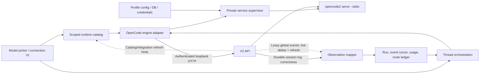

# OpenCode harness integration plan

- Status: beta vertical slice implemented; launch gates remain
- Research frozen: 2026-08-21
- Target engine ID and executable: `opencode2`
- Scope: implementation architecture, delivered slices, and remaining launch gates
- Upstream baseline: `@opencode-ai/cli@beta`, certified one exact version at a time, researched against OpenCode V2 commit [`0d2684b`](https://github.com/anomalyco/opencode/tree/0d2684b67308380fc47540fe55deb55306a08e3f)

## Outcome

Add OpenCode as a first-class, profile-scoped Artisan engine without carrying forward the abandoned OpenCode 1 prototype. The integration must preserve the real execution route—Zen, Go, or a direct/custom provider—because identical underlying models can have different credentials, pricing, quotas, behavior, and audit requirements.

The work should land behind an `opencode2_harness_beta` feature flag. The first supported platform should be Windows x64, matching the current desktop target. General availability is blocked on the launch gates in this document, not merely on a successful single-turn prompt.

## Implementation checkpoint

Implemented on 2026-08-21:

- structured profile/provider-route/model/variant/catalog identity through policy, run metadata, persistence, migration, picker selection, favorites, and usage provenance;
- scoped live model catalog capability with Zen (`opencode`), Go (`opencode-go`), custom route, variant, cost, limit, and confidence normalization;
- exact Windows x64 beta pin, NPM SHA-512 verification, script-free bounded tar extraction, executable SHA-256 storage, rollback, and V1 rejection;
- isolated profile roots, managed safe-mode configuration, versioned Artisan agents, project-config disablement, ordered permission rules, and pooled private stdio service per profile;
- narrow authenticated HTTP/SSE client, durable-log replay, volatile live deltas, session start/resume/steer/cancel/close, instructions, approvals, forms, token/cost usage, and bounded service restart continuation;
- OpenCode Console OAuth discovery/start/status plus settings UI authorization handoff; one Console connection can provision both Zen and Go routes;
- Forge/backend registration, production allowlist, route-aware selector behavior, migrations, focused regression tests, and production frontend/Forge builds.

Still launch-gated:

- live Zen and Go credential/account certification against the pinned artifact;
- a real downloaded Windows artifact/process smoke test in packaged Artisan;
- durable recovery-intent/attempt persistence for repeated host crashes (the adapter performs deterministic resume, but the additional bounded recovery ledger remains to be added);
- first-class profile switching and structured custom-provider editing in the renderer;
- trusted project config/plugins, external provider packages, and native subagents;
- eligible-account validation before displaying any Black entitlement;
- the explicit rollout flag and telemetry/rollback operations required for general availability.

## Decisions to freeze before implementation

1. Use `opencode2` everywhere: engine ID, executable name, installation record, logs, metrics, and feature flag. Never probe or fall back to the V1 `opencode` binary.
2. Run an Artisan-owned private OpenCode service, authenticated over loopback, rather than attaching to a user's shared background service.
3. Treat live durable envelopes plus the paginated message projection as the source of truth. The pinned beta does not persist bus events by default, so the per-session log can legitimately contain only `log.synced`; consume matching durable envelopes from the global stream, attempt bounded log replay, and reconcile terminal state from projected messages after `session.wait`.
4. Make model inventory dynamic and scoped by working directory, Artisan toolchain profile, and workspace trust mode. OpenCode's catalog is not a global immutable manifest.
5. Persist provider route, model, and variant as separate structured fields. Never reduce them to a display name or assume a model ID contains only one slash.
6. Model Zen and Go as execution routes. Model Black, if it is observable at all, as a billing entitlement—not a provider or model.
7. Disable project OpenCode configuration in the initial safe mode. Support custom providers from profile-managed configuration first; add project config/plugins only behind an explicit workspace-trust boundary.
8. Do not describe OpenCode as sandboxed. Its rules can ask, allow, or deny tools, but an allowed shell has host process, filesystem, and network authority.
9. Deny OpenCode-native subagents in the first release. A subagent owns its own permission configuration and is not automatically constrained to the parent's rules.
10. Pin and certify one beta package and API fixture set at a time. OpenCode is explicitly beta and its API/config/plugin contracts may change.

## Terminology and identity

| Artisan concept     | OpenCode representation                             | Example                                            | Persistence rule                       |
| ------------------- | --------------------------------------------------- | -------------------------------------------------- | -------------------------------------- |
| Harness/engine      | OpenCode adapter                                    | `opencode2`                                        | Stable engine ID                       |
| Toolchain profile   | Isolated service, config, database, and credentials | `default`, `work`                                  | Store on every session/run             |
| Provider route      | Catalog provider ID used for execution              | `opencode`, `opencode-go`, `anthropic`, `my-proxy` | Store separately from model            |
| Model               | Selectable catalog model ID                         | `claude-sonnet-4-5`                                | Store as opaque text                   |
| Variant             | Optional model option overlay                       | `high`, `max`                                      | Store separately and optionally        |
| Upstream model ID   | Provider API model identifier, if different         | provider-defined                                   | Metadata only, never the selection key |
| Billing entitlement | Account/product status                              | Black                                              | Never put in the model picker identity |
| Catalog revision    | Snapshot used to make a selection                   | adapter-generated digest                           | Store for audit/reconciliation         |

A canonical selection should have this shape:

```ts
interface EngineModelSelection {
	readonly engine_id: "opencode2";
	readonly profile_id: string;
	readonly provider_route_id: string;
	readonly model_id: string;
	readonly variant_id?: string;
	readonly catalog_revision: string;
}
```

Favorite identity should be a versioned encoding of `{ engine_id, provider_route_id, model_id, variant_id }`. The profile is deliberately excluded so a favorite can follow the user between profiles; availability is still evaluated against the current scoped catalog. Thread and run records must include the profile.

## What Zen, Go, Black, and custom models actually are

### Zen

Zen is OpenCode's curated pay-as-you-go gateway. In the V2 catalog and provider plugin, its execution route is `opencode`. An OpenCode Console integration can authenticate with device OAuth or a service API key and materialize the routes and models returned by the console configuration endpoint.

Artisan should display a **Zen** route badge, but persist `provider_route_id: "opencode"`. It should not manufacture model IDs such as `opencode-zen` or `opencode-any`.

### Go

Go is a subscription route with model-specific rolling and longer-period limits. Its V2 execution route is `opencode-go`. It can be provisioned by the same OpenCode Console connection that provisions Zen, so authentication belongs to the Console integration rather than to each visible route or model.

Artisan should display a **Go** route badge and persist `provider_route_id: "opencode-go"`. It must remain distinct from Zen even when both routes expose the same underlying model.

### Black

The public Black page currently says enrollment is paused. The researched V2 API/source has no `black` provider ID, model namespace, or provider plugin. The best-supported interpretation is that Black is an account billing entitlement layered over Console/Zen, not an execution route.

This is an inference and a launch-test item. Do not add a Black provider group or hard-code Black pricing. If a live eligible account later exposes entitlement metadata, record it in an optional `billing_entitlement` field and keep the actual execution route unchanged.

### Direct and custom providers

OpenCode V2 uses a plural `providers` configuration object. A configured provider may define an arbitrary provider ID, environment-variable credentials, a built-in or external package, headers/body options, explicit models, per-model limits and costs, and variants. OpenAI-compatible providers use OpenCode's compatible provider implementation; local providers such as Ollama, LM Studio, and vLLM may discover models dynamically.

The model catalog is composed from Models.dev metadata, integrations, discovered providers, and user configuration. Consequently:

- provider and model IDs are opaque and location-dependent;
- a model ID can contain `/`, while the selection reference remains structured;
- arbitrary provider packages and plugins execute JavaScript in the OpenCode process;
- configured limits/capabilities may be asserted rather than verified;
- a custom model can appear or disappear after credentials, config, plugins, or local servers change.

The initial release should allow profile-managed built-in providers and the native OpenAI-compatible path. External packages, file plugins, and project plugins require an explicit trust gate and visible code-execution warning.

## Current Artisan seams and required changes

| Area                                                                                                               | Current constraint                                                                 | Required change                                                                                             |
| ------------------------------------------------------------------------------------------------------------------ | ---------------------------------------------------------------------------------- | ----------------------------------------------------------------------------------------------------------- |
| [`modules/catalog/src/schema.ts`](../../modules/catalog/src/schema.ts)                                             | `HarnessId` is closed to the existing engines; models come from a static manifest  | Add `opencode2`; distinguish curated static definitions from dynamic runtime entries                        |
| [`modules/backend/src/runtime/catalog.ts`](../../modules/backend/src/runtime/catalog.ts)                           | One immutable global runtime catalog                                               | Add a scoped catalog query/subscription keyed by directory, profile, and trust mode                         |
| [`modules/protocol/src/runtime-catalog.ts`](../../modules/protocol/src/runtime-catalog.ts)                         | Query payload is empty                                                             | Carry catalog scope and return a revisioned snapshot with provenance                                        |
| [`modules/backend/src/orchestration/session-policy.ts`](../../modules/backend/src/orchestration/session-policy.ts) | Run metadata translation is effectively a Claude branch followed by Codex defaults | Replace this with an engine-owned policy/model translator registry                                          |
| [`modules/engines/src/engine.ts`](../../modules/engines/src/engine.ts)                                             | Model is one optional string; catalog discovery is not an engine capability        | Add structured selection/profile metadata and a scoped model-catalog capability                             |
| [`modules/engines/src/toolchain/distribution.ts`](../../modules/engines/src/toolchain/distribution.ts)             | Distribution assumes a downloadable raw binary and flat credential files           | Add a safely extracted NPM-tarball artifact and profile-owned config/database layout                        |
| [`modules/engines/src/toolchain/service.ts`](../../modules/engines/src/toolchain/service.ts)                       | Profiles reach spawn resolution but not the durable thread/run contract            | Carry `profile_id` end to end and resolve one supervised service per isolation key                          |
| [`modules/backend/src/runtime/backend-runtime.ts`](../../modules/backend/src/runtime/backend-runtime.ts)           | Production allowlist accepts only Codex and Claude                                 | Admit `opencode2` only when installed, compatible, and feature-enabled                                      |
| [`modules/forge/src/forge-host.ts`](../../modules/forge/src/forge-host.ts)                                         | Only Codex and Claude are built/registered                                         | Register the OpenCode adapter and its supervised service dependencies                                       |
| Orchestration persistence                                                                                          | Continuation and usage commonly identify only engine/model                         | Migrate profile, provider route, model, variant, and catalog revision into durable policy/run/usage records |
| Engine live events                                                                                                 | `EngineRun.Events` is non-replay live state                                        | Resume OpenCode observations from its durable per-session sequence and persist the cursor                   |

There is no production OpenCode 1 adapter to preserve. Historical frontend experiments used fake `opencode-zen`/`opencode-any` entries without a backend. If those values exist in external state, migration must preserve the transcript and require model reselection; it must not guess a Zen, Go, or direct route.

## Target architecture



The engine adapter should own OpenCode-specific policy translation, API schemas, session/event mapping, and catalog normalization. The backend should own durable orchestration, feature flags, profile selection, catalog composition, and the usage ledger. The toolchain should own installation integrity and private-process lifecycle.

## Contract changes

### 1. Engine-owned scoped model inventory

Add a `model_catalog` capability and an optional engine method conceptually equivalent to:

```ts
interface EngineCatalogScope {
	readonly working_directory: string;
	readonly profile_id: string;
	readonly workspace_trust: "safe" | "trusted_project_config";
}

interface EngineModelCatalogSnapshot {
	readonly engine_id: string;
	readonly scope: EngineCatalogScope;
	readonly revision: string;
	readonly generated_at: string;
	readonly entries: readonly RuntimeModelEntry[];
}
```

Each runtime entry needs:

- a stable catalog ID and structured native selection;
- provider route display name and model display name;
- optional upstream provider/model metadata;
- capabilities, limits, cost, and variants;
- metadata `source` and `confidence` (`reported`, `configured`, `inferred`, or `unknown`);
- availability and any connection/configuration problem;
- no embedded secrets, headers, tokens, or raw provider options.

The runtime catalog endpoint should merge curated static entries with engine snapshots. Cache by the complete scope, invalidate on connection/config/plugin/catalog change signals, and return the exact revision selected by a thread. OpenCode should have no invented offline models: when its private service cannot start, show an actionable unavailable state.

Flatten variants into stable selectable rows or add a dedicated variant control. Do not map arbitrary OpenCode variants onto Artisan's reasoning-effort control; variants can alter much more than reasoning.

### 2. Structured durable run metadata

Extend `ThreadSessionPolicy`, `EngineRunMetadata`, run-start journal payloads, native continuation metadata, and usage records with:

- `profile_id`;
- `provider_route_id`;
- `model_id`;
- optional `variant_id`;
- `catalog_revision`;
- optional `upstream_model_id` and `billing_entitlement` as non-authoritative metadata.

Keep a compatibility reader for old records whose single `model` string belongs to existing engines. New OpenCode records must always use the structured fields. A database migration should backfill existing engine/profile defaults but never infer a V1 OpenCode route.

### 3. Per-engine run translation

Replace `MakeSessionPolicyRunMetadata`'s engine conditionals with a registered translator per engine. The OpenCode translator owns:

- structured model reference and variant;
- reserved agent selection;
- canonical permission conversion;
- product instructions and normalized global guidance;
- web tool policy;
- unsupported-option validation.

Provider-owned settings should use a namespaced options schema with explicit decoding. Unknown OpenCode options should fail before the first prompt rather than silently falling back.

### 4. Usage and provenance

OpenCode reports token usage and cumulative cost. Add optional monetary cost and route provenance to engine usage observations and the durable ledger. Account quota/remaining Go allowance does not appear to be a stable V2 API contract, so report it as unavailable unless a future documented integration endpoint supplies it.

## Toolchain and private service

### Artifact installation

Add a distribution variant for a pinned NPM tarball. The installer should:

1. Resolve one exact `@opencode-ai/cli` beta and matching platform package from registry metadata.
2. Verify the registry integrity value (SHA-512/SRI).
3. Extract without executing lifecycle or post-install scripts.
4. Reject absolute paths, traversal, links, duplicate/conflicting entries, and unexpected executable members.
5. Select the expected `bin/opencode2.exe`, compute/store its installed SHA-256, and verify it before launch.
6. Record package version, platform package, integrity, API fixture version, and certification result.

Do not install `latest`, auto-update the harness, or reuse a user-installed V1/V2 executable. Add other platform packages only after the same artifact and process tests pass there.

### Profile layout and environment

Each Artisan profile needs private XDG data/config/cache/state roots, an explicit `OPENCODE_CONFIG_DIR`, and an absolute `OPENCODE_DB`. Apply a highest-precedence managed `OPENCODE_CONFIG_CONTENT` overlay that disables auto-update and defines Artisan's reserved agents/rules.

The isolation key for the first release is `profile_id + safe-mode`. If trusted project config is added later, include trust mode and possibly workspace identity in the service key so a safe session never reuses a process that has loaded project code.

OpenCode also discovers ecosystem files under the OS home directory (for example `.agents` and `.claude`). XDG variables alone do not isolate that behavior. Full profile isolation therefore needs either:

- an upstream production-supported switch that disables ecosystem-home discovery; or
- a deliberately substituted process home with conformance tests for provider tools and child processes.

Until one is proven, describe Artisan profiles as isolating the OpenCode database/config/credentials, not every possible home-discovered instruction/plugin source. This is a launch gate for any stronger isolation claim.

### Process protocol

Use the same private bootstrap shape as OpenCode's standalone client:

1. Generate a random 32-byte base64url password per process.
2. Start `opencode2 serve --stdio --port 0` with the managed profile environment and `OPENCODE_PASSWORD`.
3. Parse exactly one bounded startup JSON record containing the loopback URL; reject non-loopback hosts, malformed/oversized output, and startup timeouts.
4. Authenticate every request with Basic auth using username `opencode` and the generated password.
5. Probe health and enforce the pinned-compatible server version before exposing the engine.
6. Keep stdin open as the ownership lease. On shutdown, close stdin, wait for bounded graceful exit, and surface—rather than conceal—failure to stop.
7. Redact authorization headers, provider credentials, configured headers/body fields, prompt content, and raw database/config values from process logs.

Pool one healthy process per isolation key with reference-counted session leases. Never attach to the user's shared OpenCode service. Never expose the loopback URL or password to the renderer.

## Authentication and connection management

Use the V2 integration API rather than importing V1 credential files. The backend owns connection mutations; the renderer receives only typed status and user-action prompts.

Required flows:

- list connection states and available auth methods;
- start device OAuth, display verification URL/code, poll status, and support cancellation;
- submit a service API key through a secret-only backend channel;
- disconnect with confirmation and readback;
- refresh the scoped catalog after any connection state change;
- distinguish “connected but route unavailable” from “not connected.”

One OpenCode Console connection may cause both `opencode` (Zen) and `opencode-go` (Go) routes to appear. Present one connection card and separate route badges in the model list. Never reveal, round-trip, or persist secrets in Artisan's catalog/journal.

Direct/custom provider credentials remain inside the profile-owned OpenCode database/config. Artisan may offer a structured editor for vetted provider fields later, but the initial integration can link to a profile configuration surface and then re-query the live catalog.

## Session and event adapter

### API boundary

The V2 HTTP API is marked experimental. Build a narrow local client from pinned schemas/fixtures rather than allowing a floating beta client to leak through Artisan interfaces. Decode every response/event at the adapter boundary, retain sanitized raw provenance for diagnostics, and turn unknown events into diagnostics instead of crashing the run.

### Start, resume, steer, cancel, and close

1. **Start:** resolve the exact scoped catalog entry; persist the native session ID and deterministic prompt ID before sending; create the OpenCode session with location, reserved agent, and structured model reference; install instruction entries; then submit the prompt.
2. **Resume:** validate engine, profile, location, route/model/variant availability, and reserved-agent policy version. Reuse the native session only when those invariants hold. A user-requested model switch must resolve against the current scoped catalog and be journaled before sending.
3. **Steer:** submit with OpenCode's steer delivery and a command-derived deterministic native message ID. Persist admission before the request so retries are idempotent.
4. **Cancel:** call session interrupt, then observe the durable interrupted terminal event. A successful HTTP response alone is not terminal proof.
5. **Close:** release Artisan observation/service leases. Do not delete the OpenCode session or database record merely because the UI closes a thread.

`session.wait` is only a process-local idle wait and does not resume work. It gates a full message-projection read; terminal state normally comes from a live durable execution event and is reconstructed from the completed assistant projection when that event was missed.

### Correctness stream versus refresh stream

| OpenCode source                                                  | Artisan use                                                                                                              | Cursor/recovery rule                                                                                                                    |
| ---------------------------------------------------------------- | ------------------------------------------------------------------------------------------------------------------------ | --------------------------------------------------------------------------------------------------------------------------------------- |
| Bounded `/api/experimental/session/:id/log?after=…&follow=false` | Replays persisted full-value events when bus persistence is enabled; may contain only `log.synced` on the certified beta | Advance the aggregate cursor when sequences exist; never wait indefinitely for a log entry                                              |
| Paginated session message projection/export                      | Cold-start, missed-terminal, and drift reconciliation                                                                    | Anchor recovery to the deterministic user prompt ID and rebuild completed assistant parts without duplicating observations              |
| Global `/api/event`                                              | Durable session envelopes plus ephemeral deltas and catalog, config, integration, permission, and form refresh hints     | Consume matching durable envelopes immediately; after disconnect, attempt bounded replay and reconcile from the full message projection |
| Pending permission/form queries                                  | Recover interactive requests after reconnect                                                                             | Re-query and dedupe by native request ID                                                                                                |

Required event mappings include:

| OpenCode event                                              | Artisan observation/state                                                |
| ----------------------------------------------------------- | ------------------------------------------------------------------------ |
| execution started/succeeded/failed/interrupted              | run lifecycle and terminal outcome                                       |
| durable text started/ended plus ephemeral global delta      | assistant message lifecycle; ended text is authoritative after reconnect |
| durable reasoning started/ended plus ephemeral global delta | reasoning observation; ended text is authoritative after reconnect       |
| tool input/called/progress/success/failed                   | tool-call observations with sanitized raw provenance                     |
| retry/compaction                                            | retry/compaction diagnostics                                             |
| usage                                                       | token/cost observation carrying route provenance                         |
| inbox/model/agent selection                                 | state/diagnostic observations as appropriate                             |

### Crash and restart recovery

Private stdio mode does not run the managed server's automatic suspended-session sweep. This must not be hand-waved away.

On process loss or Artisan restart:

1. Confirm the old owned process is dead before starting a successor.
2. Read the durable log. An execution with `started` but no terminal event, or one interrupted for server shutdown, is suspended; success, failure, and user interruption are not.
3. Persist a recovery intent, deterministic recovery message ID, and attempt count before issuing anything.
4. Start the new private service, reopen the session, add a product-authored continuation instruction, and invoke the documented resume behavior.
5. Reconnect the durable log from the committed cursor and reconcile the message projection.
6. Cap attempts and fail visibly after the cap; never create an unbounded continuation loop.

This path requires fault-injection tests and either upstream confirmation or source-pinned behavior. If a supported standalone recovery API cannot be established, native continuation after host/service restart remains experimental and must be surfaced as such.

### Instructions and guidance

Use OpenCode's durable session instruction entries for Artisan's normalized `global_guidance`. Use a versioned reserved Artisan agent for product-owned system instructions and final permission rules. Disable project configuration/instruction discovery in safe mode so AGENTS content is not applied twice. Before the first prompt, read back the effective agent and verify its ID, policy version, and rule digest.

## Permissions and trust boundary

OpenCode permission rules are ordered and last-match-wins. The adapter must generate a complete final ruleset instead of appending a few optimistic overrides.

Canonical translation rules:

- `write_access: false`: deny edit and other mutation tools.
- `write_access: true`: allow or ask for edit according to approval policy, limited to the session location; deny external-directory access unless `edit_scope: "host"` explicitly permits it.
- `network_access: false`: deny web fetch/search and deny shell/execute because an allowed shell can open the network. Tool rules alone cannot provide a no-network shell.
- `network_access: true`: web tools follow the web-search toggle; shell still follows approval policy.
- `approval: "on_request"`: risky allowed actions ask; approval `true` maps to **once**, and rejection maps to reject.
- `approval: "never"`: permitted actions do not prompt; forbidden actions remain denied.
- `approval: "always"`: reject as unsupported until a precise, tested semantic exists.

Do not expose OpenCode's durable **always allow** response through Artisan's current boolean approval command. It changes future project behavior and needs a separate explicit command, preview, and audit record if added later.

Publish `safety_boundary: "rules"` for constrained configurations and `"bypassed"` only for an explicit unrestricted configuration. Never publish `"sandbox"` unless Artisan later adds and verifies an OS-level boundary.

Project `.opencode` plugins and configured provider packages execute code inside the harness. A later trusted-project mode must:

- require an explicit per-workspace trust decision before service start;
- show which project config/plugin paths will load;
- use a separate service isolation key from safe mode;
- re-prompt after meaningful config/plugin identity changes;
- preserve a one-click return to safe mode;
- make the code-execution and child-process authority clear.

Native subagents stay denied until Artisan can prove that reserved child agents, target restrictions, and their tool rules cannot widen the parent assignment's authority.

## Delivery plan

Each phase should be a reviewable vertical slice with its own tests and feature-flag behavior. Do not enable the next phase merely because its happy path works.

### Phase 0 — Freeze the compatibility target

Deliverables:

- record one exact umbrella/platform NPM version, SRI values, executable SHA-256, upstream commit, and API/event fixtures;
- add a compatibility note for breaking beta upgrades;
- run manual research accounts for Zen and Go, plus one native OpenAI-compatible custom provider;
- open/resolve upstream questions for private-service recovery and ecosystem-home discovery;
- validate Black with a live eligible account when one becomes available, without blocking the rest of the adapter on enrollment.

Exit criteria: the selected binary can start privately, authenticate, expose health/location/provider/model/integration endpoints, complete a prompt, and produce a replayable durable log using recorded schemas.

### Phase 1 — Make Artisan's contracts route- and profile-aware

Deliverables:

- add `opencode2` to engine/harness identifiers without adding any V1 alias;
- add structured selection/profile/catalog revision to protocol, session policy, engine metadata, persistence, continuation, usage, and diagnostics;
- introduce engine-owned policy translation;
- introduce scoped, revisioned dynamic model inventory and cache invalidation;
- update selectors/favorites to use stable structured identity;
- migrate existing non-OpenCode sessions losslessly and mark any historical fake OpenCode values “reselection required.”

Exit criteria: existing Codex/Claude behavior and serialized fixtures remain compatible, while a fake dynamic engine can publish two identical model names on different routes without collisions.

### Phase 2 — Install and supervise `opencode2`

Deliverables:

- safe NPM-tarball distribution support and Windows x64 pinned manifest;
- profile-owned roots/config/database and managed overlay;
- private stdio bootstrap, Basic-auth client lease, version/health gate, bounded shutdown, and redacted diagnostics;
- backend/Forge registration and production allowlist behind `opencode2_harness_beta`;
- clear installation, incompatible-version, process-crash, and profile-lock errors.

Exit criteria: repeated launch/stop, concurrent lease, crash, stale startup output, wrong host, wrong password, incompatible version, and locked-database tests pass without orphaning a service or leaking a secret.

### Phase 3 — Read-only connections and live catalog

Deliverables:

- integration status/auth-method queries and Zen/Go OAuth/key flows;
- provider/model/default/variant normalization with source/confidence metadata;
- scoped catalog subscription, invalidation, and reconnect reconciliation;
- route-grouped model UI and dedicated variant selection;
- safe-mode profile custom-provider configuration path.

Exit criteria: connecting one Console account can reveal independent Zen and Go routes; disconnecting removes their availability; two profiles/workspaces cannot bleed catalog or credentials; no fake offline model is selectable.

### Phase 4 — Single-turn execution and interactive tools

Deliverables:

- session create/prompt with deterministic IDs and admission journal;
- durable log consumer, event mapper, cursor persistence, message reconciliation, and terminal detection;
- versioned reserved agents, guidance/instruction entries, permission translation, and effective-policy readback;
- permission and form/question mapping; cancel and close semantics;
- token/cost observations with route provenance.

Exit criteria: a reconnect at every event boundary produces exactly one logical transcript; unknown events degrade to diagnostics; approval recovery works after a dropped global stream; network-disabled runs cannot invoke shell or web tools.

### Phase 5 — Continuation, steering, and restart recovery

Deliverables:

- native resume validation and optional explicit model switching;
- idempotent steer/cancel commands;
- suspended-execution classification, persisted recovery intent, bounded resume attempts, and cursor-safe reconciliation;
- cold-start recovery of pending permissions/forms;
- continuity diagnostics that distinguish user interruption, service shutdown, crash, and incompatible upgrade.

Exit criteria: process-kill and Artisan-restart fault tests cannot duplicate a prompt/tool result or resume a terminal/user-cancelled run. Recovery either continues once or reaches a visible bounded failure.

### Phase 6 — Trusted custom providers and controlled rollout

Deliverables:

- explicit trusted-project configuration mode with isolated service key and config/plugin preview;
- vetted external provider-package policy and audit metadata;
- native subagents only if a separate permission-containment review passes;
- Windows x64 internal canary, opt-in beta, upgrade/rollback runbook, telemetry, and support diagnostics;
- removal/rejection tests for V1 binary names, V1 credential paths, and historical fake models.

Exit criteria: all launch gates below pass and rollback can restore the prior pinned OpenCode build without changing the durable route/model identity or invoking OpenCode 1.

## Suggested PR boundaries

1. Protocol/persistence identity migration and per-engine translator seam.
2. Scoped dynamic catalog contract with a fake-engine implementation.
3. NPM platform artifact installer and certification manifest.
4. Profile layout and private-service supervisor.
5. Pinned V2 client schemas and read-only provider/model/integration adapter.
6. Zen/Go connection UI and route-aware model/variant picker.
7. Session start plus durable observation stream.
8. Permissions, questions/forms, cancellation, usage/cost, and guidance.
9. Native continuation, steering, crash/restart recovery, and reconciliation.
10. Trusted custom-provider mode, rollout gates, and V1 rejection cleanup.

## Verification matrix

### Contract and migration

- schema round trips for structured selection, catalog scope/revision, and old-record compatibility;
- migration tests for every supported prior database snapshot;
- route collisions: same model on Zen, Go, and a direct provider remain distinct;
- opaque IDs with multiple slashes, Unicode, long values, and variants;
- favorite stability across profiles plus unavailable-state behavior.

### Artifact and process security

- SRI/SHA mismatch, traversal, absolute path, symlink, duplicate entry, unexpected member, and partial extraction rejection;
- no lifecycle/post-install execution;
- startup timeout, oversized/malformed startup line, non-loopback URL, auth failure, version mismatch, early exit, crash, graceful EOF, and locked DB;
- secret canaries in password/API key/custom header/config never appear in logs, events, errors, renderer payloads, or crash reports.

### Catalog and authentication

- Console device OAuth success/cancel/expiry, service key success/failure, disconnect/readback, and reconnect;
- Zen-only, Go-only, both routes, no balance/allowance, and route removal;
- custom static models and dynamic Ollama/LM Studio/vLLM discovery where supported;
- plugin loading/failure delay, config change, integration change, global event loss, and profile/workspace isolation;
- capability/limit/cost provenance and unknown metadata presentation.

### Sessions and durability

- start/resume/steer/cancel/close idempotence;
- disconnect/reconnect before and after every durable event type;
- cursor commit crash windows and duplicate/out-of-order delivery;
- projection reconciliation after lost global events and decoder drift;
- messages exceeding one projection page;
- process death mid-text, mid-tool, mid-approval, mid-form, and after provider completion but before terminal observation;
- Artisan restart with suspended, succeeded, failed, shutdown-interrupted, and user-interrupted executions.

### Policy and trust

- complete truth table for approval, write, edit scope, network, and web toggle;
- rule order/last-match behavior and effective-agent digest verification;
- shell denial whenever network is disabled;
- external-directory denial outside explicit host scope;
- project config/plugins absent in safe mode and never shared into it from trusted mode;
- subagent denial in the initial release;
- exact single application of normalized AGENTS guidance.

### Existing engine regression

Run the current catalog, session-policy, toolchain, engine conformance/matrix, backend runtime-catalog, frontend picker/offline, engine-availability, transport installation, and real-process suites for Codex and Claude. The new dynamic path must not turn their stable catalog or run metadata into OpenCode-specific behavior.

## Launch gates and unresolved risks

| Gate                     | Why it blocks                                                | Required evidence                                                                               |
| ------------------------ | ------------------------------------------------------------ | ----------------------------------------------------------------------------------------------- |
| Certified beta pin       | V2 API/config/plugin contracts can break                     | Exact artifact + fixture suite + upgrade diff/runbook                                           |
| Private restart recovery | Standalone stdio skips the managed recovery sweep            | Upstream-supported contract or source-pinned fault tests with bounded idempotent recovery       |
| Home ecosystem discovery | XDG isolation does not cover every home-discovered source    | Supported disable flag or tested process-home design; otherwise weaken profile isolation claims |
| Custom code execution    | Project plugins/provider packages execute inside the harness | Safe mode by default, explicit trust boundary, isolated process key, visible preview/warning    |
| Permission semantics     | Rules do not provide OS sandboxing or a networkless shell    | Full truth-table tests and honest `rules`/`bypassed` boundary labels                            |
| Global event loss        | Catalog and interactive prompts can be missed                | Authoritative re-query on reconnect; durable session log for run correctness                    |
| Zen/Go billing identity  | Same model may travel through different billing routes       | Live-account tests and route-preserving cost ledger                                             |
| Black semantics          | Public enrollment paused; no V2 Black route found            | Keep out of picker; validate optional entitlement with an eligible account before displaying it |
| Windows process behavior | Beta distribution/install path differs from stable releases  | Repeated Windows x64 real-process, lock, shutdown, and crash tests                              |

## Rollout and rollback

- Default the feature off. Enable first for development profiles, then an internal canary, then explicit user opt-in.
- Emit metrics by engine/version and provider route, never by secrets or prompt content: startup failures, schema incompatibility, catalog refresh failures, stream reconnects, recovery attempts, terminal mismatches, and approval latency.
- Block automatic beta upgrades. A new package requires a compatibility PR with regenerated fixtures, source/API diff review, full adapter tests, and live Zen/Go/custom smoke tests.
- Keep the immediately previous certified `opencode2` artifact available for rollback. Rollback changes the executable/schema decoder selection, not durable session/model identity.
- If a beta becomes incompatible, mark the engine unavailable with an actionable diagnostic. Never recover by launching V1 `opencode`.

## Explicitly out of scope for the first release

- OpenCode 1 compatibility or migration of V1 native sessions/credentials;
- claiming an OS sandbox supplied by OpenCode rules;
- arbitrary unreviewed project plugins/provider packages in safe mode;
- native OpenCode subagents;
- reliable account quota display without a documented API;
- a Black model/provider route;
- automatic beta upgrades;
- non-Windows platform support before platform-specific certification.

## Research sources

Primary public documentation:

- [OpenCode beta overview and installation](https://opencode.ai/v2/docs)
- [OpenCode experimental API](https://opencode.ai/v2/docs/api)
- [Providers and custom-provider configuration](https://opencode.ai/v2/docs/providers)
- [Configuration precedence](https://opencode.ai/v2/docs/config/)
- [Model references and variants](https://opencode.ai/v2/docs/models/)
- [Permission rules and host authority](https://opencode.ai/v2/docs/permissions/)
- [Agents and subagent behavior](https://opencode.ai/v2/docs/agents/)
- [V1-to-V2 migration notes](https://opencode.ai/v2/docs/migrate-v1)
- [Zen](https://opencode.ai/docs/zen/), [Go](https://opencode.ai/docs/go/), and [Black](https://opencode.ai/black)

Source-pinned implementation evidence:

- [OpenCode Console provider plugin](https://github.com/anomalyco/opencode/blob/0d2684b67308380fc47540fe55deb55306a08e3f/packages/core/src/plugin/provider/opencode.ts)
- [Global event stream](https://github.com/anomalyco/opencode/blob/0d2684b67308380fc47540fe55deb55306a08e3f/packages/protocol/src/groups/event.ts)
- [Session API and durable log](https://github.com/anomalyco/opencode/blob/0d2684b67308380fc47540fe55deb55306a08e3f/packages/protocol/src/groups/session.ts)
- [Private standalone bootstrap](https://github.com/anomalyco/opencode/blob/0d2684b67308380fc47540fe55deb55306a08e3f/packages/cli/src/services/standalone.ts)
- [Server process environment handling](https://github.com/anomalyco/opencode/blob/0d2684b67308380fc47540fe55deb55306a08e3f/packages/cli/src/server-process.ts)
- [Managed suspended-session recovery](https://github.com/anomalyco/opencode/blob/0d2684b67308380fc47540fe55deb55306a08e3f/packages/core/src/session/execution/restart.ts)
- [Provider catalog/config resolution](https://github.com/anomalyco/opencode/blob/0d2684b67308380fc47540fe55deb55306a08e3f/packages/core/src/provider.ts)
- [Plugin supervisor and project-code loading](https://github.com/anomalyco/opencode/blob/0d2684b67308380fc47540fe55deb55306a08e3f/packages/core/src/plugin/supervisor.ts)

All source-dependent behavior above must be rechecked against the exact beta chosen in Phase 0. The source links document the researched baseline; they are not permission to follow unstable internals indefinitely.
