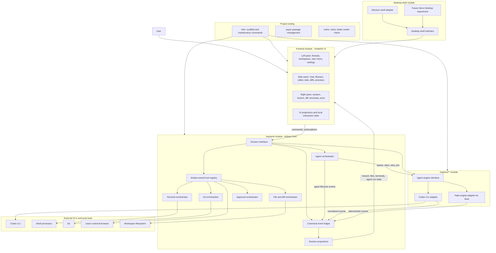

# Artisan Editor PRD

Last updated: 2026-07-22

This is a living PRD for Artisan Editor. It captures the current product
direction and should be updated as new decisions are made during brainstorming.

## Problem Statement

AI coding apps make developers jump between too many partial tools. The chat
surface can often edit files, but the actual development session still depends
on an external editor, detached terminals, unclear process state, and
provider-specific tool behavior that leaks into the product.

T3 Code has an attractive selling point: users can bring their own keys,
subscriptions, and CLI auth instead of paying direct API rates for every model
interaction. However, its product architecture feels too provider-shaped. When
the same conceptual capability, such as internet search, appears under multiple
provider-specific names and behaviors, the UI and core logic become inconsistent.

The user wants an editor that feels precise, fast, and coherent. The product
should not be a loose bundle of chat, file editing, terminals, and provider
quirks. It should be a single live development session with a standard internal
language for agent work.

## Solution

Artisan Editor is an agent-native local development workbench for users who
want the power of CLI/subscription-based coding agents inside a coherent editor
experience.

The application centers on three panes:

- A left navigation pane for thread selection, workspace navigation, user
  account controls, and settings.
- A main pane that switches between chat, Monaco-powered text editing, diffs,
  previews, and other active work tabs.
- A right session pane that shows the live operational state: branch, diff
  summary, changed files, terminal sessions, running processes, ports, and
  agent activity.

The backend/core should treat external agents as engines, not as direct model
API providers. During prototyping, Codex CLI is the sole production engine.
Future engines may be integrated through adapters after the editor/core is
proven. Each adapter translates engine input and output into Artisan's canonical
session model.

The main architectural idea is:

Artisan does not standardize how engines think. Artisan standardizes what the
user can see, review, replay, and trust.

## System Architecture Sketch



The architectural seam is the agent engine interface. Everything above that
seam speaks Artisan's vocabulary. Everything below that seam may be weird,
provider-specific, CLI-specific, or subscription-specific.

The desktop shell is a separate seam from the product core. Electron is the v1
shell choice. Deno Desktop should be treated as a future experiment once its
SvelteKit/SER compatibility and cross-platform feature parity are proven.
Neither shell should define the frontend, backend/core, or engine adapter
interfaces.

## Engine Modules And Conformance Harness

The canonical product term should be `Engine`, not `Provider`. An Engine is an
executable agent harness Artisan can discover, start, resume, steer, cancel, and
observe. Codex CLI is the only production Engine during prototyping. A Provider
is descriptive metadata about the company, authentication source, models, and
rate/subscription context behind an Engine. Core orchestration should depend on
Engines.

Production engine integrations should live in one obvious module with one
folder per engine. The initial shape should be:

```text
modules/engines/src/
  engine.ts
  registry.ts
  codex/
    codex-engine.ts
    codex-process.ts
    codex-protocol.ts
    codex-normalizer.ts
```

Future engine folders should implement the same Engine interface only when a
new executable integration is deliberately selected. Adding a folder should not
silently activate an engine; the backend composition root should register
adapters explicitly so duplicate ids, missing Layers, and unsupported
capabilities fail visibly at build or startup time.

Each Engine should declare capabilities rather than forcing fake parity. Initial
capabilities should include availability/version discovery, authentication
state, start, resume, streaming events, steering, approvals, cancellation,
subagents, model selection, and native tool visibility. Unsupported features
should be explicit capability states, not missing methods or runtime guesses.

### Artisan-Managed Engine Toolchains

Artisan should become the preferred owner and lifecycle manager of its Engine
executables rather than depending on whichever binary happens to resolve from
the user's global `PATH`. The engine picker and settings may offer `Install`,
`Update`, `Repair`, `Pin version`, `Roll back`, and `Use system installation`
actions according to each Engine's distribution capabilities.

Managed Engine installations should follow these rules:

- Install into an Artisan-owned, per-user toolchain directory, never into a
  global package-manager prefix or privileged system directory.
- Keep immutable versioned installations side by side with one atomic active
  pointer. Do not overwrite an executable that owns a running process.
- Pin every running session to the exact Engine version that started it. A
  background update becomes active only for a new or safely resumed session.
- Download in the background, verify the publisher, source, checksum, signature,
  platform, architecture, and expected package contents, then unpack into a
  staging directory before atomic activation.
- Retain at least the last known-good compatible version. If the new Engine
  fails discovery, authentication probing, protocol negotiation, or a bounded
  conformance smoke, quarantine it and restore the previous active version.
- Record installation origin, version, digest, update channel, compatibility,
  health, activation time, and every repair/update decision in a local toolchain
  ledger.
- Never silently replace an independently installed system binary. `Use system
installation` is an explicit advanced mode whose version and health Artisan
  can inspect but whose package-manager ownership it respects.

Artisan may manage Engine configuration and authentication integration, but it
must distinguish owned configuration from user-owned configuration. Prefer a
documented include, profile, namespace, or clearly delimited managed block.
When an Engine only supports one shared mutable file, parse and validate its
native format, preserve unknown fields and comments where possible, show the
planned reconciliation, make a recoverable backup, and use conditional atomic
replacement. Never reduce configuration synchronization to blind file
overwrite.

Credentials remain in the Engine's documented auth store or secure OS-backed
storage. Artisan may invoke the official login flow and report auth health, but
must not copy subscription tokens between Engines or invent an undocumented
credential format. Managed installations, configuration ownership, and auth
ownership are separate states.

The default user experience should be quiet:

- Check compatible managed Engines with randomized background scheduling.
- Download and validate updates without interrupting work.
- Activate safe updates between sessions without prompting.
- Surface UI only for a required login, permission elevation, breaking
  compatibility choice, repeated repair failure, quarantined release, or an
  update that cannot preserve the current session.
- Show concise version, channel, health, and last-update information in Engine
  settings rather than recurring update banners in the workspace.

Engine packages, protocols, model catalogs, and capability manifests must have
independent compatibility ranges. A newer Engine is not activated merely
because its version sorts higher; its adapter protocol and catalog requirements
must be satisfiable by the installed Artisan version.

### Thread Engine Affinity And Deferred Cross-Engine Handoff

For v1, every Artisan thread is locked to the Engine that accepts its first
run. This intentionally matches the conservative T3 Code behavior and avoids
pretending that provider-native sessions are interchangeable.

- A draft thread may change Engine until its first run is durably accepted.
- The first accepted run persists the thread's immutable `engine_id` and native
  session identity.
- Later model changes may occur only inside that Engine and only when its
  declared capabilities support them. Model switching must not imply Engine
  switching.
- Selecting another Engine from a locked thread should offer to start a new
  thread with that Engine. It must not silently copy history, mutate the native
  session, or imply that context was preserved.
- The transcript should make Engine identity and any model changes attributable
  without repeatedly distracting the user.
- Backend validation, not disabled frontend controls alone, must reject a run
  whose Engine differs from the thread's persisted `engine_id`.

Cross-Engine handoff is a deferred investigation, not a v1 promise. The likely
future model is one canonical Artisan thread containing multiple explicitly
bounded Engine epochs, joined by an inspectable provider-neutral handoff
capsule. The capsule would combine a model-authored summary with deterministic
Artisan-owned facts such as objectives, active constraints, decisions, changed
files, Git state, tests, processes, approvals, unresolved work, and source
provenance.

Native compaction cannot be treated as a universal export contract. Research as
of 2026-07-22 found:

- Claude Code can expose the generated text through its documented
  `PostCompact.compact_summary` hook.
- OpenCode persists a readable summary message that can be retrieved through
  its session-message API.
- Codex app-server exposes a `contextCompaction` marker but no supported summary
  text; private rollout replacement history is unstable and may be opaque or
  encrypted.
- Grok Build can compact, but does not document a stable structured summary
  payload for CLI/ACP integrations; xAI API compaction state may be opaque and
  reusable only by xAI.
- Antigravity has no confirmed public compaction-summary integration surface.

Future adapter capabilities should therefore separate:

- `can_request_native_compaction`
- `can_read_native_compaction_summary`
- `can_reuse_native_compacted_state`
- `native_compaction_portability`

Before enabling cross-Engine continuation, investigate summary fidelity,
constraint retention, deterministic workspace capture, provenance, capsule
schema/versioning, token bounds, user inspection/editing, failed handoff
recovery, switching back after another Engine modifies the workspace, and
whether the destination Engine can distinguish imported context from user
instructions. Do not scrape undocumented transcript files or encrypted native
state to manufacture support.

Unit parser tests are necessary but not an adequate release gate. Artisan needs
an Engine Conformance Harness that exercises the Engine interface and the real
process boundary. Test infrastructure should live outside production source:

```text
.tests/engines/
  harness/
  scenarios/
  fixtures/
    codex/
  conformance/
  live/
```

The harness should support three interchangeable engine backends:

- A deterministic fake executable launched as a real child process, exercising
  stdin, stdout, stderr, chunk boundaries, backpressure, signals, and exit codes.
- Recorded and sanitized native transcripts replayed byte-for-byte, preserving
  fragmentation, delays, malformed frames, and provider schema drift cases.
- Opt-in live runs against the locally installed Engine for compatibility smoke
  testing and new-fixture recording; paid/subscription-backed live tests should
  never run silently in ordinary CI.

An Engine Scenario should describe user inputs, native process frames, timing or
fault injections, expected canonical events, expected final projections, and
cleanup invariants. The same scenario should be runnable against the fake
executable, transcript replay, and a compatible live Engine where practical.

The conformance suite should cover discovery, startup, normal completion,
stream fragmentation, interleaved stdout/stderr, approvals, steering,
cancellation, resume, process crash, timeout, malformed output, duplicate native
events, abrupt transport loss, backend restart, and orphan-process cleanup.

The deepest integration harness should run a real backend runtime with a
temporary workspace, temporary Git repository, temporary SQLite database,
in-memory or MessagePort transport, deterministic clock/ids, and a fake Engine
process. It should drive commands through the public protocol router and assert
only observable protocol output, durable ledger records, rebuilt projections,
filesystem/git effects, and process cleanup.

Property and state-machine tests should enforce invariants across generated
action sequences: one durable acceptance per command id, no duplicated side
effects after retry, contiguous per-stream sequences, replay-equivalent
projections, terminal states after every process exit, correlated observable
actions, and no leaked processes or handles.

## Quiet Application Updates And Self-Healing

Artisan application updates should be background infrastructure, not a recurring
conversation with the user. Signed compatible releases should download and
stage while Artisan is running, then apply automatically after a clean close or
on the next launch. An active Engine run, filesystem mutation, database
transaction, or unresolved approval must never be interrupted to install an
update.

The Electron application itself should not attempt arbitrary live code patching.
The main process, Electron runtime, native modules, preload, renderer bundle, and
backend utility form one signed release unit and change together across a
restart. Data-only assets such as the model catalog may refresh live only when
they are separately versioned, signed, schema-validated, compatibility-checked,
and incapable of introducing executable code.

Release behavior should include:

- Background checks after startup and periodically with jitter, not modal
  startup prompts.
- Differential downloads where supported, immutable versioned artifacts,
  HTTPS, checksums, platform signing, and macOS notarization.
- Staged rollout cohorts with a server-side kill switch before broad release.
- A durable update state machine and local structured diagnostics visible from
  settings when troubleshooting is needed.
- A consistent snapshot before an irreversible persistence migration and a
  post-update health gate covering the main process, backend utility, renderer,
  database, and managed Engine registry.
- Retention of the previous known-good application release. Repeated early
  startup failure should let a small launcher/watchdog restore that release
  before opening the user's workspace.
- A signed repair action that can re-download the current release and rebuild
  derived caches without touching user projects, conversations, credentials, or
  canonical ledger data.

Windows should use the existing NSIS packaging path with an updater that stages
and applies on exit. macOS should use signed and notarized application artifacts.
Linux package-manager installations should remain owned by their package
manager; a portable AppImage may opt into application-managed updates. Store
policies take precedence for store-distributed builds.

The ordinary workspace should show no update banner. Update UI appears only for
security-critical restarts, blocked migrations, prolonged incompatibility,
failed/quarantined updates, or a user-requested manual check. A passive status
and update history belong in settings.

## Frontend-Backend Contract

Artisan should have a hard frontend/backend split. The frontend is the UI
renderer and interaction surface. The backend/core is the session state machine,
side-effect owner, event ledger, and engine/tool orchestrator.

The contract should be a typed Artisan protocol rather than ad hoc IPC calls.
The protocol should make every important action traceable, replayable, and
testable.

Principle:

Frontend sends intent. Backend emits facts.

Protocol shape:

- Commands: user or UI intents sent from frontend to backend.
- Events: append-only facts emitted by backend after something happens.
- Queries: request/response reads for initial state, details, and paginated
  history.
- Projections: backend-owned derived state streamed to the frontend for easy UI
  rendering.
- Acknowledgements: lightweight delivery/acceptance receipts exchanged by both
  sides so neither side has to guess whether a command or event was received.
- RPC: allowed for bounded request/response operations, but not as the main
  source of truth.

Examples:

- `command.send_message`
- `command.open_file`
- `command.steer_agent`
- `command.kill_terminal`
- `command.install_marketplace_item`
- `event.message_received`
- `event.agent_status_updated`
- `event.file_changed`
- `event.terminal_output`
- `event.git_status_changed`
- `event.approval_requested`
- `projection.thread_list_updated`
- `projection.session_summary_updated`

Every command and event should carry trace metadata:

- `id`: unique id for this command or event.
- `schema_version`: version of the payload contract.
- `timestamp`: backend-created event time, or frontend-created command time.
- `thread_id`: current thread/session.
- `run_id`: active agent run when applicable.
- `agent_id`: active agent when applicable.
- `correlation_id`: links a command to resulting events.
- `causation_id`: points to the immediate event/command that caused this item.
- `origin`: `frontend`, `backend`, `engine`, `marketplace`, `mcp`, `terminal`,
  or `system`.
- `raw_origin`: optional pointer to provider/native payload when one exists.

Reliability rules:

- Commands and events should be at-least-once delivered and idempotently
  applied.
- The frontend should assign a stable command id before sending a command.
- The backend should ACK command receipt quickly with `accepted`, `rejected`,
  or `duplicate`.
- `accepted` means the command is durably accepted for processing, not that all
  resulting work has completed.
- The backend should emit one or more events correlated to the accepted command.
- The frontend should ACK the highest contiguous event sequence it has applied
  per stream, so the backend can resume from the correct point after reconnects.
- The backend should attach monotonically increasing sequence numbers per
  stream, such as per thread/session, to support resume and gap detection.
- If the frontend detects a missing sequence number, it should request replay
  from the last acknowledged sequence.
- If a command ACK is not received before a timeout, the frontend should retry
  the same command id rather than create a new command.
- Retried commands must not duplicate side effects. The backend should return
  the prior command receipt or current status for duplicate command ids.
- The protocol should include heartbeats so both sides can distinguish idle
  connections from broken connections.
- Reconnect should follow a simple flow: authenticate/open stream, send last
  applied sequence, replay missed events, then resume live events.

Frontend rules:

- The frontend must not talk directly to engine adapters, shells, terminals,
  git, filesystem, MCP servers, or provider config files.
- The frontend renders projections and sends commands.
- Local UI state is allowed for ephemeral interaction details such as hover,
  selected tab, local draft text, split sizes, and open popovers.
- Durable session state belongs to the backend/core.
- Optimistic UI is allowed only when the command/event contract defines how to
  reconcile success, failure, and rollback.

Backend rules:

- The backend validates commands, performs side effects, appends events, and
  updates projections.
- The event ledger is the durable source of truth.
- Projections can be rebuilt from the ledger plus current external snapshots.
- Engine adapters translate provider/native output into Artisan events before
  the frontend sees it.
- All transports must preserve the same protocol shape whether the app uses
  Electron IPC, WebSocket, local HTTP, or an in-process test adapter.

This makes the app feel like a clean product instead of a frontend that knows
too much about every CLI, MCP, terminal, and provider quirk.

## V1 Transport And Persistence

The production boundary is the standalone **Artisan Forge** daemon. It owns the
Effect backend runtime, SQLite/migrations, Codex and PTY subprocesses, and the
immutable web application. It exposes the existing versioned Artisan protocol
over a loopback WebSocket and serves the frontend from the same HTTP origin.

`ae` is the stable product CLI and Artisan Forge is the daemon it controls.
The V1 command contract is `ae setup`, `ae start`, `ae stop`, `ae restart`,
`ae status`, `ae logs`, `ae doctor`, and `ae open`; `ae start --foreground`
keeps Forge attached for containers, VMs, and service wrappers. Named profiles
own loopback listener configuration, canonical data/project roots, a private
control secret, an exact runtime ownership record, logs, and optional
current-user autostart. Profile and secret material must be schema-decoded,
written atomically, reject symlink traversal, and use a private Windows
DACL/POSIX mode.

Electron is a thin client and launcher. It owns only the application window,
native title-bar behavior, folder selection, taskbar state, and supervision of
its app-owned Forge process. It must not construct the backend runtime, open the
database, or broker routine application traffic. The installed package starts
the separately named `Artisan Forge.exe`, passes configuration through its
environment, waits for a structured readiness record, and loads Forge's HTTP
frontend. Its bearer control token stays in the main process: Electron exchanges
it for an HttpOnly `SameSite=Strict` browser session and exposes only a
token-free WebSocket endpoint plus the narrow native bridge to the renderer.

The same backend must run without Electron for browser-only and VM use. Headless
mode serves the identical frontend and WebSocket endpoint. It binds loopback by
default; remote use starts with SSH local forwarding. Direct non-loopback TCP
and managed TLS are fail-closed until their certificate, authentication, and
remote-root policy is implemented. A browser never silently
spawns a local daemon and instead connects to one already running. Electron and
headless launches use the same protocol, persistence, frontend build, and Engine
composition.

Browser and Electron clients must have product feature parity. Native shell
facilities may improve an interaction, but they must not create desktop-only
product capabilities. Project selection is backend-owned: browser clients browse
bounded server roots through opaque directory identities, while Electron may
offer a native picker as a convenience. Both paths must resolve to the same
canonical `ProjectRef`, create the same durable thread/project state, and use the
same public Artisan protocol. A browser must never be left at a message that a
core workflow is available only in the desktop app.

The previous Electron utility-process/MessagePort host and custom
`artisan://` static protocol are superseded. MessagePort remains a useful
in-process test adapter, not the production desktop topology.

The transport is only the delivery mechanism. Artisan owns a transport-safe,
versioned wire protocol defined with Effect Schema in a shared protocol module.
That module should contain schemas and inferred data types only, with no
Electron, filesystem, engine-adapter, or database dependencies.

The wire protocol should use a discriminated envelope containing:

- `protocol_version`: negotiated connection-level protocol version.
- `kind`: message category such as hello, command, receipt, query, result,
  subscription, snapshot, patch, event, stream chunk, stream end, or error.
- `message_id`: stable unique identity used for tracing and retry deduplication.
- `correlation_id`: link from a receipt, result, or event to its originating
  command or query when applicable.
- `sequence`: backend-issued ordering cursor within one named event or
  projection stream when applicable.
- `journal_sequence`: global append position used for durable audit and command
  receipts; it is distinct from the stream-local sequence used for gap detection.
- `sent_at`: transport timestamp encoded as an ISO string.
- `payload`: the kind-specific, Effect-Schema-validated body.

### Protocol Routing

Artisan still needs an application router, but it should route typed protocol
messages rather than HTTP methods and URL paths. WebSocket is the production
duplex transport; the protocol router is the application boundary that decodes an
envelope, validates its payload, dispatches it to the owning backend capability,
and encodes correlated output.

Routing should happen in two stages:

- The envelope router dispatches connection and delivery concerns by `kind`,
  including hello/version negotiation, commands, queries, subscriptions,
  stream control, ACKs, heartbeats, and protocol errors.
- Domain routers dispatch the validated payload by its canonical `type`, such
  as `thread.send_message`, `agent.steer`, `terminal.write`, `file.open`, or
  `marketplace.install`.

Each backend domain module should own its schemas and handlers. The application
composition root should combine those handlers into an explicit, statically
typed router rather than one global switch statement or a runtime plugin bag.
Effect handlers should obtain persistence, engine, terminal, filesystem, and
other capabilities from Services. Layers should construct and compose those
Services at the backend runtime boundary; protocol payloads should contain
domain input, not passed-through dependency objects.

The renderer should consume a typed protocol client rather than manipulate
WebSocket frames directly. For request/response interactions, the client should keep
a pending-request table keyed by `message_id` and resolve it when a correlated
result or error arrives. Commands should first receive a durable receipt, then
surface progress and completion through correlated events or projection
updates. Subscriptions should be keyed by `subscription_id` and receive an
initial snapshot followed by ordered patches.

This protocol router is the transport-neutral equivalent of an HTTP router. A
future HTTP adapter could map methods and paths into the same command/query
types, and a WebSocket adapter could carry the envelopes directly, without
changing domain handlers or frontend-facing semantics.

Although MessagePort supports the Structured Clone algorithm, the canonical
protocol should deliberately use portable, JSON-compatible values. IDs and
timestamps should be strings. Database entities, Effect values, functions,
class instances, Electron objects, Node streams, and provider-native objects
must not cross the boundary directly. Binary terminal data may use transferable
`Uint8Array` or `ArrayBuffer` payloads.

V1 should preserve two logical traffic classes:

- A control port for commands, receipts, queries, approvals, steering,
  projection snapshots, projection patches, and protocol health.
- A stream port for high-volume terminal bytes, model text deltas, and verbose
  process output.

The WebSocket adapter multiplexes those classes without changing their
independent sequence and bounded-buffer contracts. Separating control and stream traffic prevents terminal or model output from
delaying cancel, approve, steer, or other latency-sensitive actions. Stream
chunks should use sequence numbers, batching, and bounded buffering, but should
not each require durable journal writes or individual ACK round trips.

Connection startup should negotiate a supported protocol version and include
the frontend's last applied cursor. The backend should respond with the selected
version and either replay missed durable updates or send a fresh projection
snapshot. A command receipt should be emitted only after the command has been
durably accepted in SQLite; later events communicate progress and completion.
Rejected commands should receive a correlated `rejected` receipt with a stable
error code and retryability hint. Malformed messages that cannot be trusted
enough to correlate should receive an uncorrelated protocol-error envelope.

SQLite should be the boring, reliable local source of truth for the canonical
event ledger, command deduplication records, and rebuildable projections. It
should run in WAL mode. Large raw engine payloads and artifacts may live outside
SQLite, with stable references recorded in the ledger.

Drizzle ORM is the selected persistence toolkit. As of 2026-07-10, Drizzle 1.0
stable has not shipped; v1 development should pin the current Drizzle 1.0 RC and
its matching Drizzle Kit RC. The backend should use Drizzle's native Effect 4
SQLite driver with the matching Effect 4 and Effect SQLite Node prereleases.
The older standalone Effect-to-Drizzle adapter should not be used for this
stack.

Drizzle must remain an implementation detail behind backend persistence
interfaces such as the journal store and projection repositories. Protocol and
domain types should come from Effect Schema rather than Drizzle table inference.
Appending accepted commands and resulting events, updating deduplication state,
and applying synchronous projection changes should share one SQLite transaction
where their consistency depends on one another.

The transport and persistence seams should remain independently replaceable. A
future remote or browser client may bridge the same protocol over WebSocket,
while bounded administrative or health operations may use HTTP. Neither choice
should change engine adapters, core command handlers, journal semantics, or
frontend projection models.

## Surface Layer Taxonomy

Artisan needs a hard surface layer that normalizes engine-specific nouns into
Artisan-owned product concepts. Codex timers, Claude-style sessions, skills,
`AGENTS.md`, hooks, MCP servers, and future engine features should not leak into
the UI as unrelated vendor objects.

The surface layer should expose canonical groups:

- Work: threads, turns, agent runs, messages, plans, and run status.
- Agents: coordinator agents, worker agents, roles, delegated tasks, agent
  rosters, agent threads, fan-out groups, joins, and handoff summaries.
- Time: timers, reminders, monitors, scheduled runs, follow-ups, and recurring
  checks.
- Guidance: `AGENTS.md`, rules, memories, custom instructions, project
  instructions, prompt templates, and engine-specific guidance files.
- Routines: skills, slash commands, reusable prompts, workflows, and agent
  recipes.
- Capabilities: tools, MCP servers, app connectors, browser/computer use, web
  search, and engine-owned native tools.
- Engines: Codex CLI, future executable adapters, model profiles, engine
  profiles, auth state, and executable health.
- Workspace: repositories, workspaces, files, directories, symbols, tabs,
  previews, ports, and browser targets.
- Processes: terminals, shell commands, dev servers, background tasks, and
  process logs.
- Changes: file edits, diffs, patches, git status, commits, branches, stashes,
  and pull requests.
- Permissions: approvals, sandbox modes, trust prompts, destructive actions,
  secrets, credentials, and access scopes.
- Knowledge: attached context, search results, external docs, indexed files,
  diagnostics, and captured terminal output.
- Identity: local user, machine identity, workspace account, organization, and
  engine login identity.
- Settings: app preferences, project preferences, engine config, keyboard
  shortcuts, appearance, and notification settings.

Each surface item should keep both a canonical Artisan shape and the raw origin
metadata. For example, a Codex automation, reminder, or monitor should appear to
the rest of the app as a `Timer`, but its raw Codex payload should remain
available for debugging and round-tripping.

The surface layer should be strict about naming. The UI should say `Timer`,
`Routine`, `Guidance`, `Capability`, `Engine`, `Process`, and `Change` instead
of switching vocabulary per provider.

## Harness Policy

Artisan should be more than a CLI wrapper. It should be an interaction harness
around external agent engines.

A thin CLI wrapper would only spawn Codex, mirror its output, and accept its
product decisions as Artisan's product decisions. That is not enough. It would
preserve the exact problems Artisan is meant to fix: mismatched tool names,
inconsistent clarification behavior, hidden terminal state, and
provider-specific UI clutter.

The harness owns:

- Intake: how user requests enter a session.
- Clarification: when the system asks questions before or during work.
- Session policy: engine, model, permissions, sandbox, search, and effort.
- Surface taxonomy: canonical names for work, time, guidance, routines,
  capabilities, processes, changes, and permissions.
- Event normalization: raw engine output becomes Artisan events.
- Review state: changed files, diffs, terminal state, approvals, and errors.
- Steering: follow-up input, interruption, cancellation, and resume.

External engines own:

- Their model loop.
- Their native tool execution when Artisan cannot or should not intercept it.
- Their subscription/auth behavior.
- Their engine-specific transcript and raw payloads.

Clarification policy:

- Artisan should allow clarification in normal work mode, not only in a special
  planning mode.
- If a user request is materially ambiguous, risky, or missing required
  parameters, the harness should surface a `Question` event before execution.
- Engine-native clarification requests should be normalized into the same
  `Question` surface item.
- If an engine does not naturally ask clarifying questions, the harness may run a
  lightweight intake/planning pass or apply an Artisan instruction layer that
  tells the engine to ask before acting when uncertainty is high.
- The default should be: ask when the answer materially changes the work; make a
  reasonable assumption when ambiguity is low risk; record the assumption in the
  session.
- The user should be able to choose a stricter execution mode for trusted tasks,
  but strict mode should be a session policy, not a hardcoded engine behavior.

Live steering policy:

- When an engine supports live steering, follow-up messages sent while an agent
  run is active should steer the active run immediately instead of being queued
  as a later turn.
- This should be default-on for steering-capable engines because it matches the
  user's intent: "tell the thing currently working what I just realized".
- The setting should be toggleable as a simple session preference such as
  `Auto-steer follow-ups`.
- The toggle should live in the right session pane with other low-frequency
  session controls, not inside every message bubble.
- Sending a steering message should require no extra confirmation or click when
  the toggle is on and the target is unambiguous.
- If the active engine does not support live steering, Artisan should queue the
  message as the next turn and show that it was queued.
- If multiple agents are running, the steering target should be the selected
  agent/thread or coordinator. If there is no clear target, Artisan should show
  a compact target picker rather than guessing.
- If the engine rejects or loses a steering message, Artisan should fall back to
  queueing and surface a visible status/error.
- The event ledger should distinguish `steering_message` from `queued_message`
  so replay and debugging can explain how the input was routed.

## Hybrid Harness And MCP Policy

Artisan should use a hybrid harness model.

The harness should expose an Artisan-owned control plane to engines, ideally
through MCP-style tools where the engine supports them. Those tools should cover
actions where Artisan needs direct visibility, user trust, or consistent UI:

- Ask a user question.
- Record an assumption.
- Update visible agent/thread status.
- Start, read, write to, restart, and stop terminals.
- Read and write workspace files when Artisan wants first-class diff tracking.
- Query git status and diffs.
- Open local previews in the user's external browser and inspect their backend
  health/metadata without embedding the page in Artisan.
- Request approval for risky actions.
- Record a native engine action when the engine used something Artisan does not
  directly control.

Expensive or provider-native actions should remain engine-owned when that is
better for user cost, subscription usage, or implementation simplicity. Examples:

- Provider-native web search.
- Engine-native context retrieval.
- Engine-owned codebase search.
- Model-side browsing or citations.
- Provider-side reasoning/search features.

The rule is:

Artisan owns the user-visible action format. The engine may own the underlying
implementation.

For engine-owned actions, Artisan should use the best available normalization
path:

1. Parse structured engine output when the engine exposes tool events.
2. Ask the engine, via system/developer instructions, to report native actions
   through an Artisan MCP tool when available.
3. Fall back to transcript observation and raw event capture when native action
   details are not observable.
4. Record unknown or opaque native work as an `engine.native_action` event with
   whatever metadata is safely available.

This keeps the UI unified without forcing Artisan to reimplement or rebill every
provider capability. A user should see `Search`, `Question`, `Terminal`,
`Change`, `Approval`, and `Timer` regardless of whether the underlying action
was performed by Artisan, Codex, or a future engine.

## Multi-Agent Orchestration

Artisan Editor should be multiple-agent native from the start. Parallel agents
should not feel like a hidden CLI trick, a terminal transcript detail, or a
bolted-on advanced mode.

The product should have an `AgentOrchestrator` module as a first-class backend
module. Its interface should stay small:

- Start an agent run or fan-out group from a user request, plan step, or
  explicit orchestration command.
- Assign each agent a role, scope, engine, model/profile, workspace, and
  permission policy.
- Track lifecycle states such as queued, running, waiting, blocked, joining,
  summarized, stopped, failed, and complete.
- Steer a running agent with follow-up instructions.
- Stop, pause, resume, or close an agent thread.
- Join multiple agent results into a synthesized answer, review set, or
  implementation plan.

Everything complicated should live behind that module: native engine subagent
features, CLI thread switching, shared-workspace mutation coordination, sandbox
inheritance, approval routing, result summarization, conflict detection,
timeout handling, and cost/usage visibility.

Artisan should model agents as product objects:

- `agent_id`: durable Artisan identity for a spawned agent instance.
- `display_name`: human-readable name shown in the UI.
- `role`: derived behavior category such as reviewer, explorer, implementer,
  tester, researcher, summarizer, or custom. It should come from the selected
  agent profile or assignment, not from a separate decorative label.
- `engine`: Codex CLI today, or a future engine adapter after the core is proven.
- `native_agent_name`: provider-specific agent name, if the engine has one.
- `native_display_name`: provider-specific nickname or label, if the engine has
  one.
- `scope`: repo, files, change set, issue, test command, terminal, or document
  set.
- `status`: current lifecycle state.
- `summary_contract`: what the agent must return to the coordinator.
- `artifacts`: findings, diffs, logs, branches, terminal sessions, and files
  produced by that agent.

Durable orchestration model:

- An `orchestration_group` is one visible fan-out graph owned by a parent
  Artisan thread. It records the coordinator, policy, aggregate state, and join
  strategy.
- An `agent_instance` is the durable Artisan identity and display personality.
  It may participate in more than one assignment over its lifetime, while each
  provider-native identity remains origin metadata.
- An `assignment` is a bounded unit of delegated intent: role, scope,
  instructions, permissions, workspace, expected result, and parent graph
  node. Reassignment creates a new assignment rather than mutating history.
- An `agent_run` is one execution attempt for an assignment. Retries and engine
  failover create new runs linked to the same assignment, preserving every
  attempt and its native resume identity.
- A `join` is an explicit graph node that waits for selected upstream
  assignments and applies a named strategy such as synthesize, review,
  first-success, or require-all. Joins are durable work, not an implicit final
  prompt hidden inside the coordinator transcript.
- Graph edges express dependency and result flow. They must never be inferred
  later from timestamps or nested provider transcripts.
- Group, assignment, run, and join transitions use monotonic durable state
  machines. Provider events may enrich them but cannot reopen a terminal
  attempt.
- Dispatch uses durable leases and an outbox so a backend restart can recover
  unstarted work, mark abandoned attempts interrupted, and retry only when the
  assignment policy permits it.
- The public protocol exposes graph snapshots and ordered patches. Raw native
  subagent events remain inspectable, but the frontend never reconstructs the
  orchestration graph from provider-specific output.

### Shared Workspace Collaboration Contract

Artisan should follow the user's existing Git mental model rather than replacing
it with hidden agent infrastructure. The user opens a project, chooses or creates
the branch that represents the intended body of work, and then asks agents to
work. From that point onward, the visible checkout is the work. Every accepted
agent edit should appear in that checkout, in its ordinary `git diff`, and in the
pull request created from that branch.

The user should never need a cleanup session to discover which worktree, hidden
branch, temporary commit, or agent-owned directory contains the implementation.
There must be one obvious answer to "where is my work?": the workspace and branch
currently shown by Artisan. The right pane's branch, changed-file, and diff state
must describe that same checkout rather than an aggregate reconstructed from
hidden copies.

This produces the following product invariants:

- All agents in an orchestration group collaborate in the same checked-out
  workspace and current branch, whether that branch is `main`, `master`, or a
  user-selected feature branch. Accepted changes become immediately visible to
  every other agent working there.
- Artisan must never create, attach, hide, retain, or clean up Git worktrees for
  agent isolation. Provider features that normally create worktrees must be
  disabled, bypassed, or adapted before they can run as an Artisan writer.
- Artisan must not silently create per-agent branches or temporary commits to
  coordinate ordinary edits. Branch creation, checkout, commit, merge, rebase,
  and push remain explicit user-visible Git actions.
- The Artisan mutation protocol, durable change ledger, and bounded claims are
  the concurrency authority. They attribute edits, serialize or reject
  overlapping writes, expose conflicts, and recover interrupted mutations in
  the shared checkout.
- Agents must read the latest accepted workspace state before applying a change.
  An agent cannot continue writing against a private stale copy while another
  agent's accepted edits remain invisible to it.
- Non-overlapping claims may execute concurrently. Overlapping claims must be
  queued, rejected, or returned for explicit reconciliation; Artisan must not
  solve the overlap by silently forking the filesystem.
- Starting, stopping, retrying, or deleting an agent must not move its work to a
  different directory. Completed and partial accepted changes remain visible in
  the shared workspace and retain their operation and agent attribution.
- A Git repository must not be required for change tracking, review, rollback,
  or multi-agent collaboration. Git remains an optional integration for status,
  commits, remotes, pull requests, and user-directed branch operations after
  Artisan has coordinated the live workspace.
- Work that genuinely requires an incompatible dependency tree or destructive
  experimentation should use a separately opened project workspace chosen
  explicitly by the user. Artisan must present that as a different workspace,
  not disguise it as an implementation detail of the current task.

The no-worktree rule is a product guarantee, not a default that providers,
models, advanced settings, or orchestration policies may override. If an engine
cannot perform a write-capable assignment without creating a worktree, Artisan
should report that capability as unsupported and use another execution path.

Agent name bank:

- Artisan should let the user provide a custom list of playful agent display
  names.
- The default name bank should feel a little silly and warm rather than
  monotonous or enterprise-flat.
- Agent display names should be Artisan-owned. Provider names and provider
  nicknames remain raw origin metadata.
- Names should be unique within a visible fan-out group when possible.
- If the name bank is exhausted, fall back to a role-aware suffix such as
  `Sprocket 2` rather than reverting to provider labels.
- The role should remain visible separately from the display name. For example,
  a row can pair a playful name with `Explorer`, `Reviewer`, or `Tester` so the
  UI keeps both personality and clarity.
- This should be one focused setting, not a provider-by-provider nickname
  control panel. A simple editable list is enough for v1.
- When an engine supports native display nickname pools, such as Codex
  `nickname_candidates`, Artisan may mirror the user name bank into that engine
  adapter where safe. The Artisan `display_name` remains the source of truth in
  the UI.

UI requirements:

- The main pane should include an `Orchestrator` mode as the detailed
  multi-agent workspace.
- The right pane may show a compact current-agent or fan-out summary, but it
  should not be the only place to inspect orchestration.
- Users should be able to inspect each agent thread, terminal attachments,
  files touched, approvals, and final summary.
- Users should be able to name or rename visible agent instances when useful.
- Fan-out groups should show topology, not just a flat list: coordinator,
  workers, joins, and final synthesis.
- Agent rows should use the same live status language as threads, including
  specific observable actions over generic `Thinking`.
- Agent rows should use the same two-line identity/status pattern as thread
  rows:

    ```text
    Bob
    -> Refactoring your landing page.
    ```

- The first line is the stable, playful `display_name`.
- The second line is a live work description supplied by the agent or
  coordinator, not a duplicate of the role label.
- Examples: `Gibby -> Auditing the routing layer`, `Bob -> Refactoring your
landing page`, `Sprocket -> Running the visual regression tests`.
- Multi-agent work should support keyboard and command-palette actions such as
  steer, stop, open thread, open diff, promote finding, and summarize now.

Agent status heartbeat:

- Artisan should provide a tiny status update tool/event that agents can call
  after assignment and at meaningful transitions.
- The status update should accept compact fields such as `agent_id`,
  `short_description`, `current_action`, `blocked_reason`, `confidence`, and
  `updated_at`.
- The call should be cheap and invisible in the main transcript. It updates the
  orchestrator roster and event ledger projection.
- The coordinator should request this status immediately after delegating work,
  so the user does not stare at generic agent names while workers spin up.
- The status should be human, specific, and present-tense: `Refactoring the
landing page`, `Comparing auth adapters`, `Waiting on test output`.
- Status descriptions must not reveal private chain-of-thought. They describe
  observable work and intent, not internal reasoning.
- If an agent cannot provide a status, Artisan falls back to the assignment
  summary or observable tool state.

Codex mapping:

- Current Codex docs say subagent workflows are enabled by default, but Codex
  only spawns subagents when explicitly asked.
- Codex has built-in agents such as `default`, `worker`, and `explorer`.
- Custom Codex agents are defined as TOML files under `~/.codex/agents/` or
  `.codex/agents/` and require `name`, `description`, and
  `developer_instructions`.
- Codex identifies a custom agent by its `name` field.
- Codex does not expose a separate `role` field in the custom agent schema.
  The agent `name`, `description`, and `developer_instructions` effectively
  define the role. Artisan should keep `role` as its own canonical field.
- Artisan `role` should be useful, not ornamental. It should drive or derive
  from behavior: default instructions, tool access, write permissions, model or
  effort preference, expected summary format, UI icon, and orchestration rules.
  If a role does not affect any behavior or projection, it should be omitted and
  derived from the agent profile instead.
- Codex supports optional `nickname_candidates` so the app/CLI can show
  readable display nicknames for spawned agents. Those nicknames are
  presentation-only; the underlying agent identity remains the custom agent
  `name`.
- Artisan should map all of this into its own agent identity model instead of
  leaking raw Codex subagent naming into the UI.

Design rule:

Artisan owns the orchestration graph. Engines may provide native subagent
mechanics, but Artisan owns the visible roster, lifecycle, naming, summaries,
and review surfaces.

## Lab-Native Engine Stance

Artisan should not try to become a Pi-style unified model/provider runtime for
v1.

The model labs usually know how to tune their own harnesses for their own
models: tool schemas, prompting style, context handling, planning behavior,
search/browsing behavior, permission flows, and provider-native optimizations.
Artisan should preserve those advantages by treating Codex CLI, and deliberately
selected future lab-native tools, as engines.

The product job is not to replace every lab harness. The product job is to make
lab-native engine work visible, steerable, reviewable, and consistent inside one
desktop workbench.

This means:

- Prefer lab-native CLIs/harnesses for v1 engines.
- Avoid building a generic multi-provider model runtime as the v1 core.
- Keep model/provider abstraction out of the main product interface.
- Normalize engine output into Artisan surfaces after the engine runs.
- Use Artisan MCP-style tools for local/control-plane actions where unified UX
  matters.
- Let provider-native capabilities stay native when that preserves quality,
  cost, or subscription value.

Pi remains useful as a reference for RPC/events/extensibility, but it is not the
product direction for Artisan Editor.

## Rich Link Rendering

Links in chat, tool output, search results, and markdown previews should render
as resolved link surfaces when practical.

Preferred display:

- Favicon or site icon.
- Page title.
- Hostname as secondary text.
- Original URL available on hover/copy.

Fetching strategy:

1. Normalize and validate the URL.
2. Check an in-memory and persistent metadata cache keyed by canonical URL.
3. Fetch the HTML with a short timeout, redirect limit, response-size limit, and
   safe user agent.
4. Extract title from `og:title`, then `<title>`, then hostname fallback.
5. Extract icon candidates from `link[rel~="icon"]`,
   `link[rel="apple-touch-icon"]`, `og:image` only as a last visual fallback,
   and `/favicon.ico`.
6. Resolve relative icon URLs against the final response URL.
7. Cache successful and failed lookups with separate TTLs.
8. Render a quiet unresolved state while metadata is loading.

Security and privacy rules:

- Fetch link metadata from the backend, not directly from the renderer.
- Do not fetch private/local network URLs unless the user explicitly opts in for
  that workspace.
- Strip credentials from displayed and cached URLs.
- Avoid sending cookies or user browser credentials.
- Cap response size and never execute page scripts.
- Preserve the original URL even when metadata resolution fails.

## External Browser Policy

Artisan Editor must never ship an integrated browser, WebView, browser tab, or
embedded page-preview surface. Electron's Chromium runtime exists only to render
the Artisan application UI; it is not a general-purpose browser bundled into the
product experience.

Reasons:

- Embedded browsers add substantial memory use and interaction lag.
- WebView and app-level scaling frequently diverge from the user's real browser.
- The user's extensions, profiles, cookies, developer tooling, accessibility
  configuration, and browser preferences are absent or incomplete.
- Maintaining a second browser surface creates security and compatibility work
  that does not improve Artisan's core coding workflows.

Preview behavior:

- Opening a local web preview launches the user's configured external browser.
- Artisan may own preview-server lifecycle, port discovery, health, logs, and
  URL state, but it does not render the page.
- Browser inspection or automation must use an explicit external-browser
  connector/session and remain attributable; it must not silently create an
  embedded browser.
- File, Markdown, image, diff, and code previews may still render as native
  Artisan editor surfaces because they are not general web browsing.

## Thread Retention Policy

Artisan should keep the thread list clean by default.

Default behavior:

- Automatically delete inactive chats after `7` days with no activity.
- The retention policy is enabled by default.
- The user can toggle automatic deletion off.
- The user can change the retention duration later, but v1 should default to `7`
  days.

Activity should include:

- User message sent.
- Agent run started.
- Agent run completed or failed.
- File or diff activity attached to the thread.
- Terminal/process activity explicitly attached to the thread.
- Manual rename, pin, archive, or restore.

Deletion behavior:

- Pinned threads should not be auto-deleted.
- Archived threads should follow the same retention policy unless the user later
  chooses a separate archived-thread retention setting.
- The app should run retention cleanup on startup and periodically while open.
- If safe to implement, deletion should be recoverable for a short grace period;
  otherwise v1 should at least make the policy clear in settings.

## Thread Identity And Status

Thread names should not be one-shot summaries of the first prompt. They should
live and update as the conversation grows.

Sidebar thread rows should use a two-line pattern:

```text
<thread name>
-> <live status>
```

Examples:

```text
Artisan engine adapter
-> Thinking about your message...

Terminal orchestrator
-> Patching the failing test...

Left pane design
-> Waiting for your reply
```

Thread naming rules:

- Generate an initial title from the first meaningful user request.
- Keep titles short, ideally `3` to `6` words.
- Treat user-edited titles as sacred. Once a user manually renames a thread,
  never auto-rename it.
- Automatically refine the title throughout the thread while it remains
  auto-managed.
- When a thread pivots substantially, update the auto-managed title to match the
  current work.
- Use the thread's current goal, artifacts, changed files, and recent activity
  when refining the title, not only the first message.
- Avoid changing the title on every small message. Update it when the thread's
  center of gravity actually changes.

Live status rules:

- The status line may change frequently.
- It should describe the current action or state in plain language.
- Examples include `Thinking about your message...`, `Reading files...`,
  `Patching the bug...`, `Running tests...`, `Waiting for approval`,
  `Waiting for your reply`, `Reviewing changes...`, and `Idle`.
- The status line should not be a second title.
- The arrow symbol visually separates stable identity from live state.

Implementation idea:

- After each meaningful user message or run transition, run a tiny thread
  metadata refinement pass.
- The refinement pass should update only compact metadata: proposed title,
  current status, current goal, and optional rename suggestion.
- The pass should be token-cheap and should not flood the main transcript.
- The pass can be skipped when the engine event stream already provides a clear
  live status.
- The pass must respect the user-renamed-title lock.

## Activity Status Personality

Artisan should not show a flat `Thinking` label while an engine is working. The
active state should feel alive, a little silly, and recognizably Artisan.

Behavior:

- Use a small animated Artisan mark, such as a pulsing star/spark, beside the
  activity label.
- Use pixel/bitmap animation assets for high-personality waiting states instead
  of relying only on CSS spinners or vector icon motion.
- Rotate through short activity verbs or phrases while the engine is working.
- Prefer playful but readable words such as `Pondering`, `Percolating`,
  `Recombobulating`, `Puttering`, and `Zesting`.
- Match status text to actual engine state when known. For example, prefer
  `Reading files`, `Running tests`, or `Patching the bug` over a generic spinner
  phrase when the event stream exposes real activity.
- Use whimsical spinner words when the model is reasoning or waiting without a
  more specific observable action.
- Avoid surfacing internal chain-of-thought. This is mood and activity feedback,
  not reasoning disclosure.
- Keep motion lightweight and under the app's reduced-motion policy.
- Do not add a large settings panel for this. If a plain mode is needed later,
  it should be tied to accessibility/focus preferences rather than another
  prominent dial.

Animation direction:

- Thinking should use a tiny looping bitmap sprite: a pulsing Artisan star,
  blinking cursor, or small workbench-like pixel action beside the rotating
  status word.
- Compacting should have a more distinctive bitmap animation because it is a
  product moment. The preferred direction is an original tiny industrial
  compactor machine that scoops transcript blocks, terminal logs, diffs, and
  notes into a neat compressed cube.
- The compacting animation can be inspired by the emotional shape of the
  classic WALL-E-style waste-compactor gag, but must be an Artisan-original
  machine. Do not use the protected character's name, silhouette, face, color
  blocking, or recognizable design.
- The compacting loop should communicate that context is being preserved and
  compressed, not deleted. End on a tidy labeled cube, archive brick, or summary
  cartridge that drops back into the thread timeline.
- Render these as bitmap sprite sheets or APNG/WebP assets with
  `image-rendering: pixelated` at stable integer scales so the animation stays
  crisp on high-DPI displays.
- Each animation asset should have a manifest entry for dimensions, frame rate,
  duration, loop behavior, accessible label, and reduced-motion fallback frame.
- Reduced motion should show the fallback still frame plus text such as
  `Compacting context...` or `Working...`, with no looping sprite.

References:

- DeepakNess published a raw list of `187` Claude Code spinner verbs:
  https://deepakness.com/raw/claude-spinner-verbs/
- Alex Beals analyzed Claude Code's thinking animation and noted the CLI source
  locations where the animation can be inspected:
  https://blog.alexbeals.com/posts/claude-codes-thinking-animation
- `spinner-verbs-dictionary` classifies Claude-style spinner verbs by mood:
  https://github.com/claude-code-book/spinner-verbs-dictionary

Artisan can use these references for taste and coverage, but should ship its own
curated default word list rather than depending on or blindly copying an
unowned list.

## App Icon Activity Indicator

Artisan should provide an app-level working indicator outside the main window
where each platform supports it. This should feel like the app is alive while
agents are running, compacting, testing, or waiting on long work.

Terminology:

- App bundle/launcher icon: the installed app icon. Treat as static.
- Dock/taskbar icon: the running app representation. Can expose state on some
  platforms.
- Tray/menu-bar icon: optional persistent status icon. Can often be swapped or
  animated, but platform behavior varies.

Platform findings:

| Platform                   | Possible                                                                                                                                                                    | Recommended v1                                                                                                                                          |
| -------------------------- | --------------------------------------------------------------------------------------------------------------------------------------------------------------------------- | ------------------------------------------------------------------------------------------------------------------------------------------------------- |
| macOS Dock                 | Electron exposes `app.dock.setIcon`, `setBadge`, and progress. Native AppKit also supports custom Dock tile drawing through `NSDockTile`.                                   | Use a subtle pulsing/sprite-swapped Dock icon or Dock progress while work is active. Prefer low-frequency updates and restore the normal icon on idle.  |
| macOS menu bar             | Electron Tray lives in the menu bar extras area and supports image updates.                                                                                                 | Optional: animate/swap a compact monochrome status icon if Artisan adds a tray/menu-bar item.                                                           |
| Windows taskbar            | Electron supports taskbar progress, `setOverlayIcon`, and `flashFrame`. Windows docs explicitly say overlay icons should not be frequently changed or animated.             | Use indeterminate/determinate taskbar progress for active work, plus optional static overlay for long-lived status. Do not animate the taskbar overlay. |
| Windows notification area  | Electron Tray supports notification-area icons and image updates.                                                                                                           | Optional: animate/swap tray icon frames for working status, with reduced-motion and battery/perf guardrails.                                            |
| Linux taskbar/dock         | Behavior depends on desktop environment. Electron progress supports Windows, macOS, and Unity-style environments, but generic Linux dock/taskbar animation is not reliable. | Best effort only: use window/projection state in-app, tray/status notifier where supported, and Unity progress when available.                          |
| Linux tray/status notifier | Tray location and support varies by desktop environment. StatusNotifierItem supports icon and overlay concepts, but visualization support is not uniform.                   | Optional best effort. Do not make critical status depend on tray animation.                                                                             |

Design rules:

- The app icon indicator is ambient status, not the primary status surface. The
  in-app right pane and Orchestrator remain the source of detailed truth.
- Use a tiny set of pre-rendered bitmap frames for pulsing/working states where
  dynamic icon swapping is acceptable.
- Keep frame rates low, such as `2` to `4` frames per second. App icons should
  breathe, not strobe.
- Respect `prefers-reduced-motion` and an app-level reduced motion setting.
- Restore the static icon immediately when the app becomes idle.
- On Windows taskbar, prefer progress state over animated overlays because
  Microsoft's taskbar overlay guidance discourages frequent changes and
  animation.
- On Linux, treat this as best-effort polish because desktop environment support
  varies too much to make it a core indicator.

References:

- Electron Dock API: https://electronjs.org/docs/latest/api/dock
- Electron Windows taskbar customization:
  https://electronjs.org/docs/latest/tutorial/windows-taskbar
- Electron Tray API: https://electronjs.org/docs/latest/api/tray
- Electron progress bars: https://electronjs.org/docs/latest/tutorial/progress-bar
- Apple `NSDockTile`: https://developer.apple.com/documentation/appkit/nsdocktile
- Windows `ITaskbarList3::SetOverlayIcon`:
  https://learn.microsoft.com/en-us/windows/win32/api/shobjidl_core/nf-shobjidl_core-itaskbarlist3-setoverlayicon
- Windows `ITaskbarList3::SetProgressState`:
  https://learn.microsoft.com/en-us/windows/win32/api/shobjidl_core/nf-shobjidl_core-itaskbarlist3-setprogressstate
- Freedesktop StatusNotifierItem:
  https://specifications.freedesktop.org/status-notifier-item/latest-single

## Project Affinity And Rehoming

Threads should not be trapped under the project where they started. Real work
often crosses repositories, especially when related projects share skills,
plugins, docs, config, or generated artifacts.

Each thread should track project affinity:

- `primary_project`: the project where the thread appears by default.
- `linked_projects`: other projects materially involved in the thread.
- `project_locked`: whether the user manually pinned the thread to a project.
- `project_affinity_scores`: evidence scores for candidate projects.
- `rehome_suggestion`: optional suggested move when confidence is not high
  enough for automatic rehome.

Affinity evidence should include:

- Current and historical working directories.
- Files read, edited, created, or deleted.
- Git roots touched by tool calls.
- Terminal cwd and process ownership.
- Explicit project/repo mentions in user or agent messages.
- Linked artifacts, PRs, branches, and diffs.
- The thread's current goal and title metadata.

Rehoming behavior:

- If a thread is auto-managed and one project becomes the clear owner, the
  harness may automatically move it to that project.
- If confidence is medium, show a suggestion such as `Move to barekey?`.
- If the user manually assigns, pins, or locks the project, never auto-move it.
- If a thread genuinely spans multiple projects, keep one primary project and
  show linked-project badges instead of forcing a move.
- Moving a thread changes its sidebar grouping only. It must not rewrite the
  transcript, lose event history, or detach artifacts.
- The user should be able to manually move a thread between projects from the
  thread row or thread actions menu.

Sidebar behavior:

- Project groups should be derived from current primary project, not initial
  project.
- Linked-project threads may optionally appear in secondary project searches or
  filters, but should not duplicate noisily in the default sidebar.
- A recently auto-moved thread can show a quiet transient note or badge so the
  user understands why it moved.

## Global Guidance Settings

Settings should include a global system prompt/guidance field.

Behavior:

- Artisan stores one canonical global system prompt/guidance file as the source
  of truth.
- The user can edit the global Artisan system prompt in settings.
- The global prompt applies across projects and threads unless a project or
  thread explicitly overrides or appends to it.
- Providers/engines that support a native global system prompt or equivalent
  configuration should sync the Artisan global prompt into that provider when
  possible.
- Providers/engines that do not support native sync should receive the prompt
  through the Artisan harness/instruction layer at run time.
- The UI should clearly indicate whether a provider is `synced`, `applied at run
time`, `unsupported`, or `sync failed`.
- Sync should be explicit and inspectable. Do not silently overwrite provider
  config without making the target and status visible.
- This should not become a provider-sync control panel full of dials. The default
  behavior should be opinionated and automatic, with prompts only when user
  choice is genuinely required.

First-run/import behavior:

- On install or first launch, Artisan should scan supported providers/engines for
  existing global guidance sources.
- If no provider guidance exists, create the Artisan global guidance file with a
  default empty or starter value and mark providers as ready for sync.
- If exactly one provider guidance value exists, import it into the Artisan
  global guidance file as the initial source of truth.
- If multiple provider guidance values exist and they are identical after
  normalization, import that shared value into the Artisan global guidance file.
- If multiple unique provider guidance values exist, prompt the user to choose
  which one becomes the Artisan source of truth.
- After the user chooses, Artisan writes the chosen source of truth back to every
  supported provider guidance location that sync is enabled for.
- Provider guidance discovered during first-run import should be backed up or
  recoverable before Artisan overwrites it.
- The first-run prompt should show provider name, path/location, last modified
  time when available, and a preview/diff of each unique guidance value.

Provider mirror rule:

- After initialization, provider global guidance files are mirrors of Artisan's
  canonical global guidance file.
- Edits should happen in Artisan settings.
- If an external provider guidance file changes later, Artisan should detect
  drift and offer to import, overwrite, or ignore rather than silently merging.
- Avoid per-provider toggles unless a real user need appears. Thread
  auto-deletion is a good toggle because it changes data retention. Guidance sync
  should mostly be a sane default with clear recovery, not a settings maze.

Precedence:

1. Engine safety/system requirements.
2. Artisan global system prompt.
3. Project guidance.
4. Thread guidance.
5. User message.

If a provider has different precedence rules, the adapter should document the
difference and expose it in the sync status/details.

## Model Behaviour Settings

Settings should include a first-class `Model Behaviour` tab for useful model and
engine behavior that providers currently hide in config files, flags, or
undocumented-looking advanced menus. Users should not need to know that Codex
calls a value `model_auto_compact_token_limit`, where a TOML file lives, or which
CLI flag controls the equivalent behavior.

Product rules:

- Expose one canonical Artisan control for one genuinely shared concept. Do not
  render duplicate Codex, Claude, and future-provider versions of the same dial.
- Start with high-value behavior such as automatic compaction trigger, default
  reasoning/effort, response verbosity, and other stable options proven useful
  across at least one supported engine. This is a curated product surface, not a
  generated form for every provider config key.
- Each setting row should show the icons of providers that support it. Support
  states should distinguish `supported`, `experimental`, `runtime only`, and
  `unsupported`; icons need accessible names and concise tooltips rather than
  color-only meaning.
- When two providers expose similarly named options with materially different
  semantics, keep them in the same understandable group but do not pretend they
  are equivalent. The adapter should explain the difference in compact details.
- Show scope and activation timing beside the control: `global default`,
  `current session`, `new threads`, `next turn`, `immediate`, or `restart
required`. Existing runs must not silently change when a provider only reads
  config at thread creation.
- The Settings tab owns global defaults. The right session pane may expose a
  temporary session override for a high-traffic control, but message bubbles
  should remain free of persistent model configuration.
- For token-valued controls, distinguish a trigger such as auto-compaction from
  the model's maximum context capacity. Validate provider/model limits and show
  units directly; never imply that raising a trigger increases context length.
- If none of the installed/configured engines support a control, keep it
  discoverable but disabled with a precise reason. Do not silently accept a
  setting that no active engine can apply.

Backend contract:

- A versioned `ModelBehaviourCapability` registry should own the canonical
  setting id, value schema, bounds, scope, activation timing, support state, and
  provider mapping. The frontend renders this projection instead of hardcoding
  provider options.
- Engine adapters translate canonical values into native config keys, startup
  fields, or runtime arguments. Raw provider names remain origin metadata and
  inspectable details, not the primary API or UI vocabulary.
- Global values are Artisan-owned source-of-truth settings. Where a provider
  must read a global config file, Artisan may sync only the keys it owns while
  preserving comments, formatting where practical, profiles, unknown keys, and
  unrelated credentials.
- Provider config must be parsed and written with a structured format-aware
  implementation. Never patch TOML, JSON, or YAML with ad hoc string
  replacement.
- Before changing an existing provider value, create recoverable backup evidence
  and expose the target path/key plus sync status. Detect later external drift
  and offer `import`, `overwrite`, or `ignore` rather than entering a write war.
- Version-gate mappings against the installed CLI. If an option disappeared or
  changed shape, mark that provider mapping unavailable and leave its config
  untouched.
- Persist canonical settings, hashes, support metadata, and reconciliation
  events. Never ingest an entire provider config into SQLite because nearby
  fields may contain credentials or unrelated private configuration.
- Applying a setting must be durable and idempotent. A lost receipt may retry the
  exact operation without duplicate config writes, backups, or events; reusing
  an operation id with a changed value is a conflict.

The initial compaction control should expose the provider-neutral concept
`auto-compaction trigger (tokens)`. For Codex, the adapter may map that to
`model_auto_compact_token_limit` for newly started threads when the installed
version supports it. The UI must describe it as the compaction trigger, not the
context-window size.

## Marketplace

Artisan should expose extension-style additions through a first-class
Marketplace. The Marketplace is the user-facing place to install, connect,
inspect, enable, disable, remove, and sync skills, MCPs, and future extension
types.

The internal implementation can still use separate registries because skills
and MCPs have different lifecycles. The UI should not make the user care about
that distinction until it matters for permissions, auth, or runtime behavior.

Marketplace categories:

- Skills and routines: reusable instructions, workflows, prompts, commands,
  scripts, and recipes.
- MCPs and capabilities: live tool/resource providers such as local stdio
  servers and remote HTTP services.
- Future extension types: agent profiles, themes, snippets, templates, engine
  adapters, plugin bundles, and workspace automations.

Marketplace behavior:

- The left sidebar should include a `Marketplace` button directly under
  `New chat`.
- `New chat` remains the primary creation action. `Marketplace` is the stable
  secondary action for extending what Artisan and its agents can do.
- Marketplace entries should show what will be installed or connected before
  writing files, starting processes, requesting OAuth, or syncing provider
  config.
- The install/connect flow should support global, workspace, and project
  scopes.
- Agents may request Marketplace installs or connections, but all writes,
  process starts, external connections, and auth flows must route through normal
  user approval.
- Installed Marketplace items should appear in the relevant internal registry
  and then sync to compatible CLIs where safe.
- Marketplace should avoid becoming a pile of toggles. Each item needs a clear
  status, scope, compatibility, permissions, health, and sync state.

## Marketplace Skills And Routines

Artisan should own a unified skill registry for reusable agent capabilities.
Skills, slash commands, reusable prompts, workflows, recipes, Codex skills,
Claude-style commands, and future marketplace/package-installed skills should
appear as one Artisan `Routine` surface instead of separate provider silos.

Principle:

Users install and manage skills in Artisan. Engines receive synced or
translated mirrors when they support a native skill/command format.

Registry behavior:

- Artisan stores a canonical skill registry as the source of truth.
- Each registered skill has stable metadata: id, display name, description,
  source, version, author, install scope, permissions, compatible engines,
  exported commands, required files, and sync status.
- Skills can be installed globally, per workspace, or per project.
- Skills should be searchable, filterable, enableable, disableable, inspectable,
  and removable from Artisan.
- Agents should be able to discover and invoke eligible skills through the
  Artisan harness, regardless of whether the underlying engine has native skill
  support.
- When an engine supports native skills or commands, the corresponding adapter
  can sync Artisan registry entries into that engine's expected format.
- When an engine does not support native skills, Artisan should expose the skill
  through runtime instructions, MCP-style tools, or an Artisan-owned routine
  invocation path.
- Provider-native skill files are mirrors or imports, not the canonical source
  after initialization.

Install sources:

- Local folders and files.
- Git repositories.
- Package-manager based sources such as `npx skills` or future compatible skill
  package installers.
- Artisan Marketplace/catalog entries.
- Provider-native skill directories discovered during first-run import.

`npx skills` integration:

- Later versions should provide a first-class UI integration for compatible
  `npx skills` flows.
- Users should be able to click a catalog item, inspect what it installs, choose
  a scope, and install without copying terminal commands manually.
- Agents should also be able to request skill installation, but installation
  must route through the normal user approval and permission flow.
- The install flow should show package/source, files written, permissions,
  engine compatibility, trust level, and rollback option.
- Installed skills should immediately appear in the Artisan registry and then
  sync to supported CLIs.

Sync behavior:

- Codex-compatible skills can sync to Codex skill locations when enabled.
- Claude-compatible commands/agents can sync to Claude-native locations when a
  safe mapping exists.
- Unsupported engines still see skills through Artisan's harness layer.
- Sync status should be visible per skill and per engine: `synced`,
  `runtime-only`, `unsupported`, `sync failed`, or `drift detected`.
- Drift detection should work like global guidance: if a mirrored provider skill
  changes externally, Artisan should offer to import, overwrite, or ignore.
- Avoid turning this into a giant settings dashboard. The default should be:
  install once in Artisan, then sync where safe.

Agent usage:

- Agents should receive only the skills relevant to their current project,
  engine, permissions, and task.
- Skill discovery should use progressive disclosure: short metadata first, full
  instructions only when selected or invoked.
- The Orchestrator should show which skill an agent used, why it was eligible,
  and what artifacts or actions came from it.
- Skill invocation should be logged in the canonical event ledger.

## Marketplace MCPs And Capabilities

MCP servers should be managed by Artisan as first-class `Capability` entries,
not as skills. They are adjacent to skills, but they are different in shape and
risk.

Difference from skills:

- A skill is usually instructions, workflow, prompts, scripts, and supporting
  files.
- An MCP server is a live capability provider that exposes tools, resources,
  prompts, and server instructions over the Model Context Protocol.
- A local MCP server may be launched by the client as a stdio subprocess.
- A remote MCP server may be an independent HTTP service, often with bearer
  token or OAuth authorization.
- MCPs therefore need lifecycle, health, auth, network, tool-policy, and
  approval management in a way ordinary skills usually do not.

Principle:

Users connect and manage MCPs in Artisan. Engines receive synced or translated
MCP config when they support native MCP.

Registry behavior:

- Artisan stores a canonical MCP registry as the source of truth.
- Each registered MCP has stable metadata: id, display name, source, transport,
  command or URL, install scope, auth mode, required secrets, exposed tools,
  exposed resources, server instructions, compatible engines, enabled state,
  health, and sync status.
- MCPs can be global, workspace-scoped, or project-scoped.
- MCPs should be searchable, enableable, disableable, inspectable, removable,
  health-checkable, and reconnectable from Artisan.
- Stdio MCPs need process lifecycle management: install command, launch command,
  environment, cwd, startup timeout, stderr logs, crash state, restart, and
  uninstall/rollback.
- HTTP MCPs need connection lifecycle management: URL, auth, OAuth login state,
  token storage, scopes, refresh status, network errors, and disconnect.
- Tool-level policy should be first-class: allowed tools, disabled tools,
  default approval behavior, per-tool approval behavior, and sensitive action
  labels.
- Server instructions should be captured and shown because MCP servers can
  provide server-wide guidance during initialization.
- MCP activity and tool calls should be logged in the canonical event ledger.

Install/connect sources:

- Local stdio commands such as `npx`, `uvx`, binaries, scripts, or Docker
  wrappers.
- Remote Streamable HTTP endpoints.
- Plugin-bundled MCP servers.
- Provider-native MCP config discovered during first-run import.
- Future catalog/marketplace entries.

Sync behavior:

- Codex-compatible MCP entries can sync to Codex MCP configuration when enabled.
- Claude-compatible MCP entries can sync to Claude-native MCP configuration when
  a safe mapping exists.
- Unsupported engines can still access MCP capabilities through Artisan's own
  harness when practical.
- Sync status should be visible per MCP and per engine: `synced`,
  `runtime-only`, `unsupported`, `auth required`, `sync failed`, or
  `drift detected`.
- Provider-native MCP config files are mirrors or imports, not the canonical
  source after initialization.
- Drift detection should work like global guidance and skills: if a mirrored
  provider MCP config changes externally, Artisan should offer to import,
  overwrite, or ignore.

Agent usage:

- Agents should receive only the MCP tools/resources relevant to their current
  project, engine, permissions, and task.
- MCP discovery should use progressive disclosure: server metadata and tool
  names first, full tool schemas/instructions only when eligible or invoked.
- Agents can request that an MCP be installed or connected, but the request must
  route through the normal user approval and permission flow.
- The Orchestrator should show which MCP an agent used, which tool was called,
  whether approval was required, and what result or artifact came from it.

Security rules:

- Never silently start or connect a new MCP that can access private data,
  external accounts, local files, browsers, terminals, databases, or network
  resources.
- Remote MCPs require clear origin, auth, scope, and trust display before
  connection.
- Local HTTP MCPs must prefer localhost binding and should surface warnings for
  broad network bindings.
- Secrets should be stored in secure OS-backed storage where possible and
  referenced by name in synced CLI config.

## Left Pane UX Spec

The left pane is the stable navigation surface for Artisan Editor. It should be
quiet, familiar, and dense enough for repeated use.

The pane has four vertical regions:

1. Header
2. Thread actions
3. Scrollable thread list
4. Bottom user card

Header behavior:

- Show the Artisan Editor symbol and `Artisan Editor` wordmark in one horizontal
  row.
- Set the logo wordmark in Cal Sans with `-0.05em` letter spacing.
- The header should be compact and persistent at the top of the sidebar.
- The header should communicate product identity without acting like a marketing
  hero.

Thread actions behavior:

- Show primary thread actions directly below the header.
- The first v1 action is `New chat`.
- Show a `Marketplace` button directly under `New chat`.
- `New chat` should be the clear primary action. `Marketplace` should be a
  stable secondary action, not buried in settings.
- Future actions may include search, import, or workspace/thread filters, but
  the header action stack should stay short.

Thread list behavior:

- The sidebar content area is the thread list.
- Threads must be scrollable independently of the header and bottom user card.
- The active thread should be visibly selected.
- Thread rows should support enough metadata for later design work, such as
  title, updated time, active/running state, unread/change badges, and overflow
  actions.
- Thread list scrolling must not move the bottom user card.

Bottom user card behavior:

- A user card is pinned to the bottom of the left pane.
- Clicking the user card opens a dropdown for user/account/settings actions.
- The card should try to use the local OS user image first.
- If no OS user image is available, generate a deterministic gradient avatar.
- The preferred display name source is the OS username.
- If no username is available, fall back to the machine/desktop identifier, such
  as a Windows `DESKTOP-ABC123` style name.
- The generated gradient avatar should be stable for the same user/machine so
  it does not change across app launches.
- The dropdown should open from the user card, use an origin-aware transform,
  and keep motion short because it may be opened frequently.

## Root Page And Personal Usage Analytics

The root route `/` is the user's local activity home. It should prioritize the
recent-thread table, then use compact analytics to make the user's own Artisan
history useful and enjoyable. Analytics are a product feature, not outbound
telemetry: collection and aggregation stay local unless the user explicitly
chooses to export or sync them.

Artisan should maintain an append-only normalized usage ledger. Every recorded
run, turn, and usage update should retain the dimensions needed to compare
otherwise incompatible engines without flattening their identity:

- Canonical provider/lab, harness, gateway, model, and native model identifier.
- Thread, project, workspace, session, run, agent, and orchestration-group
  identity where applicable.
- Start/end timestamps, duration, time of day, weekday, and time zone at the
  event boundary.
- Input size in characters and bytes, attachment count, generated lines, tool
  calls, edits, commands, approvals, retries, interruptions, and outcome.
- Time to first output, active generation duration, and observable throughput.
- Input, output, cached-input, cache-write, and reasoning tokens when exposed.
- Monetary cost, account quota, rate-limit windows, context-window size, and
  subscription usage only when the harness or provider actually exposes them.

Usage measurements must never pretend to be more authoritative than their
source. Token and cost fields therefore carry explicit provenance:

- `measurement_source`: `provider`, `harness`, or `artisan_estimate`.
- `finality`: `live_estimate` or `final`.
- `reported_*` values preserve authoritative or harness-reported accounting.
- `estimated_*` values preserve Artisan's own model-aware approximation.
- Missing or zero-valued provider cost must render as `Not reported` unless the
  provider explicitly reports a zero cost. It must not be presented as free.

Artisan may calculate stable first-party measurements itself, including time,
characters, bytes, lines, tool activity, edits, and outcomes. Exact billed
tokens must remain provider/harness reported when available because model
tokenizers, hidden reasoning, prompt caching, tool schemas, system prompts, and
gateway-added content can change the billable total. Artisan estimates are
useful for continuity, never a billing claim.

The ledger must keep gateway identity separate from provider and model
identity. An OpenCode Zen, Go, Black, or direct-provider route may use the same
underlying model while having different pricing, limits, and accounting. Root
analytics must not merge those routes into one misleading model total.

The root page may derive compact, playful views such as:

- Usage by hour, weekday, provider, harness, gateway, model, and project.
- Favorite models and harnesses over selectable time ranges.
- Session length, turns per thread, tokens or characters per thread, and
  generation speed.
- Tool-call, edit, command, approval, acceptance, retry, and revert rates.
- Cost by provider/model/project when cost is reported or clearly estimated.
- Personal observations such as `You use Opus most after midnight`, provided
  the sample size is shown or sufficient and the copy never implies judgment.

Provider-specific data should enter the same ledger without forcing a false
lowest common denominator. For example, Codex app-server can report detailed
thread token usage, context, rate-limit windows, and account usage; Codex JSON
exec exposes a smaller token summary; Claude exposes per-call token/cache usage
and client-estimated cost; OpenCode exposes per-message and per-step token/cost
breakdowns; and Antigravity's status payload exposes live context, cache, and
quota/reset data without cost. Grok Build's CLI/ACP contract does not currently
document stable usage or cost fields, so those values remain unavailable for
CLI-backed runs. Direct xAI API accounting must not be substituted for Grok
Build subscription usage. Capabilities that are not reported remain unavailable
rather than being synthesized as authoritative data.

Retention and privacy behavior:

- Store normalized analytics locally with the canonical event history and
  preserve raw provider attribution needed to audit a total.
- Do not transmit analytics, prompt content, filenames, project identity, or
  behavioral observations without an explicit user-controlled export or sync.
- Let users clear analytics independently where compatible with the canonical
  audit/erasure contract, and clearly explain which aggregates will disappear.
- Derived projections must be rebuildable from retained ledger events and must
  not become a second source of truth.

## Desktop Layout Proportions

The desktop layout should use stable side panes and a fluid main pane rather
than a strict percentage split.

Default desktop sizing:

- Left pane: fixed, around `260px` to `280px`.
- Main pane: flexible, takes the remaining space, with a practical minimum
  around `680px` to `760px`.
- Right pane: fixed, around `320px` to `360px`.
- Outer padding and pane gaps should stay compact, around `8px` to `12px`.

Recommended first CSS grid shape:

```css
grid-template-columns: 272px minmax(720px, 1fr) 340px;
gap: 12px;
```

Behavior:

- The main pane should usually read as the dominant surface, roughly `55%` to
  `65%` of the usable width on normal laptop and desktop sizes.
- Do not force an exact `2/3` versus `1/3` split. That makes the side panes too
  large on wide monitors and too cramped on laptops.
- The right pane may be empty for v1 skeleton work, but it should keep its
  reserved column so the final session-cockpit layout is visible from day one.
- Empty right-pane and prose-card states should render as quiet placeholders or
  blank surfaces, not explanatory onboarding cards.
- Session-level controls such as engine picker, model picker, reasoning/effort,
  sandbox/permission mode, web/search toggles, and engine-specific extras should
  live in the right pane instead of inside message bubbles.
- Message bubbles should stay focused on conversation content, tool summaries,
  and reviewable outcomes. They should not carry persistent model/config
  controls.
- On narrower windows, shrink the side panes first. Once the main pane would
  fall below its minimum useful width, collapse or hide the right pane before
  compromising the editor/chat.

## Main Pane Modes And File Tabs

The main pane should be the active work surface, but it should not expose every
piece of session state at once. The main pane needs a clear mode switcher and a
separate file-tab strip.

Main pane structure:

- A main content card owns the current workspace surface.
- A slim top bar sits above or inside the top edge of the main content card.
- The right side of the top bar contains an icon-tab group for primary modes:
  `Text Editor`, `Chat`, and `Orchestrator`.
- The remaining width beside the mode switcher is a separate file-tabs card or
  strip for text-editor tabs.
- The file-tabs strip should not compete visually with the mode switcher. Mode
  tabs answer "what surface am I in"; file tabs answer "which file am I
  editing".

Mode behavior:

- `Text Editor` shows Monaco and the active file tab.
- `Chat` shows the conversation, tool summaries, follow-up composer, and
  reviewable outcomes.
- `Orchestrator` shows the detailed multi-agent view: coordinator, workers,
  fan-out groups, joins, summaries, agent threads, and agent artifacts.
- Switching modes should preserve scroll position, selected file, draft chat
  text, and selected orchestration node.
- Mode tabs should use icons with tooltips. Text labels may appear only when
  there is enough width.
- The mode switch should be visually compact, right-aligned, and stable. It
  should not resize when mode names, badges, or counts change.

File-tab behavior:

- File tabs belong to the text editor, not to Chat or Orchestrator.
- The file-tabs strip may stay visible in Chat and Orchestrator as context, but
  it should read as secondary or collapse to changed/open-file affordances if it
  creates clutter.
- User-opened files become normal tabs.
- Temporary navigation can use a preview tab that is replaced until pinned or
  edited.
- Agent-touched files should show badges in existing tabs and in review/change
  surfaces, but they should not automatically flood the file-tab strip.
- Overflow should use horizontal scrolling, compact icons, or a menu rather
  than shrinking tab labels until they become unreadable.

Right pane relationship:

- The right pane stays information-dense but readable.
- It should own low-frequency session controls and live facts: engine/model
  options, reasoning/effort, permissions, branch, git summary, changed files,
  running terminals, ports, and compact agent status.
- It should not duplicate the full Chat, Editor, or Orchestrator surfaces.
- The main pane is where users do the work. The right pane is where users
  understand and steer the session.

## Composer Placeholder Personality

The empty chat composer should use the curated generic placeholder vocabulary
from `@artisan/data/composer/placeholders.json`. Placeholder copy is a small
personality surface, not instruction, onboarding, advertising, or a capability
claim.

Behavior:

- Choose one placeholder when an empty composer first becomes visible.
- Treat every transition from visible placeholder to hidden placeholder as the
  end of that placeholder's display cycle. Typing even one character hides it.
- When the composer becomes empty again, choose a new placeholder before it is
  revealed. For example, typing one character and then pressing Backspace must
  reveal a newly selected phrase rather than restoring the previous one.
- Avoid an immediate repeat when the vocabulary contains more than one entry.
- Do not rotate placeholders on a timer while the composer remains empty. The
  copy changes only after it has genuinely left view and later returns.
- Restoring a non-empty draft keeps the placeholder hidden. Clearing that draft
  starts a new display cycle under the same rules.
- Keep the vocabulary generic, open-ended, and lightly whimsical. Do not use
  concrete task suggestions, provider marketing, or capability-specific prompts
  such as `Use a skill` or `Try a plugin`.

Reveal treatment:

- Render the visible placeholder as a controlled presentation layer rather
  than relying on the browser's unkeyed native placeholder paint, so each new
  phrase can enter intentionally without disturbing the textarea value, caret,
  selection, focus, or assistive-technology name.
- Reveal each new phrase with one restrained cross-fade and small blurred rise.
  The motion should read as fresh copy arriving, not as a looping animation.
- Use the shared motion tokens and preserve the global reduced-motion policy.
  Reduced motion swaps the phrase immediately with no translation or blur.
- Placeholder motion must never delay typing, intercept pointer input, cause
  layout shift, or announce decorative copy as a live-region update.

Verification:

- Prove initial empty render, character entry, Backspace-to-empty refresh,
  paste-and-clear refresh, no immediate repeat, non-empty draft restoration,
  focus/caret preservation, and reduced-motion behavior.
- Decode the imported placeholder vocabulary at its data boundary, require a
  non-empty unique set of non-blank strings, and retain a stable local fallback
  if packaged data cannot be loaded.

## User Stories

1. As a developer, I want to use my existing CLI/subscription-based agent auth,
   so that I do not need to pay duplicated API rates inside Artisan Editor.
2. As a developer, I want Codex CLI to run through a replaceable Engine seam, so
   that Artisan can prove the editor/core without prematurely maintaining many
   executable adapters.
3. As a developer, I want all engines to appear through the same Artisan UI, so
   that provider differences do not leak into my workflow.
4. As a developer, I want agent activity to be translated into a standard event
   stream, so that I can understand what happened regardless of engine.
5. As a developer, I want internet search, terminal work, file edits, and git
   actions to be logged consistently, so that I can review agent work after the
   fact.
6. As a developer, I want a real Monaco-based text editor in the app, so that I
   do not need to open VS Code or Cursor just to inspect and modify files.
7. As a developer, I want the editor to be good enough on day one, so that the
   app feels like a real workspace rather than a chat wrapper.
8. As a developer, I want the main pane to support both chat and file editing,
   so that conversation and implementation can share the same work surface.
9. As a developer, I want a top bar above the main pane, so that workspace modes
   and editor file tabs stay visible without becoming one overloaded tab list.
10. As a developer, I want user-opened files to become normal tabs, so that the
    tab strip represents what I am intentionally working on.
11. As a developer, I want preview tabs for temporary file browsing, so that
    quick exploration does not clutter my workspace.
12. As a developer, I want AI-edited files to be surfaced without automatically
    polluting my tab strip, so that the agent does not rearrange my workspace.
13. As a developer, I want files already open in tabs to show agent-change
    badges, so that I know when the agent touched something I am watching.
14. As a developer, I want a changed-files list in the session pane, so that I
    can quickly review everything the agent modified.
15. As a developer, I want to click an agent-changed file and see a diff
    preview, so that review is fast but still intentional.
16. As a developer, I want to pin or promote preview tabs, so that temporary
    context can become part of my active workspace.
17. As a developer, I want a persistent right session pane, so that I always know
    what branch I am on and what processes are running.
18. As a developer, I want terminals to be first-class session objects, so that
    they are not invisible subprocesses hidden behind an agent.
19. As a developer, I want to see terminal name, command, cwd, status, owner,
    ports, exit code, and recent output, so that I can understand process state
    at a glance.
20. As a developer, I want to send input to a terminal session, so that I can
    interact with running processes without leaving the app.
21. As a developer, I want to restart, kill, pin, or hand a terminal to the
    agent, so that terminal orchestration feels native.
22. As a developer, I want the agent to read terminal output through the core
    session model, so that it can diagnose failures without guessing.
23. As a developer, I want the right pane to show running dev servers and ports,
    so that previews and local services are easy to find.
24. As a developer, I want git branch and diff summary visible at all times, so
    that I know the state of my work before asking the agent to change more.
25. As a developer, I want the left pane to remain simple and familiar, so that
    thread navigation, workspace switching, user controls, and settings are
    predictable.
26. As a developer, I want file navigation through quick open and recent files,
    so that the app does not need to become a full VS Code clone immediately.
27. As a developer, I want the app to feel calm and fast, so that heavy agent
    work does not make the interface feel chaotic.
28. As a developer, I want each engine adapter to be a translator rather than a
    product owner, so that the Artisan core remains coherent.
29. As a developer, I want provider-specific names and output formats hidden
    behind a small Artisan interface, so that new engines do not multiply UI
    complexity.
30. As a developer, I want the app to keep a durable log of agent runs, so that I
    can inspect what happened later.
31. As a developer, I want failed commands and process exits to be visible in
    the session pane, so that errors do not disappear into scrollback.
32. As a developer, I want approval requests to be represented consistently, so
    that each engine's permission flow feels understandable.
33. As a developer, I want the UI to distinguish user-owned state from
    agent-owned activity, so that I feel in control of the workspace.
34. As a developer, I want engine-owned tools to still be logged in normalized
    form, so that provider-native behavior can be reviewed consistently.
35. As a developer, I want Artisan-owned tools to be directly controllable by the
    app, so that files, terminals, git, and external-browser preview launches can
    be reliable.
36. As a developer, I want one session ledger to drive the panes, so that chat,
    tabs, changed files, terminals, and git state agree with each other.
37. As a developer, I want durable project planning notes, so that brainstorming
    decisions persist outside the chat thread.
38. As a developer, I want the PRD to evolve during brainstorming, so that the
    product can sharpen before implementation begins.
39. As a developer, I want the left pane to show the Artisan Editor logo and
    product name, so that the app has a clear but compact identity anchor.
40. As a developer, I want `New chat` directly under the sidebar header, so that
    starting a fresh thread is always obvious.
41. As a developer, I want the thread list to scroll independently, so that long
    thread history does not move the app identity or user controls.
42. As a developer, I want the active thread to be visibly selected, so that I
    always know which conversation is driving the main pane.
43. As a developer, I want a bottom user card with account/settings actions, so
    that identity and preferences are available without cluttering the header.
44. As a developer, I want Artisan to use my OS user image and username when
    available, so that the app feels native to my machine.
45. As a developer, I want a deterministic fallback avatar and machine-name
    fallback, so that the user card still looks intentional when OS identity data
    is unavailable.
46. As a developer, I want the main pane to dominate the workspace while side
    panes stay stable, so that chat and editing have enough room without losing
    navigation or session awareness.
47. As a developer, I want empty right-pane and prose-card states to feel quiet,
    so that early skeleton screens do not look like marketing/onboarding pages.
48. As a developer, I want engine-specific concepts like Codex timers, skills,
    `AGENTS.md`, and Claude sessions grouped into Artisan-owned concepts, so
    that the app has one coherent vocabulary.
49. As a developer, I want raw engine metadata preserved behind each normalized
    surface item, so that Artisan can debug, replay, and round-trip vendor
    behavior without showing vendor clutter in the UI.
50. As a developer, I want model and engine controls in the right pane instead
    of inside message bubbles, so that conversation history stays readable and
    session configuration has a stable home.
51. As a developer, I want Artisan to ask clarifying questions in normal work
    mode when the request is materially ambiguous, so that I am not forced into a
    special planning mode just to avoid bad assumptions.
52. As a developer, I want Artisan to record assumptions when it proceeds
    without asking, so that I can understand how the agent interpreted my
    request.
53. As a developer, I want engines to use Artisan-owned tools for visible local
    actions, so that terminals, files, approvals, and questions have one
    coherent UI.
54. As a developer, I want engines to keep provider-native expensive actions
    such as search when that saves cost or preserves subscription value, so that
    Artisan does not turn into an unnecessary API billing layer.
55. As a developer, I want provider-native actions normalized into the same
    Artisan event ledger when observable, so that I get one reviewable history
    even when the underlying tool was engine-owned.
56. As a developer, I want Artisan to preserve lab-native engine behavior, so
    that Codex, and any deliberately selected future engines, can keep the
    optimizations their labs built for their own models.
57. As a developer, I want links to render with favicon, page title, and
    hostname, so that chat and tool output are easier to scan than raw URLs.
58. As a developer, I want inactive chats to auto-delete after 7 days by
    default, so that the thread list does not become stale clutter.
59. As a developer, I want to toggle chat auto-deletion off, so that I can keep
    long-lived threads when my workflow needs them.
60. As a developer, I want thread names to live and update as the conversation
    grows, so that the sidebar reflects what the thread is actually about now.
61. As a developer, I want thread titles to keep auto-updating until I manually
    rename them, so that automatic naming helps without stealing control.
62. As a developer, I want threads to move to the project they actually belong
    to when work crosses repositories, so that project groups stay accurate.
63. As a developer, I want cross-project threads to keep linked-project context,
    so that intertwined repos are visible without duplicating noisy sidebar
    entries.
64. As a developer, I want manually assigned or pinned project placement to be
    respected, so that automatic rehoming never fights my explicit organization.
65. As a developer, I want a global system prompt in settings, so that my default
    guidance applies consistently across projects and engines.
66. As a developer, I want Artisan to sync global guidance to providers that
    support it, so that native engines and Artisan runtime behavior stay aligned.
67. As a developer, I want sync status to be visible, so that I know whether a
    provider is using synced config or runtime-applied instructions.
68. As a developer, I want working/thinking states to use playful rotating
    activity labels and a small pulsing mark, so that waiting on the model feels
    alive instead of sterile.
69. As a developer, I want thinking and compacting states to use crisp
    pixel/bitmap animations, so that long-running agent moments feel
    handcrafted instead of generic.
70. As a developer, I want multiple agents to appear as a first-class roster,
    so that parallel work is inspectable instead of hidden behind a single chat
    transcript.
71. As a developer, I want to name, inspect, steer, stop, and summarize running
    agents, so that orchestration feels controllable rather than magical.
72. As a developer, I want fan-out groups to show their coordinator, workers,
    joins, and final synthesis, so that I understand how parallel work was
    divided and recombined.
73. As a developer, I want provider-native subagent names and nicknames mapped
    into Artisan-owned identities, so that Codex and future engines appear in
    one coherent orchestration model.
74. As a developer, I want to provide my own playful agent name list, so that
    parallel agents have personality without losing their role labels.
75. As a developer, I want the main pane to switch between Text Editor, Chat,
    and Orchestrator modes from a compact top-bar icon group, so that the active
    workspace stays calm while supporting multiple workflows.
76. As a developer, I want text-editor file tabs to live in their own strip
    beside the mode switcher, so that file navigation does not get mixed up
    with top-level workspace modes.
77. As a developer, I want the right pane to stay dense but readable with model,
    git, terminal, port, change, permission, and compact agent status controls,
    so that low-frequency session state has a stable home.
78. As a developer, I want orchestrator agent rows to show a playful name plus a
    live one-line task description, so that I can understand what each worker is
    doing at a glance.
79. As a developer, I want agents to update their own visible status through a
    tiny normalized event/tool call, so that the UI stays specific without
    leaking private reasoning into the transcript.
80. As a developer, I want Marketplace to install and manage skills, so that
    Codex skills, Claude commands, reusable prompts, workflows, and future
    package skills do not fragment into provider-specific silos.
81. As a developer, I want installed skills to sync to compatible CLIs when safe,
    so that native engines can use my routines without me manually copying files
    around.
82. As a developer, I want a first-class click-to-install flow for compatible
    `npx skills` sources, so that installing agent capabilities feels like app
    UX rather than shell archaeology.
83. As a developer, I want agents to request skill installation through normal
    approval flows, so that automation can help extend the workspace without
    silently installing code.
84. As a developer, I want Marketplace to connect and manage MCPs, so that
    local stdio servers, remote HTTP servers, plugin-provided servers, and
    provider-native MCP config do not fragment across CLIs.
85. As a developer, I want Artisan to manage MCP lifecycle, auth, health, tool
    policy, and sync status, so that MCPs feel like first-class capabilities
    rather than mystery background processes.
86. As a developer, I want agents to request MCP installation or connection
    through normal approval flows, so that new live capabilities cannot appear
    silently.
87. As a developer, I want a Marketplace button directly under `New chat` in the
    sidebar, so that extending Artisan is obvious without being buried in
    settings.
88. As a developer, I want follow-up messages to auto-steer the active run when
    the provider supports steering, so that I can correct or guide work without
    waiting for a queued next turn or clicking an extra button.
89. As a developer, I want the app icon, Dock/taskbar, or tray/menu-bar surface
    to show a subtle working indicator when agents are active, so that I can see
    Artisan is working even when the window is not focused.
90. As a developer, I want a unified Model Behaviour settings tab for useful
    provider options such as auto-compaction, so that I can tune model behavior
    without editing config files or learning vendor-specific keys.
91. As a developer, I want each behavior control to show which providers support
    it and when it takes effect, so that a unified UI never hides meaningful
    capability differences.

## Implementation Decisions

- Artisan Editor should be a local workbench rather than only a hosted model
  client.
- The primary product seam is the agent engine interface, not the raw model
  provider interface.
- Codex CLI is the sole production Engine during prototyping. The generic seam
  remains for deliberately selected future CLI/subscription-backed engines after
  the editor/core is proven.
- Engine adapters are responsible for spawning, controlling, reading, parsing,
  and translating external engine behavior into Artisan's internal event model.
- The Artisan core owns the canonical concepts: workspace, thread, agent run,
  message, event, tool invocation, terminal session, file change, git state,
  preview server, and approval request.
- The frontend/backend seam should be a typed Artisan protocol made of
  commands, events, queries, and projections. RPC is allowed for bounded
  request/response operations, but durable state should flow through the event
  ledger and projections.
- Frontend code should render backend projections and send commands. It should
  not call engine adapters, terminals, git, filesystem, MCP servers, or provider
  config directly.
- Every command and event should carry trace metadata such as id,
  schema_version, timestamp, thread_id, run_id, agent_id, correlation_id,
  causation_id, origin, and optional raw_origin.
- The protocol should use ACKs, sequence numbers, idempotent command ids,
  retries, replay, and heartbeats so frontend/backend delivery is reliable
  across reconnects without duplicating side effects.
- Electron MessagePorts should be the v1 desktop transport, brokered by the main
  process and split into a latency-sensitive control port and a high-volume
  stream port.
- The transport format should be a versioned, discriminated Effect Schema
  protocol shared by frontend and backend/core, not provider payloads, database
  rows, or arbitrary structured-clone values.
- A typed protocol router should replace the role an HTTP router would have
  played. It should first route by envelope kind, then dispatch validated
  command, query, subscription, and stream payloads by canonical type to their
  owning domain module.
- Domain modules should own their protocol schemas and handlers, while the
  backend composition root combines them into one explicit router and provides
  required Effect Services through Layers.
- The frontend should use a typed protocol client that owns correlation,
  pending requests, subscriptions, reconnect, and transport details rather than
  using MessagePort directly from UI components.
- The protocol should remain portable to a future WebSocket adapter by using
  JSON-compatible values, with transferable binary buffers reserved for stream
  data such as terminal output.
- SQLite in WAL mode should store the canonical event ledger, command
  deduplication records, and rebuildable projections.
- Drizzle ORM 1.0 RC with its native Effect 4 SQLite driver is the selected v1
  persistence implementation. Exact prerelease versions should be pinned until
  Drizzle 1.0 and Effect 4 stable releases are deliberately adopted.
- Drizzle table types should remain private to persistence adapters. Domain and
  wire types should be defined with Effect Schema and exposed through deep
  journal-store and projection-repository interfaces.
- A command receipt should mean the command has been durably accepted in
  SQLite. It should not imply that the resulting agent or tool work has
  completed.
- The Agent Orchestrator should own multi-agent topology, lifecycle, visible
  agent identity, fan-out groups, steering, joins, and result summaries.
- The UI must consume Artisan core state rather than provider-specific state.
- Provider-specific names for similar capabilities must not leak into shared UI
  logic.
- Tools should be split into Artisan-owned tools and engine-owned tools.
- Artisan-owned tools include local capabilities the app can directly control,
  such as files, terminals, git, browser previews, and process orchestration.
- Engine-owned tools include capabilities performed inside an external engine,
  such as provider-native internet search or context retrieval.
- Engine-owned tool activity should still be translated into Artisan's canonical
  event ledger when observable.
- The event ledger should be the durable source of truth for agent runs and
  session state.
- Native engine subagent features should be treated as implementation details
  behind the Agent Orchestrator seam, not as the product-facing orchestration
  model.
- Artisan should preserve provider-native agent metadata, but display Artisan
  agent identities, roles, statuses, and summaries as the primary UI.
- Artisan should support one user-owned agent name bank for playful display
  names, with provider nickname support treated as adapter-level mirroring.
- Agents should be able to emit compact visible status updates through an
  Artisan-owned event/tool path that updates orchestrator rows without adding
  noise to the main transcript.
- Composer input routing should support a default-on `Auto-steer follow-ups`
  session policy for steering-capable engines, falling back to queued messages
  when steering is unsupported, disabled, ambiguous, rejected, or lost.
- The backend/core module should include a unified skill registry for
  Artisan-owned `Routine` entries, with adapters that can sync compatible skills
  into Codex, Claude, and future CLI-native formats.
- Skill installation should support local, git, package-manager, marketplace,
  and provider-import sources through one registry interface.
- `npx skills` integration should be treated as a first-class install source
  once the installer contract is stable enough to inspect, approve, execute,
  record, and roll back.
- Skill invocation and skill installation should both produce canonical ledger
  events with source, version, scope, permissions, engine compatibility, and
  artifacts.
- The backend/core module should include a unified MCP registry for
  Artisan-owned `Capability` entries, with adapters that can sync compatible
  MCP server config into Codex, Claude, and future CLI-native formats.
- MCP registry entries should model transport, lifecycle, auth, tool policy,
  health, exposed tools/resources, server instructions, scope, sync status, and
  raw provider metadata.
- Stdio MCP lifecycle should be process-managed by Artisan when Artisan owns the
  connection. HTTP MCP lifecycle should be connection/auth-managed while the
  service itself remains external.
- MCP tool calls, server health changes, installation, connection, OAuth login,
  disconnect, and sync/drift events should be written to the canonical event
  ledger.
- The terminal orchestrator should model terminals as first-class session
  objects with stable identity, status, metadata, and readable output.
- The terminal orchestrator should depend on a deep `TerminalDriver` Effect
  Service. The Electron production adapter should use Microsoft `node-pty`
  `1.1.0` behind that seam, while deterministic and real-child test drivers
  exercise the same orchestration contract without exposing native PTY types.
- The backend should run in one Electron utility process and own all PTY
  instances there. `node-pty` is not thread-safe, so PTY ownership should not
  be distributed across worker threads. Individual terminals remain scoped
  Effect resources even though one backend process owns the native library.
- Terminal bytes should flow over the dedicated bounded stream MessagePort.
  Terminal lifecycle and meaningful state transitions belong in the durable
  ledger, but individual output chunks and keystrokes do not.
- Filesystem access should be a root-capability service. Public operations use
  project-relative paths, resolve every existing ancestor against the real
  filesystem, reject traversal and symlink escapes, and keep native absolute
  paths out of renderer-owned state.
- The raw filesystem service should own safe reads, atomic writes, renames,
  metadata, watch events, and a trash adapter. It should not infer agent
  authorship from timestamps or watcher order.
- Recoverable conditional publication should live behind a separate deep
  `BoundedRegularFileStore` Effect Service rather than broadening the ordinary
  filesystem interface. Replacement should retain an exact same-directory
  stage and original backup as a two-phase receipt until SQLite durably records
  the operation as `applied`; only then may explicit finalization remove them.
- The production bounded regular-file adapter should use a focused Rust N-API
  addon for handle-relative, no-follow platform operations. Node and Effect
  path-based mutation cannot close hostile same-user ancestor and leaf swap
  races. The path-based Node adapter is a non-adversarial development and test
  implementation and must not be wired into production controlled mutation.
- The first native production target should be Windows 10 1809+/Windows 11 x64
  on a local NTFS volume. It should pin the root directory, reject reparse-point
  traversal, and mutate exact open file handles for no-overwrite rename,
  hard-link publication, and receipt deletion. Unsupported OS, filesystem, or
  primitive combinations should fail closed before mutation.
- Native bounded reads should accept only absolute roots on fixed local NTFS
  volumes, keep every traversed directory handle alive for the operation, and
  open each raw child segment relative to its parent handle. JavaScript numeric
  bounds must be validated before narrowing, disk I/O must run off the renderer
  thread, and closing a store must reject new work without invalidating an
  already-created read lease.
- Private artifact exclusion should operate on the opened file, not only the
  requested spelling. Normalized handle names must reject 8.3 aliases for
  Artisan-private paths, and the production bounded store should reject
  multiply-linked leaves so stages/backups cannot be reached through hard-link
  aliases and replacement identity remains unambiguous.
- Windows receipt recovery should promise convergence after process crashes.
  File and metadata flushes are best-effort durability hardening; Artisan must
  not claim that a multi-step replacement is atomic across power loss, storage
  firmware, arbitrary filesystem drivers, or remote volumes.
- macOS and Linux adapters should follow behind the same Effect Service only
  after their native primitive sets and race harnesses prove a truthful support
  level. Platform differences are capability states, not user-facing tuning
  dials and not a reason to weaken the Windows implementation.
- A separate change-tracking service should record controlled writes with
  thread, run, agent, command, before/after identity, and review state. Watcher
  events represent external or unattributed changes until they can be matched
  to a controlled operation.
- The change-tracking service is authoritative even when the workspace has no
  `.git` directory. Concurrent agents edit one shared branch and coordinate
  through durable Artisan claims rather than Git indexes, temporary commits,
  branches, or worktrees.
- Git reads should use argv-only process execution behind an Effect Service,
  with bounded stdout, stderr, and patch bytes. Porcelain parsing belongs in
  the Git adapter; the public model exposes staged, unstaged, untracked,
  conflicted, branch, head, working-tree, and aggregate diff facts.
- Git mutations are a separate approval-bearing command surface. A read model
  must not quietly grow checkout, reset, clean, commit, or push methods.
- The right pane should be a persistent session stack, not a hidden or rarely
  opened drawer.
- Tabs should be user-owned. AI activity should surface changed files without
  automatically flooding the tab strip.
- The main tab model should support normal tabs, preview tabs, dirty tabs,
  pinned tabs, diff previews, and agent-change badges.
- The left pane should prioritize familiar navigation and settings rather than
  becoming the main innovation surface.
- The left pane should be composed of a compact brand header, a thread action
  zone, an independently scrollable thread list, and a pinned bottom user card.
- The Artisan Editor wordmark should use Cal Sans with `-0.05em` tracking.
- The bottom user card should resolve identity in this order: OS user image,
  deterministic gradient avatar; OS username, then machine/desktop identifier.
- The bottom user card dropdown should be anchored to the card and should use
  short origin-aware motion.
- The desktop layout should use stable fixed-width side panes and a fluid main
  pane. The initial target is `272px minmax(720px, 1fr) 340px` with compact
  gaps, not a rigid percentage split.
- The right pane and prose card may be empty in the first UI skeleton, but their
  empty states should be quiet and should preserve the intended spatial model.
- The right pane should own low-frequency session controls, including engine
  picker, model picker, reasoning/effort, sandbox/permission mode, web/search
  toggles, and engine-specific extras.
- Message bubbles should not include persistent model picker or session
  configuration controls.
- The main pane should use a compact top-bar icon group to switch between
  `Text Editor`, `Chat`, and `Orchestrator`.
- Text-editor file tabs should live in a separate strip/card beside the mode
  switcher, not inside the same conceptual tab group.
- The Orchestrator mode should be the detailed multi-agent workspace; the right
  pane may show compact agent status but should not be the only orchestration
  surface.
- Links should render as rich link surfaces with resolved favicon, page title,
  hostname, and original URL access. Link metadata resolution should happen in
  the backend with caching, timeouts, redirect limits, response-size limits, and
  no browser credentials.
- The main pane should be the user's active workspace for chat, editor, diff,
  and native file-preview states. Web application previews open externally.
- Monaco is the intended editor foundation.
- SvelteKit is the intended frontend foundation.
- Vite+ is the intended scaffold and project maintenance tool for SvelteKit,
  installs, linting, formatting, testing, scripts, and routine project setup.
- `pnpm` is the default package manager for Sander-owned JavaScript and
  TypeScript projects unless the repo deliberately chooses Deno-only workflows.
- `oxfmt`, `oxlint`, and `better-svelte-check` are the intended formatting,
  linting, and Svelte validation tools.
- The repository should be organized around a frontend module, a backend/core
  module, an `engines/**` module for engine adapters, and a desktop-shell module
  for packaging/runtime integration.
- The backend/core module should own the session interface, canonical event
  ledger, projections, orchestrators, and Artisan-owned tool registry.
- The backend/core module should include a surface layer that maps vendor and
  engine nouns into canonical Artisan groups: Work, Time, Guidance, Routines,
  Capabilities, Engines, Workspace, Processes, Changes, Permissions, Knowledge,
  Identity, and Settings.
- Settings should include a global system prompt/guidance field. It should sync
  to providers/engines that support native global guidance and fall back to
  runtime-applied harness instructions when native sync is unavailable.
- Artisan should store the global system prompt in one canonical source-of-truth
  file. Provider-specific global guidance should be treated as synced mirrors
  after first-run import.
- On first launch, Artisan should discover existing provider guidance values,
  dedupe identical values, prompt when multiple unique values exist, import the
  selected value, then sync it back to supported providers.
- Guidance sync should be opinionated and low-control-surface. Avoid exposing
  per-provider sync toggles unless there is a proven user need or destructive
  data-retention/security implication.
- Guidance sync should expose provider status: `synced`, `applied_at_run_time`,
  `unsupported`, or `sync_failed`.
- The backend/core module should include a harness layer that owns intake,
  clarification policy, session policy, event normalization, review state, and
  steering across engines.
- The harness should expose Artisan-owned MCP-style tools for user-visible local
  actions such as questions, assumptions, terminals, files, git, previews, and
  approvals when the engine supports MCP/tool registration.
- Expensive provider-native actions such as web search and engine-side context
  retrieval may remain engine-owned. Artisan should normalize their observable
  outputs rather than reimplementing or rebilling them by default.
- The event ledger should represent both Artisan-owned tool calls and
  engine-owned native actions through one canonical action model.
- Artisan should not build a generic multi-provider model runtime as the v1
  core. The v1 product should use lab-native engines and normalize their output
  into Artisan surfaces.
- Thread retention should default to automatically deleting inactive chats after
  `7` days. The setting should be enabled by default and user-toggleable.
- Pinned threads should be exempt from automatic deletion.
- Thread rows should render stable title plus live status using the pattern
  `<thread name>` followed by `-> <live status>`.
- Engine thinking/working states should use a small pulsing Artisan mark plus
  rotating playful activity labels. Specific observable activity should override
  generic spinner words.
- App-level working indicators should be platform-aware: macOS can use Dock icon
  updates/progress, Windows should prefer taskbar progress or static overlays
  rather than animated overlays, and Linux should be best-effort due to desktop
  environment variance.
- Thread metadata should include `title`, `title_source`, `title_locked`,
  `live_status`, `current_goal`, and optional `rename_suggestion`.
- A token-cheap metadata refinement pass may run after meaningful user messages
  or run transitions to update title/status metadata without polluting the main
  transcript. Auto-managed titles should keep evolving as the thread grows.
- Thread metadata should include project affinity state: `primary_project`,
  `linked_projects`, `project_locked`, `project_affinity_scores`, and optional
  `rehome_suggestion`.
- The harness may auto-move auto-managed threads to a new primary project when
  affinity evidence is high confidence. Medium-confidence moves should become
  suggestions, and manually locked project placement should never auto-move.
- Project affinity should be computed from cwd, files touched, git roots,
  terminal/process ownership, explicit repo mentions, artifacts, branches,
  diffs, thread title, and current goal.
- Artisan should not simply mirror each CLI. Engine adapters should translate
  engine behavior into the harness and surface layer, while the harness owns the
  user-visible interaction rules.
- Clarification should be represented as a canonical `Question` surface item,
  whether it originates from the engine or from Artisan's own intake policy.
- Surface layer naming should be strict. UI code should consume canonical
  Artisan concepts rather than Codex or provider-specific names.
- Every normalized surface item should retain raw origin metadata for debugging,
  migration, replay, and engine-specific round-tripping.
- The `engines/**` module should own external agent engine adapters and keep
  CLI/provider-specific parsing out of the rest of the app.
- The production Engine module should use one folder per executable integration,
  beginning with `codex/`, and one explicit registry composed through Effect
  Layers. Folder discovery or implicit runtime registration should not be used.
- Engine and Provider should remain distinct domain terms. Core orchestration
  depends on Engine capabilities; provider, model, auth, and subscription data
  are metadata surfaced by an Engine.
- Prototype engine support is Codex CLI only. Additional executable adapters are
  deferred until Artisan's editor/core and canonical surfaces are proven.
- The Codex adapter should prefer `codex app-server` over stdio JSONL because
  it is the rich-client interface for threads, turns, approvals, and streamed
  agent events. `codex exec --json` should remain a fallback for one-shot runs.
- Raw engine payloads should be retained alongside normalized Artisan events so
  adapter bugs, schema migrations, and replay tools can inspect the original
  Codex event. Future adapters must preserve their own original payloads too.
- Electron is the v1 desktop shell choice because its main and renderer process
  model is mature, heavily optimizable, and well-suited to a process-heavy
  editor that needs terminals, PTYs, filesystem access, git, IPC, and background
  work.
- Deno Desktop is not a v1 target. It remains a future experiment because the
  current Artisan stack is expected to use experimental SvelteKit and SER
  features, and Deno Desktop may have rough edges or platform parity gaps for
  that stack.
- The first implementation should avoid coupling backend/core to Electron IPC or
  Deno Desktop bindings. Expose one typed session interface that a shell adapter
  can bridge into the SvelteKit frontend.
- File navigation should initially rely on quick open, breadcrumbs, recent
  files, tab overflow, and changed-files review rather than a heavy file tree.
- The visual design should feel precise, dense enough for repeated developer
  use, and calmer than existing buggy or laggy alternatives.

## Testing Decisions

- Tests should target external behavior at the highest useful seam: the engine
  interface and the canonical event ledger.
- Engine adapter tests should verify that provider/CLI-specific output becomes
  the correct Artisan events.
- Every Engine adapter should pass one shared conformance suite at the Engine
  interface rather than defining only adapter-specific unit tests.
- The Engine Conformance Harness should include a real fake child process,
  byte-faithful transcript replay, and explicitly opt-in live CLI smoke tests.
- Scenario tests should exercise fragmented and interleaved process IO,
  approvals, steering, cancellation, resume, crashes, hangs, malformed frames,
  duplicate native events, restart, and orphan-process cleanup.
- End-to-end engine scenarios should use a real backend runtime, temporary
  SQLite database, temporary workspace/Git repository, deterministic clock and
  ids, and an in-memory or MessagePort transport.
- Property/state-machine tests should verify idempotency, stream continuity,
  replay equivalence, lifecycle terminality, event correlation, and resource
  cleanup over generated action sequences.
- Core session tests should verify that event streams project into correct
  thread, file, git, terminal, and run state.
- Protocol contract tests should verify command validation, event schema
  versions, correlation/causation ids, projection updates, replay behavior,
  transport equivalence, and frontend/backend import boundaries.
- Protocol reliability tests should verify command ACKs, duplicate command id
  handling, event ACKs, sequence gap detection, replay from last acknowledged
  sequence, retry timeouts, reconnect resume, heartbeat failure detection, and
  idempotent side effects.
- MessagePort contract tests should run the same protocol fixtures through the
  control and stream transports, verify Effect Schema rejection of malformed
  envelopes, and confirm that frontend/backend types do not depend on Electron
  or Drizzle implementation types.
- Transport load tests should verify that sustained terminal or model streaming
  cannot delay control-port cancel, approve, or steer commands, and that stream
  batching and bounded buffering preserve ordering without unbounded memory use.
- Persistence tests should verify transactional command acceptance, duplicate
  command replay, event ordering, projection consistency, WAL restart recovery,
  migration behavior, and reconstruction of projections from the ledger.
- Protocol compatibility tests should verify version negotiation, portable
  encoding, snapshot fallback, replay from the last applied cursor, and
  equivalent observable behavior through MessagePort and an in-process test
  transport.
- Router contract tests should verify exhaustive dispatch by envelope kind and
  canonical payload type, unknown-message rejection, schema errors, correlated
  request results, durable command receipts, subscription snapshots and patches,
  and ownership of handlers by their domain modules.
- Terminal orchestrator tests should verify lifecycle behavior: spawn, output,
  input, restart, kill, exit, failure, and ownership metadata.
- Tab model tests should verify user-owned tabs, preview tab replacement,
  promotion to sticky tabs, dirty state, and agent-change badges.
- Changed-files tests should verify that agent edits appear in review surfaces
  without forcing tabs open.
- Git/session pane tests should verify that branch, diff summary, and changed
  files stay consistent with the ledger.
- UI tests should focus on visible workflow behavior rather than implementation
  details.
- Left pane tests should verify the header, `New chat` action, `Marketplace`
  action directly below it, independently scrollable thread list, active-thread
  selection, pinned bottom user card, dropdown behavior, and identity fallback
  order.
- Layout tests should verify that the left pane, main pane, and right pane keep
  their intended proportions on common desktop widths, and that the right pane
  collapses before the main editor/chat becomes unusably narrow.
- Main-pane mode tests should verify switching between Text Editor, Chat, and
  Orchestrator preserves active file, scroll positions, draft text, and selected
  orchestration node.
- File-tab tests should verify the editor tab strip stays separate from the
  main mode switcher, supports preview/pinned/dirty/overflow states, and does
  not auto-open every agent-touched file.
- Chat UI tests should verify that message bubbles do not render model/session
  controls and that those controls are reachable from the right pane.
- Link rendering tests should verify title/icon fallback order, unresolved
  states, cache behavior, blocked private/local URLs, redirect handling, and
  preservation of the original URL.
- Thread retention tests should verify default 7-day inactivity deletion,
  activity timestamp updates, toggle-off behavior, pinned-thread exemption, and
  startup/periodic cleanup behavior.
- Thread identity tests should verify initial title generation, ongoing
  auto-managed title refinement, user-renamed-title lock, pivot title updates,
  and live status updates in the sidebar row.
- Activity status tests should verify generic spinner word rotation, specific
  event-state overrides, reduced-motion behavior, and absence of internal
  chain-of-thought content.
- Animation asset tests should verify sprite manifest validity, reduced-motion
  still frames, stable rendered dimensions, and crisp pixel scaling for thinking
  and compacting states.
- App icon indicator tests should verify idle restore, platform capability
  detection, reduced-motion behavior, low-frequency frame updates, Windows
  taskbar progress/static-overlay behavior, macOS Dock updates, tray fallback,
  and Linux best-effort behavior.
- Agent orchestration tests should verify agent roster projections, fan-out
  group topology, visible identity mapping, steering, stop/close behavior,
  result joins, and native-provider metadata preservation.
- Shared-workspace orchestration tests should verify that parallel writers use
  the one visible checkout and current branch, observe each other's accepted
  changes, serialize or reject overlapping claims, and leave no Git worktrees,
  hidden branches, temporary commits, or agent-owned checkout directories after
  success, failure, cancellation, retry, or backend restart.
- Non-Git workspace tests should run the same concurrent change, attribution,
  review, rollback, and restart scenarios in a folder without `.git`, proving
  that Git is not the source of truth for Artisan collaboration.
- Branch-integrity tests should verify that Artisan never changes the selected
  branch as a side effect of spawning an agent and that the visible branch diff
  contains every accepted agent edit intended for the eventual pull request.
- Agent name bank tests should verify user-supplied names, uniqueness within a
  fan-out group, role label preservation, exhausted-list fallback, and provider
  nickname metadata preservation.
- Agent status tests should verify two-line row rendering, status update event
  projection, assignment-summary fallback, blocked status rendering, and absence
  of chain-of-thought content.
- Project affinity tests should verify auto-rehome for high-confidence
  cross-repo work, rehome suggestions for medium-confidence cases, linked
  project tracking for true multi-repo threads, and locked-project protection.
- Global guidance tests should verify prompt precedence, provider sync status,
  runtime fallback behavior, low-control-surface defaults, and failure reporting.
- First-run guidance tests should verify provider discovery, identical-value
  dedupe, multiple-value selection prompts, backup/recovery before overwrite,
  sync-back to supported providers, and later drift detection.
- Model Behaviour tests should verify capability-driven provider badges,
  canonical value validation, global versus session scope, activation timing,
  CLI-version gating, and truthful unsupported/runtime-only states.
- Provider-config reconciliation tests should round-trip real TOML/JSON/YAML
  fixtures while preserving unknown keys and unrelated credentials, then prove
  backup-before-write, drift import/overwrite/ignore, exact retry idempotency,
  changed-intent conflict, and no secret-bearing config snapshots in SQLite.
- Auto-compaction tests should verify token bounds, the distinction between a
  compaction trigger and maximum context, Codex key mapping where supported, and
  application to newly started rather than already-running threads.
- Thread Engine-affinity tests should verify that a draft can select an Engine,
  the first accepted run locks it durably, retries preserve the same lock, model
  changes remain within the Engine, frontend and backend reject cross-Engine
  continuation, and selecting another Engine creates a separate thread without
  claiming context transfer.
- Marketplace UI tests should verify category browsing, search, item detail
  pages, install/connect flows, global/workspace/project scopes, compatibility
  display, permissions, sync status, and uninstall/disconnect paths.
- Skill registry tests should verify install/import sources, canonical metadata,
  scope handling, enable/disable/remove behavior, engine compatibility filters,
  provider sync status, drift detection, rollback metadata, and progressive
  disclosure.
- Skill install approval tests should verify that agent-requested installs show
  source, files, permissions, trust level, scope, and rollback before writing.
- Skill invocation tests should verify that agents can discover eligible skills,
  invoke them through the Artisan harness, and log usage in the event ledger.
- MCP registry tests should verify stdio and HTTP entries, scope handling,
  enable/disable/remove behavior, health checks, exposed tool/resource metadata,
  server instructions, tool policy, provider sync status, drift detection, and
  raw metadata preservation.
- MCP install/connect approval tests should verify that agent-requested MCPs
  show source, transport, command or URL, auth mode, secrets, scopes, network
  access, exposed tools, trust level, and rollback/disconnect behavior before
  writing or connecting.
- MCP invocation tests should verify that eligible MCP tools are discoverable,
  approval policy is enforced, calls are logged in the event ledger, and
  failures surface as capability events rather than disappearing into engine
  transcripts.
- Adapter fixtures should preserve representative CLI output samples so parser
  behavior can be tested without invoking real paid/subscription engines.
- Integration tests should include at least one fake engine adapter that emits
  deterministic events for repeatable end-to-end workflows.
- Architecture tests should enforce that frontend code consumes backend/core
  interfaces and does not import individual engine adapter implementations.
- Surface layer tests should verify that engine-specific objects normalize into
  the correct Artisan groups while preserving raw origin metadata.
- Harness tests should verify that ambiguous, high-risk, or underspecified
  requests produce a `Question` event before execution, while low-risk ambiguity
  records an assumption and proceeds.
- Live steering tests should verify default-on auto-steer for capable engines,
  toggle-off queueing, unsupported-engine queueing, ambiguous multi-agent target
  handling, rejection fallback, visible routing state, and ledger event
  distinction between `steering_message` and `queued_message`.
- Hybrid harness tests should verify that Artisan-owned MCP/tool calls and
  engine-owned native actions normalize into the same event ledger shape, with
  raw origin metadata preserved.
- Shell tests should verify that the Electron adapter exposes the typed session
  interface without leaking Electron-specific IPC details into frontend or
  backend/core code.
- Prototype engine adapter fixtures should include captured Codex app-server
  JSONL and Codex `exec --json` JSONL for message deltas, tool calls, file edits,
  shell commands, approvals, failures, and final results. The deterministic fake
  Engine should exercise provider-neutral lifecycle behavior.

## Out of Scope

- Building a full VS Code replacement immediately.
- Supporting every possible agent engine in the first version.
- Forcing every external engine to use Artisan-owned tools internally.
- Designing a hosted model billing product as the primary business model.
- Treating provider APIs as the core interface.
- Automatically opening every AI-touched file as a tab.
- Hiding terminal/process state behind chat-only output.
- Shipping a complex plugin marketplace before the core session model is sound.
- Building a Pi-style generic multi-provider model runtime as the v1 core.
- Executing page scripts or using browser credentials when resolving link
  metadata.
- Shipping an integrated browser, WebView, embedded browser tab, or in-app web
  application preview. Local web previews always open in the user's external
  browser.
- Auto-deleting pinned threads.
- Auto-moving manually project-locked threads.
- Silently overwriting provider guidance/config without visible sync status.
- Silently merging conflicting provider guidance values during first-run import.
- Adding provider-sync knobs that do not protect user data, security, or a
  clearly proven workflow need.
- Cross-Engine continuation or importing one Engine's private compacted state
  into another Engine during v1.

## Further Notes

- The current product name is Artisan Editor, matching the Artisan company
  brand.
- The core positioning is: bring your own CLI/subscription agent, but get a
  standardized editor, terminal orchestrator, event ledger, and review surface.
- The clearest differentiator is not only a better editor. It is a coherent live
  development session where agent work, terminal work, file edits, diffs, git,
  and previews all share one model.
- Future brainstorming should keep updating this PRD rather than starting over.
- Open questions to resolve later:
    - Which engine should be considered after the Codex-only prototype is proven?
    - Which Codex executable path is reliably spawnable on Windows when the
      desktop app installed the CLI?
    - Does Codex app-server expose all v1 approval behavior through the stable API,
      or does Artisan need the experimental app-server capability?
    - What structured output or machine-readable mode can each target CLI provide?
    - How much terminal control should Artisan own directly versus delegate to
      engines?
    - How should approvals, sandboxing, and user permissions be represented?
    - What minimum Monaco feature set is required for the first usable editor?
    - Should thread history and workspace state be stored locally only at first?
    - What evidence and conformance threshold would make an Artisan-owned,
      inspectable cross-Engine handoff capsule safe enough to replace v1 Engine
      locking?

## Decision Log

- 2026-07-22: V1 threads lock to the Engine that accepts their first run.
  Cross-Engine continuation is deferred until Artisan can prove an inspectable,
  provider-neutral handoff capsule; native compaction summaries are retained
  only as optional evidence because harnesses expose them inconsistently.

- 2026-07-06: Product name set to Artisan Editor.
- 2026-07-06: Initial layout direction chosen: left navigation pane, center
  work pane, right session pane.
- 2026-07-06: Monaco selected as the editor foundation.
- 2026-07-06: Tabs should be user-owned, with AI changes surfaced through
  changed-file review and badges rather than automatic tab pollution.
- 2026-07-06: Right pane should represent live session state: branch, diff,
  changed files, terminals, processes, and ports.
- 2026-07-06: Backend/core direction corrected from direct model provider
  adapters to CLI/subscription-backed agent engine adapters.
- 2026-07-06: Artisan should normalize observable engine behavior into its own
  event ledger while allowing engines to keep provider-native internal tools.
- 2026-07-06: Initial module architecture sketched as SvelteKit frontend,
  backend/core session module, and `engines/**` adapter module.
- 2026-07-06: Deno Desktop identified as a plausible packaging target, not as
  the defining application seam.
- 2026-07-06: Vite+ adopted as the scaffold/project maintenance layer for the
  SvelteKit frontend rather than as a competing choice against SvelteKit.
- 2026-07-06: Desktop packaging reframed as a `desktop-shell` seam.
- 2026-07-06: Electron selected as the v1 desktop shell. Deno Desktop deferred
  as a future experiment due to expected rough edges with the experimental
  SvelteKit/SER stack and possible platform parity gaps.
- 2026-07-06: Initial multi-engine IO research was recorded in
  [`agent-engine-io.md`](../research/agent-engine-io.md); its Claude execution proposal is superseded by
  the 2026-07-18 Codex-only prototype decision below.
- 2026-07-06: Left pane UX specified: compact Artisan Editor header, `New chat`
  thread action, independently scrollable thread list, and pinned bottom user
  card with OS identity and deterministic fallback behavior.
- 2026-07-06: Logo wordmark typography set to Cal Sans with `-0.05em` tracking.
- 2026-07-06: Desktop layout proportion set to fixed side panes with a fluid
  main pane. Initial target is `272px minmax(720px, 1fr) 340px`; avoid a rigid
  `2/3` versus `1/3` split.
- 2026-07-07: Surface layer taxonomy added so engine-specific concepts normalize
  into Artisan-owned groups such as Work, Time, Guidance, Routines,
  Capabilities, Processes, Changes, Permissions, and Settings.
- 2026-07-07: Session-level model/engine controls assigned to the right pane
  instead of message bubbles.
- 2026-07-07: Artisan positioned as an interaction harness rather than a thin
  CLI wrapper. The harness owns clarification policy and can ask questions in
  normal work mode when ambiguity materially changes the task.
- 2026-07-07: Hybrid harness policy added. Artisan exposes MCP-style tools for
  visible local/control-plane actions while allowing expensive provider-native
  actions such as search to remain engine-owned and normalized after observation.
- 2026-07-07: Lab-native engine stance added. Artisan should not build a
  Pi-style unified model/provider runtime for v1; it should integrate
  lab-native CLIs and normalize their output.
- 2026-07-07: Rich link rendering added: links should display resolved favicon,
  page title, hostname, and preserve original URL access.
- 2026-07-07: Thread retention policy added. Inactive chats auto-delete after 7
  days by default, with a user toggle and pinned-thread exemption.
- 2026-07-07: Thread identity model added. Sidebar rows should show living
  thread title plus `-> <live status>`, with token-cheap metadata refinement and
  user-renamed-title protection.
- 2026-07-07: Activity status personality added. Engine working states should
  use a pulsing Artisan mark and playful rotating activity labels, using
  Claude-style spinner word references as taste input while shipping an
  Artisan-owned list.
- 2026-07-07: Project affinity and thread rehoming added. Threads can move to
  the project they actually belong to when cross-repo work makes ownership clear,
  while manual project locks are respected.
- 2026-07-07: Global guidance setting added. Artisan should provide a global
  system prompt, sync it to engines/providers that support native guidance, and
  fall back to runtime-applied instructions otherwise.
- 2026-07-07: Global guidance source-of-truth policy added. First launch scans
  provider guidance, imports the only/identical value automatically, prompts on
  multiple unique values, and then syncs the chosen Artisan source back to
  supported providers with backups/recovery.
- 2026-07-07: Settings philosophy clarified. Artisan should avoid giving users
  too many dials; guidance sync should be opinionated by default, while toggles
  are reserved for meaningful choices such as chat retention.
- 2026-07-07: Multi-agent orchestration made first-class through an
  `AgentOrchestrator`, Artisan-owned agent identities, fan-out topology,
  steering, joins, and review surfaces.
- 2026-07-07: Agent display names should come from a user-editable playful name
  bank, with provider-native names and nicknames preserved as origin metadata.
- 2026-07-07: Main pane layout refined: a compact top-bar icon group switches
  between Text Editor, Chat, and Orchestrator, while text-editor file tabs live
  in a separate strip beside it.
- 2026-07-07: Orchestrator agent rows should mirror the sidebar identity/status
  pattern: playful agent name on the first line and a live one-line task
  description underneath, fed by compact status update events.
- 2026-07-07: Marketplace added as the user-facing install/connect surface
  directly under `New chat` in the sidebar. It manages skills, MCPs, and future
  extension types while backend registries handle type-specific lifecycle.
- 2026-07-07: Marketplace skills use a canonical Routine registry under the
  hood, sync compatible mirrors to CLIs, and should later support first-class
  click-to-install flows for compatible `npx skills` sources.
- 2026-07-07: Marketplace MCPs use a separate Capability registry under the
  hood. MCPs are live stdio or HTTP capability providers with lifecycle, auth,
  health, tool-policy, and sync requirements, not just skill-like instructions.
- 2026-07-08: Live steering policy added. For engines that support steering,
  follow-up messages should default to auto-steering the active run without
  extra clicks, with a right-pane toggle and queued-message fallback.
- 2026-07-09: Frontend/backend contract added. The frontend should render
  projections and send typed commands, while backend/core owns side effects,
  ledger events, projections, and trace metadata.
- 2026-07-09: Protocol reliability added. Commands/events should use ACKs,
  sequence numbers, retries, replay, heartbeats, and idempotent command ids so
  reconnects do not lose messages or duplicate side effects.
- 2026-07-09: App icon activity indicator research added. macOS can use Dock
  icon/progress updates, Windows should prefer taskbar progress or static
  overlays, and Linux/tray behavior should be best-effort by desktop
  environment.
- 2026-07-10: SQLite in WAL mode selected for the canonical event ledger,
  command deduplication records, and rebuildable projections.
- 2026-07-10: Drizzle ORM 1.0 RC selected behind deep persistence interfaces,
  using its native Effect 4 SQLite Node driver. Exact prerelease versions should
  remain pinned until stable releases are deliberately adopted.
- 2026-07-10: Electron MessagePorts selected as the v1 frontend/backend desktop
  transport, with separate control and high-volume stream ports.
- 2026-07-10: Wire messages standardized as a portable, versioned Effect Schema
  protocol with discriminated envelopes, stable ids, correlation, sequencing,
  replay, and durable command receipts after SQLite acceptance.
- 2026-07-10: The HTTP-router role was reframed as a typed protocol router. It
  routes MessagePort envelopes by kind and canonical payload type into
  domain-owned Effect handlers, while a typed frontend client hides transport,
  request correlation, subscriptions, and reconnect behavior.
- 2026-07-10: Backend implementation started with a `thread.create` tracer
  bullet spanning Effect Schema decoding, typed protocol routing, Effect
  Services/Layers, transactional Drizzle persistence, SQLite migrations,
  idempotent command acceptance, thread projection creation, and correlated
  receipts/events.
- 2026-07-10: Durable ordering now distinguishes a global journal sequence from
  stream-local sequences. Rejected commands return correlated receipts;
  malformed messages return protocol-error envelopes. Hello negotiation,
  subscriptions, ACK cursors, and replay remain the next protocol slice.
- 2026-07-10: Engine integrations should use one explicit `engines` module with
  one folder per executable harness, beginning with Codex. Engine is the core
  term; Provider describes vendor/model/auth metadata rather than the runtime
  integration seam.
- 2026-07-10: Engine testing elevated from parser unit tests to a first-class
  conformance harness with a fake child process, native transcript replay,
  opt-in live CLI tests, full backend scenarios, fault injection, and
  property/state-machine invariants.
- 2026-07-10: Terminal execution assigned to a deep `TerminalDriver` Service.
  Electron production should host Microsoft `node-pty` `1.1.0` in the single
  backend utility process, with terminal bytes carried over the dedicated
  stream MessagePort and only lifecycle facts written durably.
- 2026-07-10: Terminal commands claim durable intent before PTY side effects
  and use at-most-once recovery for ambiguous dispatch. Session generations
  prevent stale retries from affecting restarted terminals; projection state,
  lifecycle events, stream cursors, and command completion commit atomically.
- 2026-07-10: Filesystem and Git reads became project-scoped deep Services.
  Filesystem paths are root-confined across traversal and symlink ancestors;
  Git uses argv-only bounded process execution. Attributed change tracking and
  approved Git mutations remain separate higher-level surfaces.
- 2026-07-10: External rich-link metadata uses per-hop public-address
  validation and pinned HTTP(S) connections that preserve Host and TLS SNI.
  Favicon bytes are magic-checked, content-addressed, and retained behind a
  bounded backend asset store; local preview targets use a separate explicit
  localhost registry.
- 2026-07-11: Integrated browsing was rejected permanently. Artisan may own
  preview servers, URLs, health, and attributable automation, but local web
  previews open in the user's configured external browser so their extensions,
  profile, scaling, and native performance remain intact.
- 2026-07-10: Multi-agent orchestration now uses a durable graph of groups,
  agent identities, assignments, monotonic run attempts, dependency edges,
  joins, artifacts, and exact raw observations. Dispatch is bounded per group;
  restart recovery terminalizes abandoned ownership before retrying.
- 2026-07-10: The shell-neutral MessagePort layer now owns version bootstrap,
  connection fencing, request correlation, exact-envelope retries, event ACKs,
  cursor replay, projection subscriptions, heartbeat recovery, and isolated
  binary stream backpressure. Renderer-safe entry points cannot import backend,
  Node, or Electron runtime modules.
- 2026-07-10: Concurrency tests should synchronize on observable protocol or
  lifecycle events rather than fixed sleeps. Interrupted requests retain a
  bounded correlation tombstone until their late response is consumed; stale
  turn tests wait for both the replacement turn and stale completion.
- 2026-07-11: Thread identity is a versioned durable projection. Automatic
  refinements carry activity/metadata basis versions, stale refinements are
  ignored, and a manual rename permanently protects the visible title unless
  the user explicitly changes it again.
- 2026-07-11: Retention erasure uses a durable claim, quiesces ordinary runs,
  graph agents, and terminals behind dispatch fences, then tombstones the
  thread. Historical ledger positions are preserved as content-free redacted
  events so global and stream cursors remain contiguous without retaining
  erased prompts, outputs, raw observations, or artifact metadata.
- 2026-07-11: Codex transport selection is startup-only: use app-server when
  its bounded probe succeeds, otherwise select `codex exec --json`. Never
  downgrade after ambiguous app-server side effects. Both transports retain
  exact raw frames and normalize through the same Engine contract.
- 2026-07-11: A Claude Code print-mode adapter was initially implemented. This
  decision is superseded by the 2026-07-18 Codex-only prototype decision below.
- 2026-07-11: Windows CLI ownership uses one private kill-on-close Job Object
  per Engine run. A waiting detached process host proves its identity over the
  original IPC channel while its candidate process handle is held; only then
  is it assigned and allowed to spawn the provider CLI. This removes PID-tree
  discovery/reuse races and isolates concurrent agent process trees.
- 2026-07-11: Shared engine process, JSONL framing, and event-buffer services
  own bounded bytes, terminal-last sequencing, typed spawn failures,
  cancellation, and cleanup across Codex and the deterministic fake harness.
- 2026-07-11: Thread retention policy is opinionated and small: enabled by
  default at seven inactive days, configurable as one meaningful setting, and
  pinned threads are exempt. Startup and periodic cleanup share the same
  deterministic service path and durable restart recovery.
- 2026-07-11: Settings gain a capability-driven `Model Behaviour` tab for a
  curated set of hidden provider options. Canonical controls show provider
  support icons, scope, and activation timing; adapters own versioned native
  config/runtime mappings, structured writes, backups, and drift handling. The
  first explicit control is the auto-compaction token trigger for new threads,
  which must not be presented as model context capacity.
- 2026-07-11: Canonical global guidance is implemented as an atomic file plus a
  content-free SQLite projection and event stream. First-run provider values are
  normalized and deduplicated, conflicting values require an exact user choice,
  and the complete candidate set is revalidated before a choice can overwrite
  provider mirrors. Canonical and provider writes use observed-hash conditional
  replacement, preserve the exact raced value in backup, and never overwrite a
  concurrently created target. Stale drift commands are fenced before side
  effects, exact retries are independent of later canonical/provider changes,
  and runtime-only guidance reaches Codex through a separate Engine field
  without changing user or assignment text. Claude provider-file discovery is
  configuration import/sync only and does not imply Engine support.
- 2026-07-12: The first native filesystem slice is a Windows x64 pinned-root
  bounded reader. It requires an absolute fixed-drive root on exact local NTFS,
  opens every child through parent handles with reparse traversal disabled,
  rejects normalized 8.3/private and multiply-linked aliases, denies concurrent
  writer/delete sharing, and keeps in-flight reads alive across deterministic
  store closure. Exact-handle replacement/finalization and production MSVC
  loading remain later gates.
- 2026-07-12: Multi-agent writes use one shared checked-out workspace and branch.
  Artisan does not create Git worktrees for agent isolation; its mutation
  protocol and durable change ledger coordinate overlapping edits and work even
  when the folder is not a Git repository.
- 2026-07-12: The no-worktree rule is a user-facing product guarantee. The
  selected workspace and branch are the single discoverable location of all
  accepted agent work; providers may not create hidden worktrees, branches, or
  temporary commits behind that mental model.
- 2026-07-18: The prototype has one production Engine: Codex CLI, spawned as a
  subprocess through app-server stdio with exec JSONL fallback. The concrete
  Claude execution adapter, fixtures, and conformance cases were removed to
  avoid maintaining speculative adapter breadth before the editor/core is
  proven. The provider-neutral Engine seam and deterministic fake harness remain
  the extension boundary. Claude provider-file discovery/import is a separate
  configuration feature and does not imply executable Engine support.
- 2026-07-25: The production application boundary is a standalone Artisan
  Backend daemon, not an Electron utility process. The daemon owns Effect
  runtime composition, SQLite, native modules, Codex/PTYS, and the immutable
  frontend; it exposes the canonical protocol over authenticated loopback
  WebSocket plus bounded HTTP health/static delivery. Electron is a thin native
  launcher/client that supervises a separately named backend executable and
  retains only window and OS integrations. The identical daemon runs headless
  for browser and SSH-forwarded VM use. The installed backend carries its own
  Node runtime and native dependencies, while the Electron ASAR contains only
  bundled main/preload entrypoints. Verified release evidence covers a distinct
  backend PID, native preload bridge, daemon-served renderer, Codex CLI
  app-server stdio flow, durable restart, crash backoff, and process cleanup.
