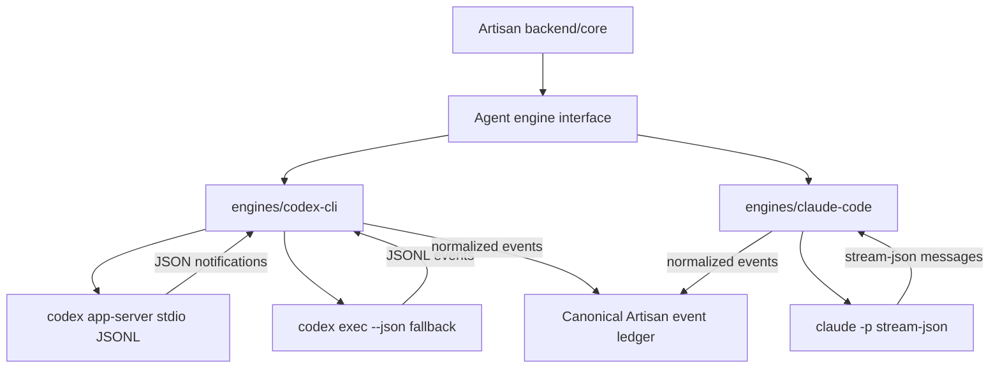

# Agent Engine IO Research

Last updated: 2026-08-10

Status: active provider-I/O architecture. Forge and Editor ship only
Artisan-owned runtime code. Provider executables, authentication state, and
protocol implementations remain external and are reached through CLI or ACP
subprocess adapters.

This note records how Artisan captures input/output from Codex CLI and Claude
Code CLI without linking or embedding either provider's SDK or executable.

## Active Summary

Interactive terminal TUI scraping is not used. Both production providers expose
structured subprocess protocols that fit Artisan's provider-neutral Engine seam.

- Codex v1 preferred path: spawn `codex app-server` over stdio and speak its
  JSONL JSON-RPC protocol.
- Codex fallback path: use `codex exec --json` for one-shot or automation-style
  runs.
- Claude path: spawn the user's `claude -p` in print mode with
  `--output-format stream-json --verbose`, parse stdout as streamed JSON, and
  keep stderr as raw diagnostics.
- Provider usage/authentication is requested through those same external
  surfaces: Codex ACP account methods and Claude's `/usage` command.
- Provider packages and executables are forbidden from product manifests, Forge
  SEA assets, and the bundled JavaScript source graph.

## Multi-Engine Capture



## Codex CLI Capture

### Preferred path: app-server over stdio

Run Codex as a child process:

```powershell
codex app-server
```

or explicitly:

```powershell
codex app-server --listen stdio://
```

Capture strategy:

- Spawn with `stdin` and `stdout` piped.
- Parse `stdout` line-by-line as JSONL.
- Write JSON messages to `stdin` one per line.
- Treat `stderr` as raw engine process diagnostics.
- Start each connection with `initialize`, then send `initialized`.
- Use `thread/start`, `thread/resume`, or `thread/fork` to establish a Codex
  thread.
- Use `turn/start` to send user input.
- Use `turn/steer` to append input to an in-flight turn.
- Use `turn/interrupt` for cancellation.
- Read notifications such as `thread/started`, `item/started`,
  `item/completed`, `item/agentMessage/delta`, tool progress, and
  `turn/completed`.

Why this is the right v1 path:

- OpenAI describes app-server as the interface used for rich clients such as
  the Codex VS Code extension.
- It supports authentication, conversation history, approvals, and streamed
  agent events.
- The default transport is newline-delimited JSON over stdio, which maps cleanly
  to an Electron backend child process.
- Codex can generate TypeScript or JSON Schema protocol artifacts per installed
  CLI version:

```powershell
codex app-server generate-ts --out ./schemas
codex app-server generate-json-schema --out ./schemas
```

Important implementation note:

- Generate and snapshot the app-server schema during adapter development. The
  schema is version-specific, so the adapter should record the Codex CLI version
  used for each captured session.

### Fallback path: non-interactive JSONL

For one-shot jobs, probes, or early adapter bring-up:

```powershell
codex exec --json "summarize the repo structure"
```

Capture strategy:

- Parse `stdout` as JSONL.
- Map events such as `thread.started`, `turn.started`, `turn.completed`,
  `turn.failed`, `item.*`, and `error` into Artisan events.
- In non-JSON mode, Codex streams progress to `stderr` and prints only the final
  agent message to `stdout`.
- Use `--output-schema` when the final message needs validated JSON.

Limitations:

- `codex exec --json` is great for automation, but app-server is better for
  Artisan's live session UX.
- Interactive `codex` TUI capture should be an emergency fallback only. It can
  be made less awful with `--no-alt-screen`, but it is still screen scraping,
  not a stable interface.

## Claude Code CLI Capture

### Production path: bidirectional stream JSON

Run Claude Code as a child process in print mode:

```powershell
claude -p --output-format stream-json --verbose "summarize this repo"
```

Production capture strategy:

- Spawn with `stdin`, `stdout`, and `stderr` piped.
- Parse `stdout` as streamed JSON messages.
- Preserve `stderr` as raw diagnostics.
- Use `--include-partial-messages` when token-level assistant deltas matter.
- Use `--include-hook-events` when hook lifecycle events should be visible.
- Use `--input-format stream-json`, keep stdin open through the run, and answer
  `control_request` permission frames with correlated `control_response` frames.
- Use `--session-id` for new Artisan runs and `--resume` for compatible native
  continuation.
- Use `--json-schema` for validated final structured output when needed.

Useful command shapes:

```powershell
claude -p --output-format stream-json --verbose "fix the failing test"
```

```powershell
claude -p --output-format stream-json --verbose --include-partial-messages "explain the auth flow"
```

```powershell
claude -p --input-format stream-json --output-format stream-json --verbose --replay-user-messages
```

Why this is the product boundary:

- It keeps the product on the user's installed Claude Code CLI and local auth
  setup.
- Claude Code supports Claude.ai subscription auth in the CLI, including Pro,
  Max, Teams, and Enterprise.
- It gives a structured stream without using the Agent SDK as the product
  integration surface.

### Provider SDK exclusion

Claude's Agent SDK is technically attractive because it exposes typed async
messages, streaming input, permissions, hooks, tools, sessions, and
interruptions. However, it points the product toward API-key-style integration
and vendor-controlled auth rules instead of the user's already-installed CLI and
subscription workflow.

That conflicts with Artisan's product boundary: use the user's existing CLI and
subscription auth while keeping provider code and memory outside Forge/Editor.
The SDK adapter and packaged native CLI were therefore removed. Source, package,
SEA-manifest, and built-bundle gates reject their reintroduction.

### Claude authentication and usage

The user installs and authenticates Claude Code. Artisan discovers the
executable, launches it with structured input/output flags, captures bounded
stdout/stderr, and translates schema-decoded events. Usage is fetched lazily by
spawning `claude -p /usage --output-format json`; Artisan does not read Claude's
private credential files or call Anthropic's private usage endpoint.

Do not build v1 around direct Anthropic API billing just to satisfy the shape of
the SDK. That would erase one of Artisan's main product advantages over API-rate
coding tools.

## Canonical Event Mapping

Both production adapters map their native frames into the provider-neutral
Engine observations represented by this minimal event set:

- `agent.run.started`
- `agent.run.completed`
- `agent.run.failed`
- `agent.message.delta`
- `agent.message.completed`
- `engine.raw_event`
- `tool.started`
- `tool.input.delta`
- `tool.completed`
- `tool.failed`
- `terminal.command.started`
- `terminal.command.output`
- `terminal.command.completed`
- `file.changed`
- `approval.requested`
- `approval.resolved`

Keep raw engine payloads attached to each normalized event:

```ts
type EngineRawPayload = {
	engine_id: "codex-cli" | "claude-code";
	transport: "stdio-jsonl" | "stream-json" | "exec-jsonl";
	version?: string;
	payload: unknown;
};
```

The raw payload is important for debugging adapter bugs, supporting future
schema migrations, and replaying sessions when Artisan's canonical event model
evolves.

## Local Environment Check

Current machine observations:

- `codex` resolves to the Windows app package path:
  `C:\Program Files\WindowsApps\OpenAI.Codex_26.623.13972.0_x64__2p2nqsd0c76g0\app\resources\codex.exe`
- Running `codex --help` from PowerShell failed with `Access is denied` through
  that resolved WindowsApps executable. The adapter should not assume this path
  is directly spawnable; it should support user-configured executable paths and
  verify the engine with a health check.
- `claude` was not found on PATH in this environment.

## Open Questions

- Which Codex installation path is reliably spawnable on Windows when the
  desktop app installed the CLI?
- Does Codex app-server expose every approval shape Artisan needs through the
  stable API, or do we need `experimentalApi` for v1?
- What exact Claude Code `stream-json` message variants appear during file
  edits, Bash commands, permission prompts, and browser/search use?
- Can Claude Code's `--input-format stream-json` sustain a long-running process
  across multiple Artisan turns cleanly, or should v1 spawn one process per turn
  and resume by session id?
- What raw event retention policy should Artisan use for sensitive data?

## Sources

- OpenAI Codex App Server:
  https://developers.openai.com/codex/app-server
- OpenAI Codex non-interactive mode:
  https://developers.openai.com/codex/noninteractive
- OpenAI Codex SDK:
  https://developers.openai.com/codex/sdk
- Claude Code CLI reference:
  https://code.claude.com/docs/en/cli-reference
- Claude Code authentication:
  https://code.claude.com/docs/en/iam
- Claude Agent SDK overview:
  https://code.claude.com/docs/en/agent-sdk/overview
- Claude Agent SDK streaming input:
  https://code.claude.com/docs/en/agent-sdk/streaming-vs-single-mode
- Claude Agent SDK streaming output:
  https://code.claude.com/docs/en/agent-sdk/streaming-output
- Claude Agent SDK TypeScript reference:
  https://code.claude.com/docs/en/agent-sdk/typescript
