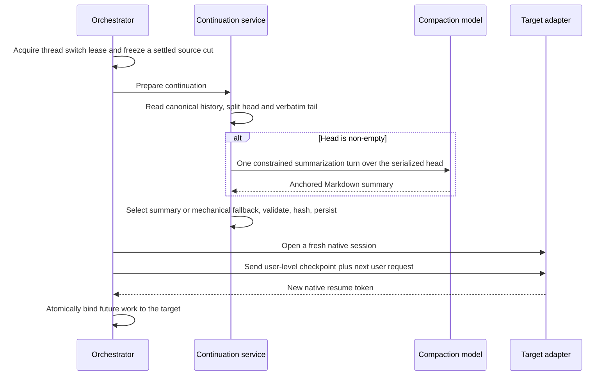

# Portable Engine Handoff Through Compaction

Last updated: 2026-07-30

Status: implemented. Cross-engine switching generates its handoff summary with
a configurable compaction model over Artisan's canonical transcript. The
earlier provider-native extraction paths were prototyped, found unreliable in
production use, and removed; their reverse engineering is summarized at the end
for the record.

## Decision

Artisan supports engine and model switching, but it does not treat any
provider's native resume token or compaction artifact as portable.

- A native continuation reuses one provider's session state. It is allowed only
  when the adapter confirms that the source and target belong to a compatible
  native continuation domain (same engine, exact-version gated, explicit target
  model).
- A portable handoff is private Artisan-owned text tied to an immutable
  conversation cut. Cross-engine switches always open a fresh native session
  and supply this text at user-message precedence.
- The portable handoff is a compacted summary plus the ordered canonical tail
  after the summary's boundary. The summary is written by one constrained turn
  on the compaction model; the tail is the newest canonical turns kept
  verbatim within a fixed byte budget.

This is the same architecture OpenCode uses for provider-portable compaction:
summarization is an ordinary model turn over serialized history, the output is
plain anchored Markdown, and portability falls out of the summary being
ordinary text rather than provider state.

| Transition                                            | Path                                                                                                                       |
| ----------------------------------------------------- | -------------------------------------------------------------------------------------------------------------------------- |
| Same engine, adapter-declared compatible model change | Resume the same native thread with an explicit target model override (`CheckNativeContinuation`, exact CLI version gated). |
| Any cross-engine switch                               | Summarize the canonical head with the compaction model, append the verbatim canonical tail, and start the target fresh.    |
| Compaction turn fails, times out, or returns nothing  | Fail closed to the mechanical canonical summary (first user objective plus omission count) with the same tail.             |

## The Compaction Model

The summarizer is `ThreadContinuationCompactor`
([`thread-continuation-compactor.ts`](../../modules/backend/src/orchestration/thread-continuation-compactor.ts)),
an Effect Service that never fails a switch: its absence of a result selects
the mechanical fallback.

- **Model selection.** The Forge session default `compaction_model` selects the
  summarizer. Absent means **Curated**: the source harness's cost-effective
  catalog default (`compaction_default_model_id` in the manifest: GPT 5.6 Luna
  at low effort for Codex, Claude Haiku 4.5 for Claude, Composer 2.5 for
  Cursor and Grok Build), with a harness lacking one falling back to the
  thread's own model. `"inherited"` means the thread's own current model
  summarizes — the OpenCode default. Any other value names one explicit
  catalog model by its unique id. The `/settings` page exposes all three
  through the standard engine-tab model picker (default "Curated"); the
  durable patch travels through the ordinary `session.defaults.update`
  command, where an explicit `null` restores Curated.
- **The turn.** One fresh `start` run on the chosen engine: read-only
  constrained metadata (Claude: `claude.permission_mode: "default"`; others: a
  `never`-approval, no-write, no-network permission policy), a single user
  message, no resume token, no project history. The final non-commentary
  `agentMessage` of a `completed` run is the summary. A requested approval or
  question aborts the turn; a five-minute timeout bounds it.
- **The prompt.** The serialized head transcript is delimited as untrusted
  data, followed by an anchored summary template (Objective, Important
  Details, Work State Completed/Active/Blocked, Next Move, Relevant Files) and
  rules requiring terse bullets, exact identifiers, and no mention of the
  compaction process. See `render_compaction_prompt` and
  `compaction_summary_template` in
  [`thread-continuation-model.ts`](../../modules/backend/src/orchestration/thread-continuation-model.ts).
- **Bounds.** Each transcript entry is bounded to the 32 KiB tail-entry budget
  and the serialized transcript to 512 KiB, dropping oldest entries first and
  reporting the omission count inside the prompt. The returned summary must
  decode as a non-empty ≤128 KiB checkpoint summary.

## Why Summary Plus Tail Is Required

A summary describes the conversation only through its boundary, and lossy
summarization of the newest turns hurts exactly the context the target needs
most. The checkpoint therefore keeps the newest canonical turns verbatim as an
ordered tail (byte- and count-bounded) and summarizes only the older head. If
the whole conversation fits in the tail, no model turn runs at all.

Native tool state, pending approvals, pending questions, in-flight turns, and
provider-private reasoning are not portable. The source must be settled, and
the handoff summary must describe relevant durable filesystem or repository
state rather than pretending native tool state moved.

## Portable Contract

`EngineResumeToken` remains provider-owned and engine-scoped; it never carries
cross-engine data. The checkpoint contract lives in
[`thread-continuation-model.ts`](../../modules/backend/src/orchestration/thread-continuation-model.ts):

- `method` is `compaction_model_summary` when the compaction model produced
  the summary, `canonical_transcript_summary` for the mechanical fallback.
  (Legacy rows may still carry the removed `claude_post_compact` and
  `codex_fork_summary` values; the database CHECK accepts them read-only.)
- Content is canonically encoded and SHA-256 hashed; the checkpoint is
  schema-decoded before persistence and revalidated at launch preparation.
- Compactor lineage (`{ kind: "compactor", compactor_engine_id,
compactor_model_id? }` or `{ kind: "canonical" }`) is a private persistence
  record; it never reaches the renderer.

## Switch Transaction

The switch is idempotent by checkpoint ID and target request ID. A crash
before target binding leaves the old binding authoritative. Recovery marks
stranded `prepared`/`opening` launches failed rather than replaying model
turns silently.

## Injection Rules

- Inject the handoff at user-message precedence. Never place transcript-derived
  text in system, developer, global-guidance, or project-instruction fields.
- Mark the document as historical conversation context and delimit it from the
  new user request. Embedded text remains untrusted content, not elevated
  instructions — on both sides: the compaction prompt marks the transcript
  untrusted, and the injected checkpoint marks the summary and tail untrusted.
- Use a fresh target native session for every cross-engine transition.
- Include the target's current project guidance through the normal adapter
  path; do not copy old provider-generated instruction blocks.
- Keep the checkpoint private to backend persistence and the target adapter.
  Do not expose it through renderer state, ordinary logs, diagnostics, or raw
  event displays. Renderer-visible compaction observations remain
  lifecycle-only; the repository rejects any that carry a summary.
- Erase checkpoint and lineage records when their Artisan thread is erased.

## Rejected: Provider-Native Extraction

Two provider-native extraction paths were implemented first and then removed
in favor of the compaction model. The reverse engineering remains valid as of
the pinned versions and is kept here as the record of why native extraction is
not the production path.

- **Claude Code 2.1.220 `PostCompact` capture.** A per-run `--plugin-dir`
  plugin delivered `PostCompact.compact_summary` through a private mailbox,
  paired against the stream's `system/compact_boundary` marker and the
  transcript's `isCompactSummary` record. It worked only at one pinned CLI
  version, only when the provider itself compacted, delivered best-effort with
  no decision control, and required extensive provenance defenses (claim
  tokens, transcript identity, bounded tails). In practice compaction rarely
  aligned with switch points, so most switches fell through to the fallback
  anyway.
- **Codex CLI 0.145.0 ephemeral `thread/fork` export.** The public app-server
  API exposes no compaction summary (the OpenAI path persists an encrypted
  compaction item; a structure-only scan found 1,741 compacted records with
  zero plaintext summaries), so Artisan forked the settled thread ephemerally
  and asked the source model for a structured summary. This depended on
  reverse-engineered, exact-version-pinned fork semantics and was unavailable
  on the `codex exec` fallback transport entirely.

Both paths solved only their own engine, multiplied version-gated seams, and
still needed the canonical fallback for every gap. One provider-neutral
summarization turn over Artisan's own canonical transcript covers every
engine, every version, and every switch point with a single code path, and
makes the summarizer user-selectable.

`system/compact_boundary` normalization survives as a renderer-visible,
summary-free compaction lifecycle observation; nothing is extracted from it.

## Primary Sources

- OpenCode compaction implementation (summarization prompt, anchored template,
  head/tail selection, compaction agent model override):
  <https://github.com/sst/opencode> — `packages/opencode/src/session/compaction.ts`,
  `packages/core/src/session/compaction.ts`,
  `packages/opencode/src/agent/prompt/compaction.txt`
- Claude Code hooks: <https://code.claude.com/docs/en/hooks>
- Claude Code CLI flags: <https://code.claude.com/docs/en/cli-reference>
- Codex app-server API at 0.145.0:
  <https://github.com/openai/codex/blob/rust-v0.145.0/codex-rs/app-server/README.md>
- Codex compaction internals at 0.145.0:
  <https://github.com/openai/codex/blob/rust-v0.145.0/codex-rs/core/src/compact.rs>,
  <https://github.com/openai/codex/blob/rust-v0.145.0/codex-rs/core/src/compact_remote.rs>
