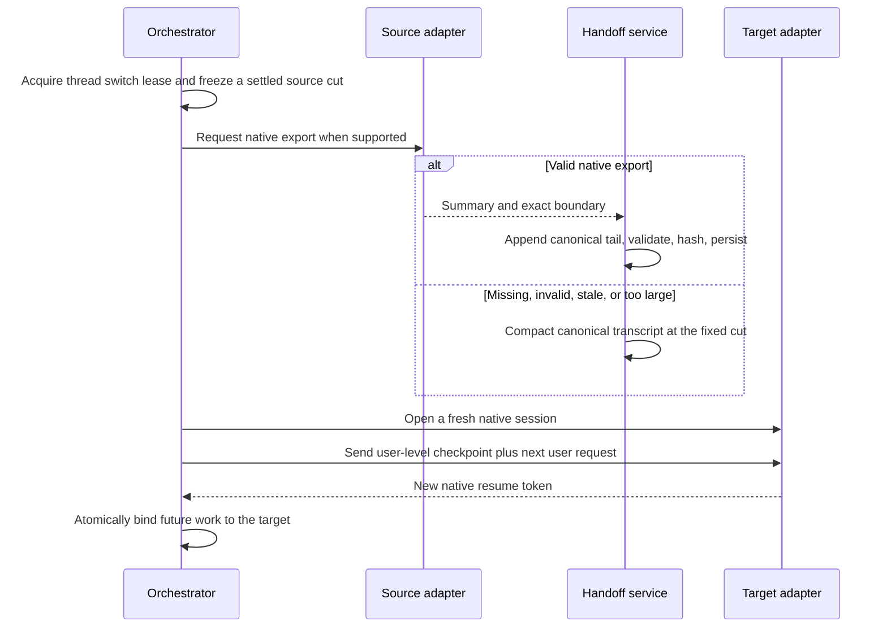

# Portable Engine Handoff Through Compaction

Last updated: 2026-07-30

Status: reverse engineering and implementation design are verified. Product
support is not implemented yet.

## Decision

Artisan can support engine and model switching, but it cannot treat every
provider's native resume token or compaction artifact as portable.

- A native continuation reuses one provider's session state. It is allowed only
  when the adapter confirms that the source and target belong to a compatible
  native continuation domain.
- A portable handoff is private Artisan-owned text tied to an immutable
  conversation cut. Cross-engine switches always open a fresh native session
  and supply this text at user-message precedence.
- The portable handoff is a compacted summary plus the ordered canonical tail
  after that summary's boundary. If either part would exceed the target budget,
  Artisan regenerates one checkpoint from the canonical transcript at the exact
  switch cut.

Only two production adapters currently exist: Codex CLI and Claude Code CLI.
They require different extraction paths.

| Source transition                                       | Verified path                                                                                                                                                 |
| ------------------------------------------------------- | ------------------------------------------------------------------------------------------------------------------------------------------------------------- |
| Codex to Codex, compatible version/provider             | Resume the same native thread with an explicit target model override.                                                                                         |
| Claude to Claude, adapter-declared compatible models    | Resume the same native session with an explicit target model. Fall back to a portable handoff if the resume is unsupported or rejected.                       |
| Claude to another engine                                | Capture `PostCompact.compact_summary`, append the canonical tail through the switch cut, and start the target fresh.                                          |
| Codex app-server to another engine                      | Create a settled, ephemeral `thread/fork`, run an ordinary constrained handoff-summary turn, capture its completed agent message, and start the target fresh. |
| Any source when native extraction is missing or invalid | Generate a checkpoint from Artisan's canonical transcript at a fixed cut.                                                                                     |

The Codex fork path is a provider-mediated export. It asks Codex to write a new
summary from copied native history; it does not decrypt Codex's remote
compaction item.

## Why Summary Plus Tail Is Required

A native summary describes the conversation only through its compaction
boundary. A switch can happen several turns later. Supplying only the summary
would silently lose those later turns.

Each captured native summary therefore records its source boundary. At switch
time Artisan selects the newest valid summary at or before the settled source
cut and appends canonical user and assistant messages after the boundary. If no
valid summary exists, the tail is too large, or non-text state is material,
Artisan compacts the canonical projection at the exact cut instead.

Native tool state, pending approvals, pending questions, in-flight turns, and
provider-private reasoning are not portable. The source must be settled, and
the handoff summary must describe any relevant durable filesystem or repository
state rather than pretending that native tool state moved.

## Claude Code 2.1.220

### Native behavior

Claude supports manual `/compact` and automatic compaction. Its stream-json
protocol announces compaction progress and a `system/compact_boundary`, but the
boundary frame itself is not the summary. The continuation implementation
promotes that exact frame to a summary-free canonical compaction marker so its
durable journal position can be paired privately with the later `PostCompact`
summary. Other system bookkeeping remains silent.

Claude's official `PostCompact` hook is the stable extraction seam. It runs for
both `manual` and `auto` triggers and supplies:

- `session_id`
- `transcript_path`
- `cwd`
- `hook_event_name: "PostCompact"`
- `trigger: "manual" | "auto"`
- `compact_summary`

The official hook reference explicitly says that `compact_summary` contains the
conversation summary generated by compaction. It also says that `PostCompact`
has no decision control, so hook delivery must be treated as a best-effort
side-effect rather than part of Claude's compaction transaction.

### Extraction solution

1. Ship a minimal Artisan Claude plugin containing only a `PostCompact` command
   hook, and add it to that CLI invocation with the official, repeatable
   `--plugin-dir` flag. Plugin hooks merge with hooks from other settings
   levels, so this avoids editing or replacing shared
   `~/.claude/settings.json`, project settings, and existing user hooks.
2. Have the hook helper stat the supplied transcript before returning, then
   forward the hook JSON plus that pre-append byte offset and file identity to
   a private, bounded receiver owned by an Effect Service. Treat every field as
   untrusted external input even though the receiver is private.
3. Schema-decode the payload, require the expected hook event, match
   `session_id` to the run's persisted native session, restrict
   `transcript_path` to the expected Claude project/session file, enforce size
   and time limits, and make duplicate delivery idempotent.
4. After the hook returns, tail only the bounded transcript suffix after the
   captured offset. For Claude 2.1.220, require the first schema-valid
   `system/compact_boundary` record and its following
   `user`/`isCompactSummary: true` record, with the same trigger and no
   intervening boundary. Claim the boundary UUID exactly once and compare the
   persisted summary's normalized hash with the hook summary before accepting
   the pair.
5. Persist the hook's plaintext summary with that boundary UUID and the durable
   journal cut corresponding to the completed boundary. The canonical tail
   begins strictly after this cut.
6. If the hook is blocked by managed policy, missing, timed out, malformed, or
   cannot be paired, record `native_summary_unavailable` and use
   canonical-transcript compaction. Never store an empty or boundary-unknown
   summary as a successful checkpoint.

The boundary parser is deliberately version-gated. Inspection of the installed
2.1.220 binary found that full and partial compaction construct a unique
`system/compact_boundary` record followed by a plaintext
`user`/`isCompactSummary` record, and await `PostCompact` before returning that
pair to the transcript writer. Future versions must pass transcript fixtures
for this ordering and field shape or disable native extraction and use the
canonical fallback.

The run adapter therefore enables the capture plugin only when its ordinary
probe reports exactly `2.1.220`. It also requires the captured boundary UUID to
match the earlier summary-free stream marker before exposing private native
compaction state. This preserves the actual boundary journal cut and lets a
later switch append every canonical turn after compaction, even when the switch
occurs several resumed Claude runs later.

A random mailbox path or bearer value is useful for accidental cross-run
isolation but is not proof of process identity: environment variables and
command arguments may be visible to child processes. Stronger provenance would
require an OS-private local transport and process attestation. In all cases,
never log the summary, hook input, transcript path, receiver address, or hook
stderr.

### Same-engine model changes

The current adapter can launch a resumed session with both `--resume` and
`--model`, but that does not prove every source/target model pair is compatible.
The Claude adapter must expose a version-tested compatibility decision. It may
resume natively only when that decision succeeds; otherwise it creates a
portable checkpoint and starts a fresh Claude session. A failed resume must be
visible and must not silently retry as a new session.

## Codex CLI 0.145.0

Continuation export and native model compatibility are pinned to exactly
`0.145.0`. Newer or prerelease CLIs keep the ordinary transport available but
disable these reverse-engineered continuation operations until their generated
schemas and behavior pass the same fixtures; orchestration then uses the
canonical transcript fallback.

### Native behavior

The public app-server API does not export a compaction summary:

- `thread/compact/start` accepts only `threadId` and immediately returns `{}`.
- Progress is an `item/started` and `item/completed` pair whose item is
  `{ "type": "contextCompaction", "id": "..." }`.
- The deprecated `thread/compacted` notification contains thread and turn
  identity, not summary text.
- Codex's `PostCompact` hook input contains session, turn, transcript, working
  directory, model, and trigger fields, but no summary.

Artisan therefore correctly emits lifecycle-only `EngineCompactionObservation`
values today in
[`codex-normalizer.ts`](../../modules/engines/src/codex/codex-normalizer.ts).
Its optional `summary` field cannot be populated from the public event.

Codex has two internal compaction implementations:

- For providers that do not support remote compaction, Codex asks the current
  model for a summary, prefixes it, places it in replacement history, and
  persists it in `CompactedItem.message`.
- The OpenAI/Azure path uses remote compaction. Its replacement history contains
  an encrypted compaction response item, and the persisted
  `CompactedItem.message` is deliberately empty.

A structure-only scan of the local Codex data on 2026-07-30 found 1,741
`compacted` records in 195 rollouts. None had a non-empty plaintext `message`;
every sampled replacement contained an encrypted compaction item. No
conversation text or encrypted payload was printed during this check.

This means filesystem scraping, `thread/read`, public compaction notifications,
and Codex's `PostCompact` hook cannot reliably recover the default OpenAI
summary.

### Extraction solution

When app-server and `thread/fork` are available, use a disposable native fork
to ask the source provider to export its own model-visible state:

Codex 0.145.0's generated `TurnStartParams` and tagged app-server reference
both define `outputSchema` as a JSON Schema constraint on the current turn's
final assistant message. Artisan must still Schema-decode the returned value
and fall back rather than trusting provider conformance.

1. Require a completed source turn. Persist a fixed completed-turn and
   canonical-projection cut before doing any provider work. Never fork an
   in-flight source implicitly; Codex documents that this snapshots it as
   interrupted.
2. Call `thread/fork` with the source thread, the explicit completed boundary,
   `ephemeral: true`, the source model/provider, and least-privilege,
   side-effect-free permissions.
3. Start one ordinary turn on the fork with a strict handoff prompt and JSON
   output schema. The prompt asks for current objective, durable decisions,
   completed work, changed artifacts, verification, unresolved blockers, and
   the next concrete action. It must forbid tool use and must not request
   private reasoning.
4. Wait for a successful terminal turn and capture the completed
   `agentMessage`. Schema-decode and size-bound it before accepting it.
5. Persist lineage containing the source cut, source thread, forked thread,
   request/turn ID, returned item ID, source and compactor models, method, and
   content hash. The injected document does not expose these native IDs.
6. Dispose of the ephemeral fork. On any unsupported method, incompatible CLI
   version, generation failure, malformed output, or race, fall back to
   canonical-transcript compaction.

The fork can see copied native history, including provider-opaque compaction
state that Codex itself can continue from. The completed agent message is new
portable text. Artisan does not claim to read or decrypt the original encrypted
summary.

`thread/inject_items` can append raw Responses items to a Codex thread, but it is
an import surface rather than an extraction surface, and it requires
provider-native Responses item shapes. The primary portable import remains an
ordinary fresh user turn so both engines share the same precedence and safety
semantics.

The `codex exec` fallback cannot fork or resume native app-server history. It
therefore goes directly to canonical-transcript compaction for cross-engine
export.

### Same-engine model changes

Codex app-server's generated `thread/resume` schema accepts explicit `model` and
`modelProvider` overrides, and `turn/start` accepts a model override for that
and subsequent turns. A compatible Codex-to-Codex model change should therefore
reuse the native thread with an explicit target model after version-gated
schema validation. It does not need a fork or portable summary.

### Rejected production path

Using the same OpenAI authentication through a custom provider alias whose name
is not `OpenAI` forces Codex 0.145.0 down its plaintext local-compaction branch.
This was accepted by a read-only strict-config probe and explains the internal
dispatch, but it relies on provider-name comparison and experimental raw events
or rollout parsing. It is diagnostic evidence, not a production contract.

## Portable Contract

Do not extend `EngineResumeToken` to carry cross-engine data. That token remains
provider-owned and engine-scoped. Introduce a separate private checkpoint
contract, for example:

```ts
type PortableHandoffCheckpoint = {
	readonly schema_version: 1;
	readonly checkpoint_id: string;
	readonly source_engine_id: string;
	readonly source_model: string;
	readonly source_cut: {
		readonly thread_id: string;
		readonly through_run_id: string;
		readonly through_observation_id: string;
	};
	readonly method: "claude_post_compact" | "codex_fork_summary" | "canonical_transcript_summary";
	readonly summary: string;
	readonly tail: ReadonlyArray<{
		readonly role: "assistant" | "user";
		readonly text: string;
	}>;
	readonly content_sha256: string;
	readonly created_at: string;
};
```

The exact TypeScript should be an Effect `Schema` with branded non-empty IDs,
bounded strings/arrays, canonical encoding before hashing, and explicit decode
errors. Provider-native IDs, receiver details, compactor request IDs, and
retention metadata belong in a separate private lineage record.

The checkpoint and lineage repositories should be Effect Services with scoped
Layers. A separate summarizer Service owns provider-neutral generation. Effect
AI offers typed model, prompt, chat, and structured-generation capabilities,
but it does not make Codex or Claude CLI native state portable; the CLI
extraction adapters remain custom boundaries.

## Switch Transaction



The switch must be idempotent by checkpoint ID and target request ID. A crash
before target binding leaves the old binding authoritative. A crash after
opening the target but before binding may retry the same target request or
dispose the orphan; it must not create repeated model turns silently.

The current orchestration recovery path revives native tokens only when the
stored engine matches policy. Portable switching must branch before that path,
not reinterpret or overwrite a native token.

## Injection Rules

- Inject the handoff at user-message precedence. Never place transcript-derived
  text in system, developer, global-guidance, or project-instruction fields.
- Mark the document as historical conversation context and delimit it from the
  new user request. Embedded text remains untrusted content, not elevated
  instructions.
- Use a fresh target native session for every cross-engine transition.
- Include the target's current project guidance through the normal adapter
  path; do not copy old provider-generated instruction blocks.
- Keep the checkpoint private to backend persistence and the target adapter.
  Do not expose it through renderer state, ordinary logs, diagnostics, or raw
  event displays.
- Erase checkpoint and lineage records when their Artisan thread is erased.
  Apply the same or shorter retention policy as the source transcript.

## Required Verification Before Product Status Changes

1. Claude fixtures for manual and automatic `PostCompact`, duplicate delivery,
   malformed payload, timeout, wrong session ID, receiver cleanup, and a
   summary-plus-tail switch.
2. Codex app-server fixtures for settled ephemeral fork, explicit boundary,
   structured summary completion, unsupported fork, interrupted-source race,
   malformed output, and canonical fallback.
3. Same-engine model-switch compatibility tests for both adapters, including a
   visible portable fallback.
4. Cross-engine integration tests in both directions proving that native IDs
   never cross engines, instruction precedence is preserved, switch retries are
   idempotent, and deletion removes checkpoint plus lineage.
5. Context-budget, secret-retention, prompt-injection, crash-recovery, and
   concurrent-switch tests.

Do not mark portable switching implemented in the backend completion matrix
until these paths exist and the full repository validation is green.

## Verification Performed for This Research

- Exact CLI versions: Codex 0.145.0 and Claude Code 2.1.220.
- Generated Codex 0.145.0 TypeScript and JSON Schema were inspected.
- Official Codex source at tag `rust-v0.145.0` was inspected for local and
  remote compaction, provider dispatch, app-server events, and hook schemas.
- The installed Claude 2.1.220 binary was inspected structurally for
  `PostCompact`, `compact_boundary`, and `isCompactSummary` construction and
  transcript serialization; no user transcript content was printed.
- Local Codex rollout shapes were counted structurally without printing
  conversation content.
- `pnpm exec vitest run .tests/engines/codex-normalizer.test.ts`: 7 passed.
- `pnpm exec vitest run .tests/engines/claude-engine.test.ts
.tests/engines/claude-normalizer-protocol.test.ts
.tests/engines/claude-jsonl.test.ts`: 32 passed, 1 skipped.
- The architecture and engine conclusions received an independent adversarial
  review; the failure semantics and boundary/tail requirements above include
  its corrections.

## Primary Sources

- Claude Code hooks:
  <https://code.claude.com/docs/en/hooks>
- Claude Code CLI flags, including `--plugin-dir`, `--resume`, and `--model`:
  <https://code.claude.com/docs/en/cli-reference>
- Codex app-server API at 0.145.0:
  <https://github.com/openai/codex/blob/rust-v0.145.0/codex-rs/app-server/README.md>
- Codex compaction dispatch at 0.145.0:
  <https://github.com/openai/codex/blob/rust-v0.145.0/codex-rs/core/src/tasks/compact.rs>
- Codex plaintext local compaction at 0.145.0:
  <https://github.com/openai/codex/blob/rust-v0.145.0/codex-rs/core/src/compact.rs>
- Codex remote compaction at 0.145.0:
  <https://github.com/openai/codex/blob/rust-v0.145.0/codex-rs/core/src/compact_remote.rs>
- Codex compaction response-item shape at 0.145.0:
  <https://github.com/openai/codex/blob/rust-v0.145.0/codex-rs/protocol/src/models.rs>
- Codex `PostCompact` schema at 0.145.0:
  <https://github.com/openai/codex/blob/rust-v0.145.0/codex-rs/hooks/src/schema.rs>
- Effect AI language-model service:
  <https://effect-ts.github.io/effect/ai/ai/LanguageModel.ts.html>
